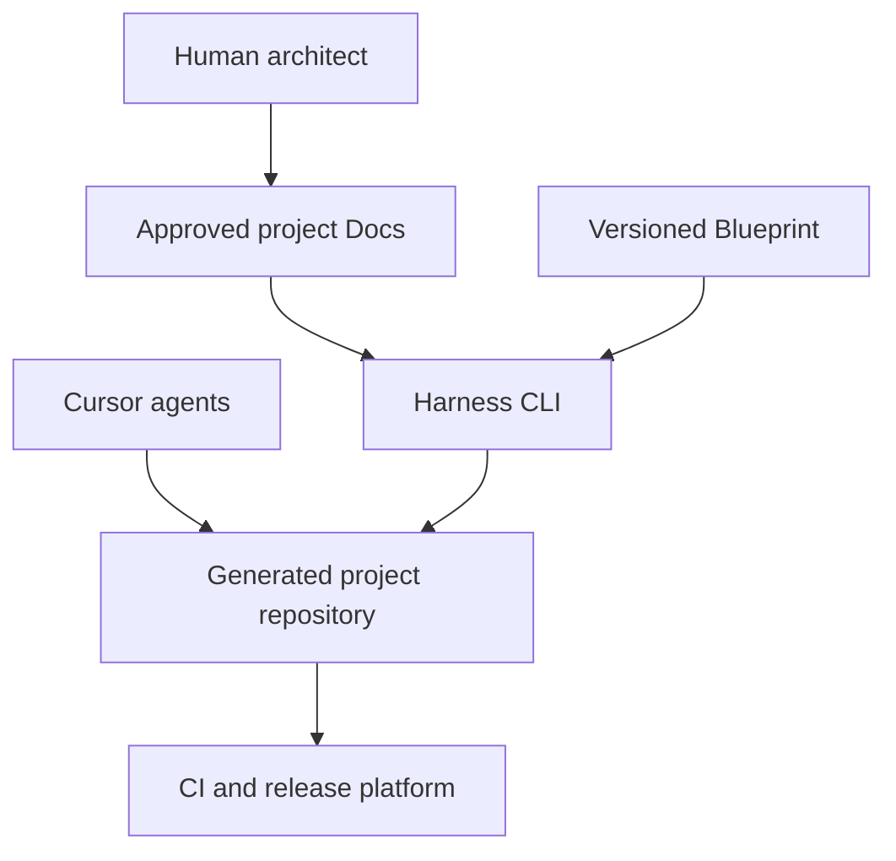
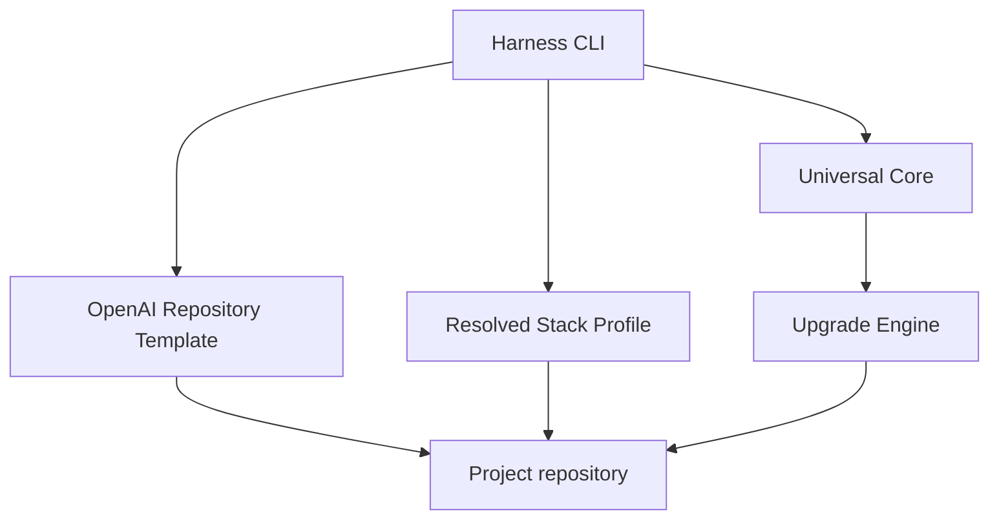
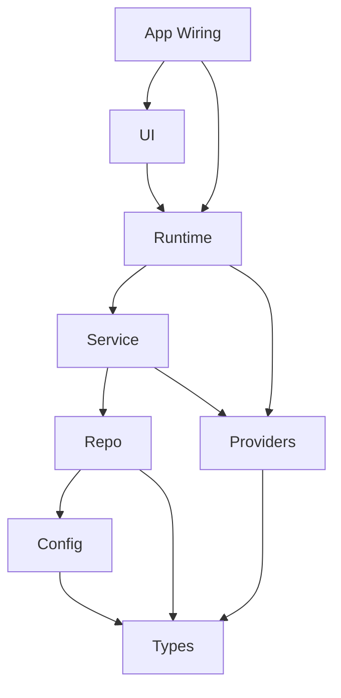
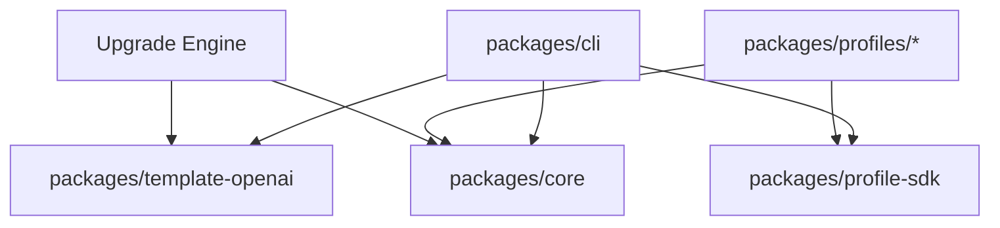
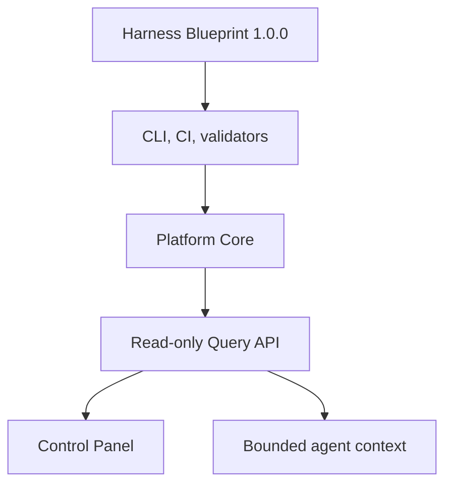

# Harness Blueprint architecture

Status: APPROVED  
Verification: NOT_VERIFIED  
Last reviewed: 2026-07-21

## Purpose

The Harness Blueprint is a versioned factory for creating and maintaining
agent-legible project repositories. It installs a universal engineering control
plane, maps project-specific documentation into the published OpenAI knowledge
layout, selects only the required stack capabilities, and proves that the
resulting repository can be changed safely by agents.

## System context



The human owns business intent, acceptance, risk decisions, and autonomy
promotion. The CLI and Cursor agents operate only inside encoded policies.

## Blueprint components



| Component | Responsibility |
| --- | --- |
| Harness CLI | Runs bootstrap, inspection, validation, environment, check, upgrade, and autonomy commands. |
| Universal Core | Defines lifecycle, statuses, invariant semantics, policy evaluation, evidence, and audit. |
| OpenAI Repository Template | Materializes the repository knowledge map and Cursor-facing operational files. |
| Profile SDK | Defines the contract every technology profile must satisfy. |
| Stack Profiles | Implement scaffold, validation, runtime, observability, build, and deployment for a stack. |
| Upgrade Engine | Produces controlled, reviewable migrations between Blueprint versions. |

## Universal semantic layers

Application domains use only the layers they need. Empty layers and speculative
directories are forbidden.



| Layer | Responsibility | Allowed dependencies |
| --- | --- | --- |
| Types | Contracts and domain types | None on higher layers |
| Config | Parsed, typed configuration | Types |
| Repo | Persistence contracts and implementations | Types, Config |
| Providers | Explicit cross-cutting or external capabilities | Types, approved Utils |
| Service | Domain behavior and orchestration | Types, Config, Repo, Providers |
| Runtime | Public operations exposed to other domains or delivery mechanisms | Types, Config, Service, Providers |
| UI | User-facing presentation and interaction | Types, Runtime |
| App Wiring | Composition and dependency construction | Required public layers |
| Utils | Domain-neutral utilities | No domain imports |

Domains are private by default. Cross-domain interaction is permitted only via
public Runtime operations, domain events, or approved orchestration. Direct
imports of another domain's private Repo or Service, direct access to its
tables, duplicated business rules, cycles, and Providers used as a bypass are
forbidden.

## Blueprint package dependencies



Profiles may not redefine Universal Core semantics. They translate stable
invariant identifiers and lifecycle contracts into stack-specific checks.

## Generated project control surfaces

| Surface | Role |
| --- | --- |
| `AGENTS.md` | Short table of contents and task entry point |
| `.cursor/rules/` | Thin always-on routing into repository sources of truth |
| `.cursor/skills/` | Progressive-disclosure operational procedures |
| `.cursor/agents/` | Independent and specialist reviewer definitions |
| `.cursor/hooks.json` | Fast feedback hooks; never the final security boundary |
| `harness.config.ts` | Human-readable project and policy configuration |
| `harness.lock.json` | Machine-readable installation versions, ownership, and checksums |
| `.github/workflows/` | Enforced CI, maintenance, and release gates |
| `tests/structural/` | Executable architecture and repository invariants |

## File ownership

| Class | Meaning | Upgrade behavior |
| --- | --- | --- |
| BLUEPRINT_MANAGED | Operational files owned by the installed Blueprint | Updated only through an upgrade PR |
| PROJECT_OWNED | Product Docs and product implementation | Never overwritten by Blueprint |
| MERGE_CONTROLLED | Shared files such as `AGENTS.md` and `harness.config.ts` | Three-way comparison with explicit conflict resolution |
| GENERATED | Deterministic representation derived from another source | Regenerated and compared in CI |

Silent overwrites are forbidden. A user or project edit to a managed file is
reported as drift and resolved in a reviewable PR.

## Boundary validation

Every external value begins as unknown and crosses an explicit parser before it
becomes a domain type. This applies to HTTP, forms, webhooks, environment
variables, queues, database rows, external APIs, LLM responses, and tool output.

## Runtime isolation

One task or ExecPlan uses one Git worktree, branch, application instance,
configuration, database boundary, service namespace, telemetry stream, and
artifact location. Cleanup targets only resources carrying the exact worktree
identifier.

## Release boundary

Code reaches production only as an immutable artifact built from an approved
commit on `main`, verified on staging, promoted through a policy gate, and
observed during a controlled rollout. Agents invoke narrow pipeline operations;
they do not patch servers, use unrestricted SSH, or write directly to the
production database.

## Architectural change protocol

A proposal to change a boundary or invariant requires evidence, an updated
dependency graph, an approved Design Doc and ExecPlan, human approval, and a
single PR containing documentation, implementation, lint or structural checks,
fixtures, and migration guidance. An agent may not weaken an invariant merely
to make a local change pass.

## Follow-on Harness Platform V1.1

Harness Platform V1.1 is a follow-on product implemented only after
`HARNESS_BLUEPRINT_V1_GATE: PASS`. It aggregates versioned Harness results into
append-only history and rebuildable read models, exposes a read-only Query API,
and includes a first-party Control Panel application.



Dependency direction is one way:

```text
Control Panel → Query API → Platform Core → accepted producer contracts
```

The Platform may depend on stable Blueprint contracts. Blueprint CLI, routing,
worktrees, checks, CI, and local evidence may not require Platform availability.
The Control Panel may not query Platform storage or mutate project truth.

Normative Platform boundaries live in
`docs/design-docs/platform-architecture.md`. Delivery is governed by the single
`docs/exec-plans/completed/build-harness-platform-v1.1.md`.

## Provenance

- OPENAI-CONFIRMED: repository-local knowledge, short `AGENTS.md`, fixed domain
  layers, explicit Providers, mechanical enforcement, worktree legibility,
  feedback loops, short PRs, increasing autonomy, and recurring cleanup.
- RECONSTRUCTED: reusable Blueprint packages, profile composition, ownership
  classes, exact state machines, and thresholds.
- CURSOR-ADAPTER: Cursor Rules, Skills, subagents, hooks, browser, cloud agents,
  Bugbot, worktrees, and automations.
- SELLGENIUS-EXTENSION: Sentry-triggered incident response and the production
  permission model described by this repository.
