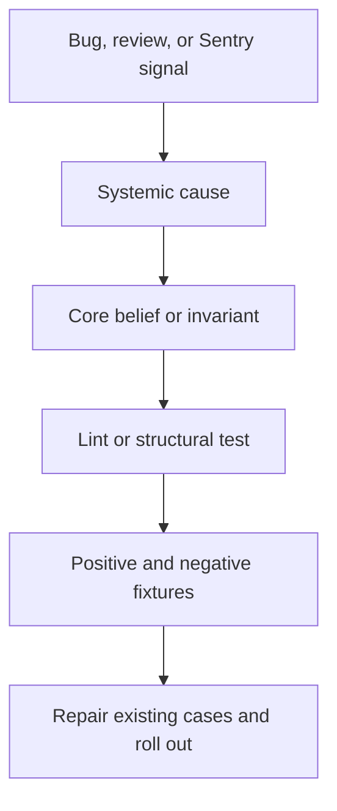

# Architecture enforcement

Status: APPROVED  
Verification: NOT_VERIFIED

## Goal

Maintain predictable domain and layer boundaries under high agent throughput
without prescribing every local implementation choice.

## Layer contract

The normative dependency model is defined in `../../ARCHITECTURE.md`. Stack
Profiles must translate it into import rules and structural graph tests for the
selected language and repository layout.

Unused layers may be omitted. A profile may not invent a conflicting layer
meaning.

## Domain boundary contract

Domains are private by default. Cross-domain access is limited to:

- public Runtime operations;
- explicit domain events;
- approved orchestration at a composition boundary.

Forbidden patterns include private Repo or Service imports, direct table access
across domains, duplicated business rules, dependency cycles, and Providers
used as a service locator or bypass.

## Boundary validation

Every external data shape is parsed from unknown into a domain type at its
entry boundary. Stack Profiles select the concrete validation library, while
the invariant remains universal.

## Universal invariant catalogue

| ID | Intent |
| --- | --- |
| ARCH-001 | Layer dependencies follow the approved direction |
| ARCH-002 | Cross-domain access uses a public boundary |
| ARCH-003 | The dependency graph contains no prohibited cycle |
| BOUNDARY-001 | External values are parsed and validated |
| CONFIG-001 | Configuration is parsed, typed, and centralized |
| LOG-001 | Operational logs are structured |
| LOG-002 | Logs carry required correlation context and redact sensitive data |
| NAME-001 | Names expose intent, type, identity, and units |
| DOC-001 | Named production functions carry required contract documentation |
| SIZE-001 | Files and modules remain within profile-defined legibility bounds |
| ERROR-001 | Error semantics are explicit and consistent |
| SIDEFX-001 | Side effects occur at visible, controlled boundaries |
| TEST-001 | Meaningful behavior changes have regression protection |
| RELIABILITY-001 | Required timeout, retry, and idempotency rules are present |
| RELIABILITY-002 | Critical operations expose required health and telemetry |
| ABSTRACTION-001 | Shared abstractions solve evidenced repeated behavior or coupling |
| CLEAN-001 | Dead, duplicated, or expired exception paths do not accumulate |
| HARNESS-001 | Agents cannot bypass, weaken, or self-modify required controls |

## Legibility and proportional abstraction

Code uses the simplest readable structure that satisfies approved boundaries.
Names should reveal intent: verbs for operations; `is`, `has`, `can`, or
`should` for booleans; plural names for collections; contextual identifiers;
and unit suffixes where relevant. Vague names such as `data`, `item`, `obj`,
`tmp`, and `doStuff` are rejected when a precise name is available.

Every named production function documents its purpose, inputs, outputs, errors,
side effects, and important invariants. Exemptions are generated code, external
dependencies, tool-generated migrations, trivial anonymous callbacks, and test
functions whose test name already expresses the contract.

Patterns and abstractions are not goals by themselves. Introduce them when they
centralize an invariant, protect a boundary, improve testing, remove meaningful
repetition, or decouple a concrete dependency.

## Three enforcement mechanisms

### Custom lints

Detect local syntax, imports, naming, documentation, logging, configuration,
and platform patterns. Error messages include stable invariant IDs and concrete
remediation for the agent.

### Structural tests

Build repository graphs and validate domains, layers, cycles, public exports,
generated artifacts, and protected Harness files.

### Taste invariants

Capture maintainability expectations that combine mechanical evidence and
independent review, such as proportional abstraction and readable error flow.

## Check modes

`harness check --fast` runs after coherent edits and targets a reference-project
runtime of no more than 30 seconds. `harness check --full` runs before review,
CI, and merge and includes all relevant tests, generated comparisons, Docs, and
structural validation.

Outputs are both human-readable and machine-readable, contain stable IDs, and
return non-zero status for blocking findings.

## Rule quality gate

Every new or modified rule requires:

- at least one positive fixture;
- at least one negative fixture;
- demonstrated detection;
- demonstrated absence of the known false positive;
- actionable error text;
- acceptable performance;
- explicit scope and exception handling.

Autofix is limited to behavior-preserving mechanical changes. Semantic changes
are implemented and reviewed normally.

## False positives

When a valid pattern is incorrectly rejected, add the smallest positive
regression fixture, correct the rule, and run the full gate. Do not disable the
rule or create a broad exception.

## Rule promotion

Classify a promoted rule as Universal Core, Stack Profile, or Project-specific.
Do not globalize a local preference without evidence.

## Protected changes

An agent may not remove a structural test, weaken an assertion, suppress an
error, or edit CI to bypass failure. A normative architectural change requires
human approval and a PR containing the updated Design Doc, `ARCHITECTURE.md`,
implementation, rule, fixtures, migration, and evidence.

Temporary exceptions must be narrow, must never reduce security or data
integrity, must reference the debt tracker, and must expire automatically.

## Provenance

- OPENAI-CONFIRMED: fixed layers, Providers, custom lints, structural tests,
  taste invariants, structured logging, naming, file limits, reliability rules,
  actionable lint messages, and centralized boundaries with local freedom.
- RECONSTRUCTED: invariant IDs, exact rule gate, check commands, exception
  lifecycle, and reference performance target.
