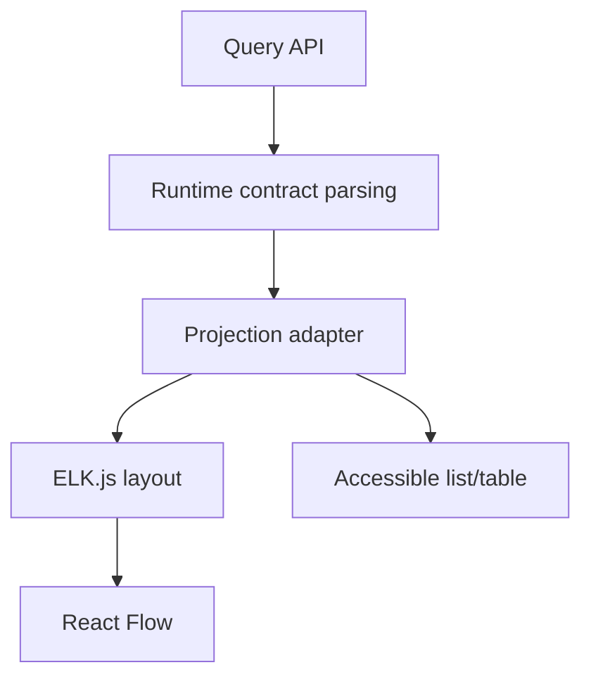

# Architecture Explorer UI

Status: PROPOSED
Implementation: NOT_IMPLEMENTED
Verification: NOT_VERIFIED

## Purpose

Make an exact-SHA, generated architecture projection inspectable. React Flow
renders interaction and ELK.js calculates repeatable layout. Neither analyzes
the repository or decides architecture truth.

## Data flow



The graph and fallback consume the same validated projection.

## Views

| View | Primary unit | Required scope |
| --- | --- | --- |
| Module | packages/modules | project or subsystem |
| Flow | APIs, events, queues, stores, external systems | selected flow |
| Contract | APIs/events/schemas and consumers | selected contract/domain |
| Class | classes and direct relationships | selected module/path |

Default is module view. Whole-project class view is rejected.

## React Flow responsibilities

Owns:

- viewport, pan, zoom, fit, focus, and selection;
- typed nodes and edges;
- visual grouping/collapse state;
- path, drift, and comparison highlighting;
- useful controls and minimap.

Does not own:

- project/SHA identity;
- architecture analysis;
- automatic layout;
- evidence authorization;
- architectural decisions or persistence.

## ELK.js responsibilities

ELK.js receives deterministically sorted nodes, edges, dimensions, ports,
direction, and spacing. Cache identity:

```text
projectionId
+ view
+ scope
+ filters
+ direction
+ layoutVersion
```

Selection or viewport changes do not recompute layout. Use a worker when the
approved representative fixture proves main-thread blocking.

## Interaction

- selecting a node shows identity, type, path, origin, contracts, comparison,
  drift, and authorized evidence;
- selecting an edge shows relation, endpoints, origin, and evidence;
- filters cover node/edge type, origin, drift, and comparison;
- expansion requests another bounded projection or reveals validated bounded
  children;
- URL preserves project, exact SHA, view, scope, and filters;
- `Fit view` and `Reset filters` restore predictable presentation;
- stale, partial, and truncated states remain persistent, not transient toasts.

## HEAD versus VERIFIED

Comparison requires explicit base and target SHA. The legend names both.
Visual and textual labels distinguish:

```text
UNCHANGED
ADDED
REMOVED
CHANGED
DRIFTED
```

Stale or schema/generator/config-incompatible projections block comparison or
make it explicitly partial according to the API contract.

## Accessibility

- equivalent list/table for every graph;
- keyboard access to node/edge details;
- deterministic focus order and labels;
- color is not the only meaning channel;
- reduced motion disables nonessential animation;
- graph controls and fallback pass automated and manual checks.

## Large graphs

- request server-scoped projections first;
- expose truncation and continuation;
- cap expansion depth;
- use progressive expansion;
- virtualize fallback when required;
- measure layout and interaction against `PANEL-OD-004/005`.

## Failure behavior

| Failure | Behavior |
| --- | --- |
| Contract mismatch | Stop graph; show supported/received schema |
| Stale projection | Show age, watermark, and persistent stale status |
| Partial/truncated | Render known data and completeness warning |
| Layout failure | Keep validated list/table and offer retry |
| Evidence denied | Show relation without protected evidence |
| Requested SHA absent | Preserve SHA and show not-found |

## Evidence

- mapper unit tests;
- deterministic layout fixtures;
- interaction/component tests;
- keyboard and accessibility checks;
- Playwright module exploration and comparison;
- bounded large-graph performance;
- screenshots for current, stale, partial, drift, and comparison states.

## References

- Projection contract: `control-panel-data-contracts.md`
- Platform projection: `architecture-projection.md`
- Tool decision: `../adr/ADR-PANEL-002-react-flow-and-elk.md`
