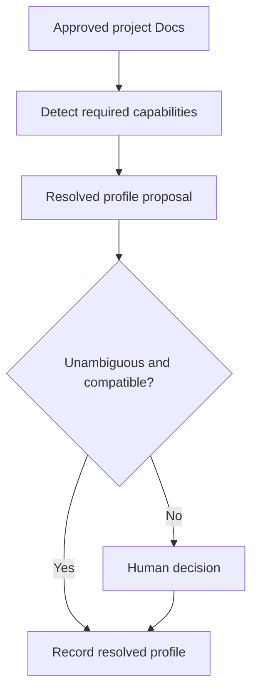

# Blueprint architecture

Status: APPROVED  
Verification: NOT_VERIFIED

## Context

The Blueprint must reproduce a stable agent-first repository environment for
new projects while allowing project-specific business knowledge and technology
choices. It must remain inspectable, versioned, upgradeable, and resistant to
silent overwrite.

## Decision

The Blueprint consists of five components:

1. a TypeScript Harness CLI;
2. Universal Harness Core;
3. the OpenAI Repository Template;
4. Profile SDK and resolved Stack Profiles;
5. Upgrade Engine.

The central Blueprint repository applies its own Harness to itself.

## Package topology

```text
packages/
├── cli/
├── core/
├── template-openai/
├── profile-sdk/
└── profiles/
    └── [profile-name]/
```

### Harness CLI

The CLI coordinates repository inspection, Docs import, bootstrap, checks,
environment lifecycle, upgrades, and autonomy reporting. It does not invent
business decisions or silently choose an ambiguous stack.

### Universal Core

Core owns invariant meanings, lifecycle states, validation result schemas,
policy evaluation, audit events, plan rules, file ownership semantics, and
extension interfaces. It is technology-neutral.

### OpenAI Repository Template

The template materializes the published knowledge layout plus Cursor-facing
operational configuration. It provides placeholders and rules, not speculative
application code.

### Profile SDK and Stack Profiles

The SDK defines required operations such as detection, scaffold, checks,
environment startup, architecture validation, build, staging deployment,
production deployment, and rollback. Profiles implement these operations for a
stack without redefining Core policy.

The first base profile is `typescript-node`. Its first full reference
composition uses NestJS, Mastra, PostgreSQL with Drizzle, Supabase, local
Vector/Victoria observability, Sentry, and container deployment. Capabilities
are installed only when the approved Docs require them.

### Upgrade Engine

The engine compares the installed lock state with a target Blueprint version,
classifies every file by ownership, produces a migration report, resolves safe
mechanical changes, and opens a controlled upgrade PR. It never performs an
unreviewed background mutation.

## Installation state

`harness.config.ts` is the project-readable configuration. `harness.lock.json`
records exact Core, template, profile, capability, policy-schema, and managed
file checksum versions.

## Capability resolution



No frontend, database, queue, agent runtime, or unused semantic layer is
created merely for possible future use.

## File ownership decision

- Blueprint-managed operational files update only through upgrade PRs.
- Product Specs, Design Docs, and product code are project-owned.
- Shared entry and configuration files use controlled three-way merging.
- Generated artifacts are regenerated and compared, not manually edited.

Drift in a managed file is surfaced; it is never overwritten silently.

## Compatibility

Every capability declares required Core and profile SDK ranges, incompatible
capabilities, installation order, provided commands, expected structural
fixtures, and upgrade migrations. Resolution fails before mutation when the
selected set is incompatible.

## Consequences

- New projects share consistent lifecycle and controls.
- Technology-specific mechanics remain replaceable.
- Project knowledge remains authoritative and protected.
- Upgrades are inspectable and reversible.
- The central system requires strong reference fixtures to prevent breaking
  every downstream project.

## Provenance

- OPENAI-CONFIRMED: initial scaffold generated by Codex CLI from a small set of
  templates; repository-local tooling and documentation.
- RECONSTRUCTED: package topology, profile composition, ownership model, lock
  file, and upgrade protocol.
