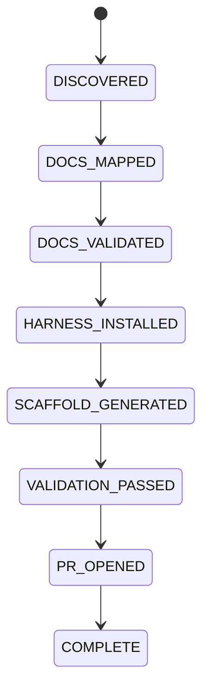

# Docs ingestion and bootstrap

Status: APPROVED  
Verification: NOT_VERIFIED

## Goal

Turn an empty or newly anchored Git repository plus approved project Docs into
a minimal, runnable, validated, agent-legible project without losing intent or
guessing ambiguous mappings.

## Preconditions

- The target is an empty repository or an explicitly approved bootstrap target.
- `main` has an anchor commit before worktree creation.
- Approved source Docs are available locally to the bootstrap process.
- No production or shared staging resources are used.

## Command

```text
npx @sellgenius/harness init --docs ./project-docs
```

The exact package publication mechanism is an implementation concern. The
behavioral contract in this document is normative.

## Docs manifest

A source manifest describes available documents, their authority, subject,
status, intended canonical destination, and relationships. If the incoming
Docs have no manifest, the agent first creates an inventory and proposed
manifest.

Absence of a manifest is not an error. Silent mapping is forbidden.

### Canonical input

When incoming Docs already use the required repository structure, mapping is
unnecessary. The agent validates structure, status, cross-links, and conflicts,
then imports them without semantic rewriting.

### Non-canonical input

The agent:

1. inventories every file;
2. classifies content as Product Spec, Design Doc, plan source, generated
   artifact, reference, duplicate, or unknown;
3. proposes target paths;
4. identifies splits, merges, conflicts, and missing required subjects;
5. asks for human approval when mapping changes authority or meaning;
6. materializes the approved mapping;
7. validates the result against the original content.

The source is retained until the mapped result passes validation.

## Bootstrap state machine



State definitions:

| State | Evidence |
| --- | --- |
| DISCOVERED | Repository, source Docs, and environment inventory |
| DOCS_MAPPED | Approved or unnecessary canonical mapping |
| DOCS_VALIDATED | Structure, status, links, conflicts, and required knowledge validated |
| HARNESS_INSTALLED | Core, Cursor adapter, configuration, and resolved profile recorded |
| SCAFFOLD_GENERATED | Minimal required application and infrastructure foundation exists |
| VALIDATION_PASSED | Reference checks and runtime baseline pass |
| PR_OPENED | Complete bootstrap PR with report and evidence exists |
| COMPLETE | Human-approved initial merge and post-merge verification complete |

## Idempotence and resume

Every state transition records inputs, outputs, checksums, resolved decisions,
and safe cleanup targets. Re-running the command:

- resumes from the last verified state;
- revalidates assumptions that may have changed;
- does not duplicate files or services;
- does not overwrite project-owned content;
- reports drift before proceeding;
- can safely stop after any completed state.

## Scaffold contract

The initial scaffold is the smallest runnable technical foundation required by
the approved Docs and resolved profile. It includes CI, formatting, testing,
environment startup, health checks, and structural protection needed for its
present capabilities. It does not include speculative domains, features,
abstractions, or empty semantic layers.

## Bootstrap branch

Bootstrap executes on a dedicated branch and worktree after an anchor commit on
`main`. It opens a first PR containing Docs, Harness configuration, minimal
scaffold, reference gates, installation report, and known limitations. Initial
merge always requires human approval.

## Failure handling

An ambiguous mapping, incompatible profile, failed Docs gate, pre-existing
conflicting file, unsafe environment, or failed reference check stops at the
current state. The report contains the cause, evidence, safe next action, and
whether retry is idempotent.

## Acceptance

- Canonical Docs are complete and traceable to source.
- Profile selection is explicit and compatible.
- Only required capabilities exist.
- The project starts in an isolated environment.
- Fast and full reference checks pass.
- A new agent can navigate the repository from `AGENTS.md`.
- Re-running bootstrap produces no unintended diff.
- The first PR is complete and reviewable.

## Provenance

- OPENAI-CONFIRMED: empty repository, Codex-generated scaffold, CI, formatting,
  package manager, framework, and initial `AGENTS.md` guided by templates.
- RECONSTRUCTED: manifest behavior, mapping protocol, exact state machine,
  idempotent resume, profile resolution, and upgrade metadata.
