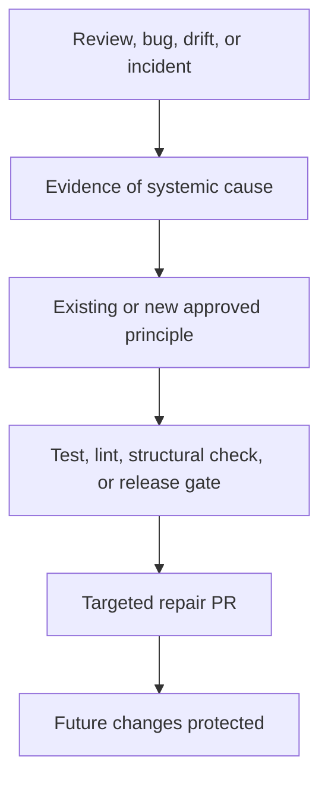

# Entropy and maintenance

Status: APPROVED  
Verification: NOT_VERIFIED

## Goal

Prevent architectural, documentary, testing, and implementation drift from
compounding as agents replicate existing repository patterns.

## Golden Principles

Stable normative principles live in `core-beliefs.md`. Mechanically enforceable
parts are promoted into lints, structural tests, fixtures, and release gates.
Human taste is captured once and then applied consistently.

## Maintenance cadence

- Run PR-level lints and structural tests on every change.
- Run a standard repository scan weekly.
- Run a deep scan after every 20 merged PRs.
- Run a targeted scan after a significant incident.
- Re-evaluate the dependency graph after an architectural change.

## Six automations

| Automation | Responsibility |
| --- | --- |
| Doc Gardener | Links, indexes, statuses, diagrams, generated Docs, and code/document drift |
| Architecture Gardener | Domain boundaries, layer direction, cycles, duplicated contracts, and expired exceptions |
| Quality Auditor | Independent evidence review and `QUALITY_SCORE.md` updates |
| Test Flake Gardener | Root-cause diagnosis and durable repair of confirmed flaky tests |
| Incident Learner | Convert production causes into tests, lints, invariants, telemetry, or release gates |
| Autonomy Evaluator | Recommend promotion, downgrade, or freeze from objective evidence |

Cursor Automations and Cloud Agents execute these roles in isolated worktrees.
Their durable instructions and checks are repository-local. Automation schedule,
prompt, and permission changes require a controlled PR.

## Bounded PRs

Gardening produces one small PR for one evidenced problem in one bounded area.
It does not perform broad aesthetic rewrites or speculative abstraction. A PR
preserves product behavior unless it repairs a documented bug, includes tests,
updates quality evidence, and remains easy to roll back.

## Normative boundary

Agents may mechanically repair links, indexes, generated content, formatting,
dead imports, and descriptions uniquely proven by code. They must escalate a
product goal change, public behavior change, new domain boundary, Golden
Principle change, conflict between approved documents, security reduction,
permanent exception, or autonomy promotion.

## Quality grading

`QUALITY_SCORE.md` uses A, B, C, D, F, N/A, and UNVERIFIED. Grades cover domains,
layers, Architecture, Correctness, Testing, Reliability, Security,
Documentation, Observability, Legibility, and Technical Debt.

Every grade cites current evidence. Critical Security or Data Integrity F caps
the area at F. Missing critical journey tests, production observability, or
rollback caps the area at C. No evidence yields UNVERIFIED rather than an
optimistic grade.

An implementer cannot independently raise its area's grade. New evidence is
checked by automated controls, the Quality Auditor, and an independent reviewer.

## Duplicate suppression

Maintenance tasks lock on automation type, domain, and problem fingerprint.
Before opening a PR, they check current `main` and existing work. Only one
active PR may address the same problem in the same domain. A stale task exits or
replans instead of recreating an obsolete change.

## Idempotence

After cleanup, an immediate rerun produces no actionable diff. Alternating or
repeated rewrites indicate an unstable rule and block maintenance auto-merge.

## Feedback promotion

## Automation autonomy

Initially every gardener opens a PR requiring human approval. After normal
promotion, purely mechanical, reversible, behavior-preserving, fully tested
cleanup may auto-merge. Normative, architectural, security, or product changes
always follow their ordinary approval path.

## Reference gate

The gate seeds stale Docs, a missing index, an inaccurate diagram, prohibited
dependency, cycle, duplicated helper, expired exception, flaky test, stale
quality grade, incident without a systemic guard, duplicate triggers, and valid
counterexamples. The system must detect every real violation, preserve valid
examples, escalate decisions, suppress duplicate work, and produce no diff on
an idempotent rerun.

## Provenance

- OPENAI-CONFIRMED: Golden Principles, recurring background Codex tasks,
  quality-grade updates, targeted refactor PRs, frequent auto-merge of safe
  cleanup, and garbage-collection framing.
- RECONSTRUCTED: cadence, exact role set, grade scale, evidence rules, locks,
  idempotence gate, and promotion boundaries.
- CURSOR-ADAPTER: Cursor Automations and Cloud Agents.
