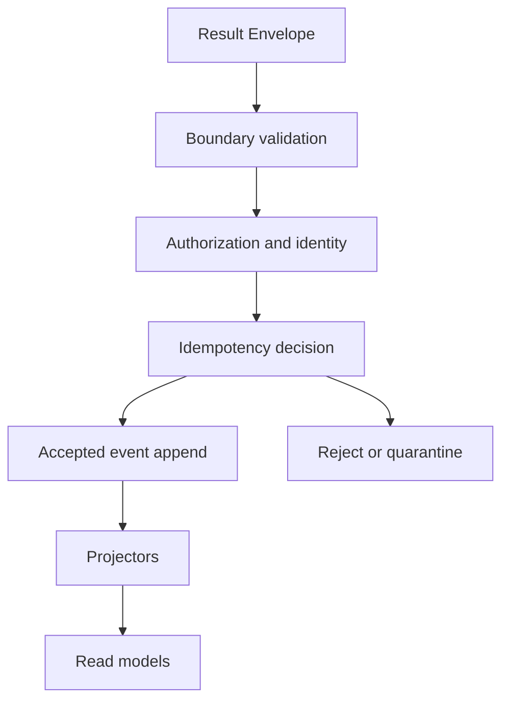

# Event ingestion and projections

Status: PROPOSED
Implementation: NOT_IMPLEMENTED
Verification: NOT_VERIFIED

## Purpose

Accept authenticated results at least once and potentially out of order,
preserve immutable operational history, and derive disposable, rebuildable
query state.

## Ingestion sequence



The accepted append and its idempotency record are atomic. A request is not
acknowledged as accepted before durability.

## Storage roles

| Store | Role |
| --- | --- |
| Accepted envelope/event log | Immutable source of Platform operational history |
| Quarantine | Invalid/conflicting payload, reason, provenance, restricted access |
| Projector checkpoint | Disposable position and version for safe resume |
| Read models | Query-optimized current state |
| Artifact index | Metadata and authorization reference; not evidence bytes |
| Audit log | Append-only security and governance operations |

The exact technologies are resolved by `PLATFORM-OD-002`.

## Representative events

```text
ResultEnvelopeAccepted
ValidationRecorded
CriterionStateChanged
ExecPlanStateChanged
ScopeConflictDetected
ScopeConflictResolved
EvidenceManifestRecorded
ArchitectureProjectionRecorded
SnapshotVerified
SnapshotRevoked
SourceGapDetected
DataMarkedStale
ReconciliationCompleted
```

Derived events retain input event references and policy/projector version.

## Ordering

Store:

- producer observation time;
- server receipt time;
- run and attempt identity;
- event ID and payload hash;
- causal/domain references where defined.

Projectors do not treat receipt order as execution order. A late valid event
triggers deterministic recomputation of the affected entity.

## Projectors

Every projector defines:

```text
name and version
consumed event versions
target read models
checkpoint/watermark
deterministic ordering rules
rebuild command
failure status
```

On projector failure:

1. accepted events stay intact;
2. affected models become stale;
3. queries expose stale status and last watermark;
4. repair and rebuild from checkpoint or origin;
5. compare canonical rebuild result;
6. resume only after evidence.

## Rebuild invariant

For the same accepted events, referenced versioned sources, projector version,
and policy/configuration:

```text
rebuild A == rebuild B
```

Canonical comparison excludes volatile runtime fields and uses defined
serialization.

## Shadow rollout

Before Platform state becomes authoritative for Platform verification:

```text
source result
→ ingest in shadow mode
→ derive projection
→ compare with source
→ record mismatch
```

Shadow mismatches cannot be hidden. Snapshot authority is enabled only after
representative convergence.

## Recovery

- retry duplicate delivery safely;
- resume projectors from durable checkpoints;
- rebuild disposable read models;
- quarantine conflicts without replacing prior accepted events;
- append corrections and reconciliation facts;
- never edit history to make a projection pass.

## Validation

- same duplicate;
- conflicting duplicate;
- out-of-order delivery;
- concurrent ingestion;
- atomic acknowledgement failure;
- projector crash and resume;
- full rebuild equality;
- late correction;
- schema upcast;
- shadow mismatch;
- project isolation.

## References

- Envelope: `result-envelope-and-schema-evolution.md`
- Criteria projection: `criteria-and-impact-model.md`
- Freshness and operations: `platform-security-reliability-and-retention.md`
