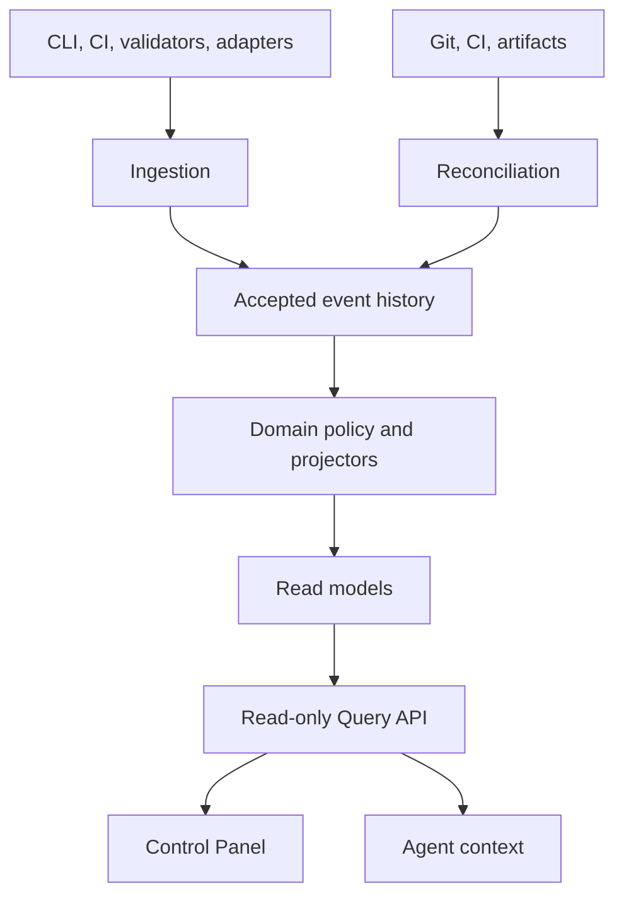

# Harness Platform V1.1 architecture

Status: PROPOSED
Implementation: NOT_IMPLEMENTED
Verification: NOT_VERIFIED

## Context

Harness Blueprint produces repository-local truth and evidence. Platform V1.1
must aggregate that state across projects without becoming the authority for
code, Docs, validator results, or evidence bytes. It must also supply stable
read contracts to the first-party panel and authorized agents.

## Decision

Use an event-backed read platform with explicit producer, domain, projection,
query, and presentation boundaries:



## Component responsibilities

| Component | Owns | Must not own |
| --- | --- | --- |
| Producer contracts | Result Envelope schema, identity, local validation | Platform storage implementation |
| Durable outbox/reporters | Retryable publication of completed source results | Re-running validators to repair delivery |
| Ingestion | Authentication, parsing, idempotency, quarantine | Deriving UI state directly |
| Accepted event history | Append-only operational facts | Mutable current projections |
| Domain policy | Criteria, conflicts, verification, freshness semantics | Browser presentation |
| Projectors | Deterministic current read models and watermarks | Authoritative evidence bytes |
| Reconciler | Source-gap detection and repair facts | Editing accepted history |
| Query API | Authorized, versioned, exact-SHA read resources | Direct database exposure or write tools |
| Agent context adapter | Bounded optional context after repository routing | Replacing repository Docs or checks |
| Control Panel | Human inspection and navigation | Project truth or write authority |

## Proposed package boundaries

Physical paths finalized at HP0 (2026-07-28); scaffold at HP1:

```text
packages/platform-contracts/     @blueprint-harness/platform-contracts
packages/platform-domain/          @blueprint-harness/platform-domain
packages/platform-client/          @blueprint-harness/platform-client
apps/platform-api/                 @blueprint-harness/platform-api
apps/platform-workers/             @blueprint-harness/platform-workers
apps/control-panel/                @blueprint-harness/control-panel
```

Record of truth: `docs/generated/platform-activation-baseline.md`.

A modular-monolith deployment may combine `platform-api` and workers in one
runtime if approved. Logical boundaries remain:

```text
contracts
→ domain/application
→ ports
→ infrastructure
→ delivery
```

Control Panel depends only on `platform-client` and public contracts. It cannot
import domain, persistence, event-store, or worker implementation.

## Dependency rules

- Blueprint packages do not import Platform packages.
- Platform reporters may integrate with stable Blueprint output contracts.
- Platform Core cannot import Control Panel code or UI dependencies.
- Query API cannot expose database rows as its public model.
- Projectors depend on accepted event contracts and domain policy, not HTTP.
- Infrastructure implements ports owned by Platform application/domain layers.
- Panel feature modules consume parsed panel-domain values, not raw transport.

## Repository-first degradation

```text
Platform unavailable
→ local Harness result remains valid
→ durable delivery becomes SYNC_PENDING
→ current Platform views become DATA_STALE
→ new Platform VERIFIED snapshot is blocked
→ repository routing, checks, and CI continue
```

This direction is mechanically tested. A Platform health call is never a
prerequisite for `harness check`.

## Identity model

Material state is scoped by:

```text
tenantId
projectId
repositoryId
branch where applicable
full Git SHA
policy/config/schema/checksum identities
```

Symbolic HEAD is resolved to an exact SHA at an observation time. Every query
that can differ by commit returns the exact SHA used.

## Internal delivery gates

The architecture is delivered by one ExecPlan with two internal gates:

```text
Platform Core + Query API
→ PLATFORM_QUERY_API_READY
→ Control Panel
→ CONTROL_PANEL_PILOT_READY
→ HARNESS_PLATFORM_V1_1_GATE
```

These gates are technical dependencies inside one release, not separate active
ExecPlans.

## Validation

- package dependency tests;
- no Blueprint-to-Platform import fixture;
- no Platform Core-to-panel import fixture;
- no panel-to-storage import fixture;
- outage test proving repository-first operation;
- exact-SHA and cross-project isolation fixtures;
- deterministic projection rebuild;
- API compatibility and authorization tests;
- real-browser panel validation.

## Consequences

- Platform storage can evolve without changing panel feature components.
- Current query state is disposable and rebuildable.
- Append-only history increases operational and retention responsibility.
- One release plan simplifies activation and evidence, while internal gates
  preserve safe implementation order.

## References

- Product Spec: `../product-specs/harness-platform-v1.1.md`
- Events: `event-ingestion-and-projections.md`
- Query consumer: `control-panel-architecture.md`
- Single-plan decision: `../adr/ADR-PLATFORM-004-unified-platform-panel-execplan.md`
