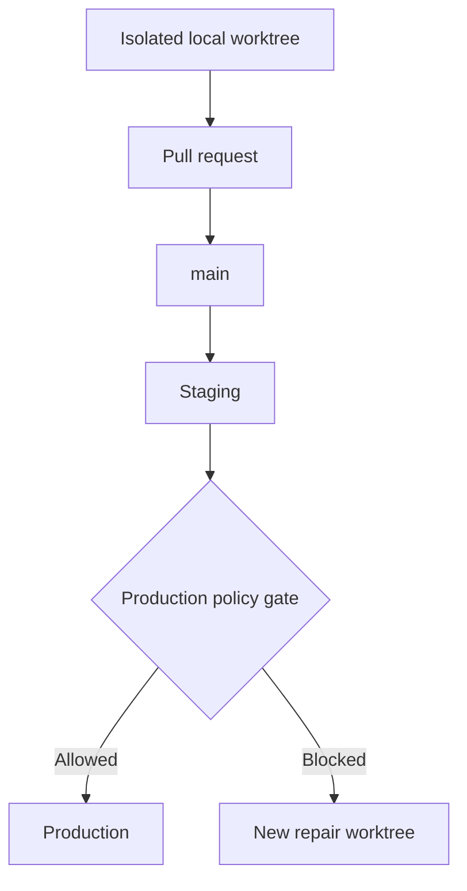
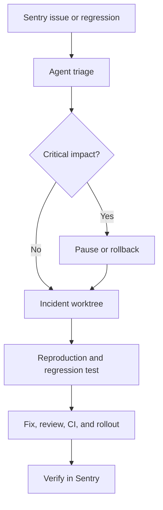

# Release and autonomy

Status: APPROVED  
Verification: NOT_VERIFIED

## Goal

Move verified changes from `main` to production through immutable artifacts,
observable rollout, bounded permissions, reliable recovery, and evidence-based
autonomy promotion.

## Environment progression



Local, staging, and production use separate data boundaries, secrets, and
integration identities. Staging contains no unapproved production data.

## Immutable artifact

A commit on `main` is built once. The resulting identified and checksummed
artifact is deployed to staging and the same bytes are promoted to production.
Only environment configuration, secrets, approved limits, and feature flags may
vary. Direct worktree deployment, local uncommitted deployment, server patching,
and rebuilding different production bytes are prohibited.

## Release states

```text
CREATED
STAGING_DEPLOYED
STAGING_VERIFIED
PRODUCTION_READY
CANARY
OBSERVING
ROLLING_OUT
PRODUCTION_VERIFIED
```

Exceptional states are `ROLLOUT_PAUSED`, `ROLLBACK_RUNNING`, `ROLLED_BACK`,
`RELEASE_FAILED`, and `HUMAN_JUDGMENT_REQUIRED`.

## Progressive rollout

The Stack Profile selects a platform-supported strategy: canary, blue-green,
rolling, or atomic replacement with fast rollback. Project-specific thresholds
and observation windows live in `../RELIABILITY.md`. No universal traffic
percentages are assumed.

Rollout stops when critical journeys, security, data integrity, health,
approved error or latency thresholds, or agent evaluation baselines fail.

## Recovery order

For a serious production regression:

1. stop traffic expansion;
2. preserve evidence;
3. restore the last verified artifact;
4. verify recovery;
5. open or update the incident;
6. diagnose in a new isolated worktree;
7. add a reproducing regression test;
8. deliver a normal reviewed PR and new release.

Rollback never rebuilds an old version. If rollback cannot restore stability,
the system freezes autonomy and escalates.

## Database changes

Migrations are classified as `NONE`, `ADDITIVE`, `TRANSFORMATIVE`, or
`DESTRUCTIVE`. Transformative work requires a dedicated migration plan.
Destructive work blocks autonomous deployment.

Use expand-contract: add compatible structures, deploy dual-compatible code,
migrate and verify data, then remove the old structure in a later separately
approved release. Application rollback must remain possible throughout the
compatible window.

## Sentry incident loop

Sentry supplies production error, trace, release, and impact context to a
read-only triage integration. A qualifying fingerprint starts one locked
incident workflow and one worktree.



The agent does not patch production through Sentry and does not mark an issue
resolved until the fix is deployed and stable through the approved observation
window. Failure to reproduce becomes `REPRODUCTION_NOT_CONFIRMED`; speculative
high-risk fixes may not auto-deploy.

## Production permission model

Agents invoke narrow, audited pipeline operations: deploy a verified artifact,
pause or resume rollout, rollback to a verified target, run smoke tests, run an
approved migration, or freeze autonomy. They do not receive unrestricted SSH,
long-lived credentials, secret-reading capability, or direct production
database writes.

Use separate observer, deployer, and migrator identities. Prefer short-lived
workload identity. Production diagnostic queries are approved, read-only,
limited, redacted, timed, and audited. Production data is not copied into a
worktree.

## Autonomy dimensions

Plan approval, merge, staging deployment, production deployment, rollback, and
incident response are independent capabilities. A repository may, for example,
allow automatic merge and staging while production still requires approval.

### Levels

| Level | Capability |
| --- | --- |
| A0 OBSERVE | Agent recommends; human approves plan, merge, and production |
| A1 EXECUTE | Agent implements and prepares clean PRs; human approves merge and production |
| A2 AUTO_MERGE | Agent merges promoted risk classes; production remains manual |
| A3 AUTO_DEPLOY_SAFE | Agent deploys promoted reversible low-risk classes |
| A4 POLICY_AUTONOMOUS | Agent operates end-to-end inside approved policy and escalates judgment |

## Promotion defaults

- A1 to A2: at least 10 consecutive qualifying PRs, all required gates passed,
  no critical regression, bypass, or documentation drift, and independent
  evaluator approval.
- A2 to A3: at least 5 manually approved production releases, working staging,
  Sentry correlation, rollout-stop drill, rollback drill, and no agent-caused
  SEV-1 or SEV-2.
- A3 to A4: at least 20 autonomous releases over at least 30 days, complete
  observability, correct escalation and rollback behavior, no policy bypass,
  incident drill, independent sample audit, and no critical release debt.

Only deployments exposed to real or representative traffic and observed for
the configured window count as evidence. An agent may recommend promotion but
only a human can approve the policy change.

## Automatic downgrade

Protective downgrade is immediate. SEV-1, policy bypass, data-integrity loss,
failed rollback, unavailable monitoring, invalid artifact provenance, or an
agent attempting to grant itself permission triggers `AUTONOMY_FREEZE` and may
return the repository to A0. Only a human can restore privilege after a freeze.

## Quality prerequisites

Auto-merge requires the affected area to be at least grade B with no D, F, or
UNVERIFIED changed surface. Safe production autonomy requires grade A for
Reliability, Security, Observability, and Rollback. A4 also requires all
critical domains at least B and the entire release and recovery path at A.

## Production gate

Before production autonomy can be enabled, a controlled reference exercise
proves artifact integrity, staging, rollout, Sentry detection, automatic pause,
rollback, incident worktree, regression repair, permission boundaries, audit,
monitoring failure freeze, and recovery release.

Passing the technical gate proves capability but does not replace the real
evidence windows required for promotion.

## Provenance

- OPENAI-CONFIRMED: agent-generated CI and release tooling, operational product,
  build failure remediation, agent-driven merge, observable feedback loops, and
  escalation when judgment is required.
- RECONSTRUCTED: exact environment path, immutable artifact contract, rollout,
  release states, permission identities, autonomy levels, counts, and gates.
- SELLGENIUS-EXTENSION: Sentry-triggered incident response and production
  policy controls.
