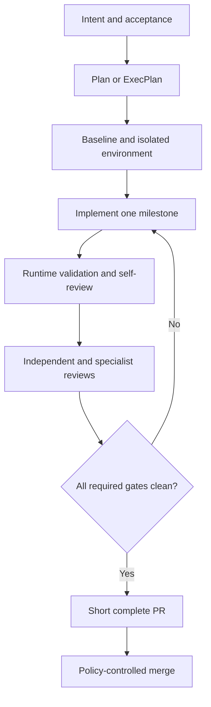

# Task execution and review loop

Status: APPROVED  
Verification: NOT_VERIFIED

## Operating contract

Humans provide intent and judgment. Agents execute the complete engineering
loop. A human may inspect every diff and artifact but is not required to author
individual lines of production code.

## Plan selection

Use a lightweight plan for a small, local, reversible task with obvious
acceptance. Use an ExecPlan for complex, multi-hour, cross-module, architectural,
API-, schema-, security-, reliability-, refactor-, migration-, or handoff-prone
work.

The agent authors and maintains the plan. Initially, a human approves an
ExecPlan before implementation. Later, only explicitly promoted low-risk plan
classes may pass without manual approval.

## One task, one worktree

An active task or ExecPlan owns one branch, worktree, isolated runtime, evidence
directory, and review thread. Parallel agents do not share mutable application
state.

## Lifecycle

## Required evidence

A behavioral change records:

- baseline result;
- reproduction or initial state;
- acceptance criteria;
- tests added or changed;
- real runtime validation appropriate to the system type;
- relevant logs, metrics, traces, DOM snapshots, screenshots, API responses,
  queue state, agent evaluations, or emulator evidence;
- checks and reviewers used;
- final result;
- remaining limitations and rollback path.

## Review layers

### Implementer self-review

The implementer compares the diff with intent, acceptance, relevant Docs,
architectural invariants, edge cases, tests, runtime behavior, and unrelated
changes. Self-review is mandatory but not sufficient.

### Independent reviewer

A separate read-only reviewer checks correctness, specification alignment,
architecture, boundary validation, error behavior, tests, regressions,
legibility, and proportional abstraction.

### Specialist reviewers

Risk triggers security, reliability, migration, frontend, or agent-evaluation
review. Specialists are additive; they do not replace general review.

### Cloud review

CI, Cursor Bugbot, and configured Cloud Agent reviews inspect the PR. Every
actionable finding is fixed, disproved with concrete evidence, or escalated. It
cannot be silently marked resolved.

## Clean definition

A change is clean when:

- `harness check --full` passes;
- required CI is green;
- no actionable reviewer or Bugbot finding remains;
- acceptance evidence exists;
- the running system was validated where applicable;
- Docs and diagrams are current;
- the living plan reflects actual progress and decisions;
- rollback or recovery is appropriate to risk;
- no unresolved conflict with `main` exists.

## Short, complete PRs

One ExecPlan may span several PR milestones. Each PR delivers one coherent,
independently verifiable result, keeps the repository working, includes tests,
avoids unrelated refactors, updates plan progress, and is deployable or safely
disabled behind an approved feature mechanism.

Split work when distinct milestones, broad review surfaces, migrations and UI
or operations, different rollback risks, branch drift, or unclear evidence make
one PR difficult to reason about. Line count alone is not a split criterion.

## CI failure classification

| Classification | Response |
| --- | --- |
| CODE_FAILURE | Fix implementation |
| TEST_FAILURE | Fix the test or escalate a specification conflict |
| INFRA_FAILURE | Controlled rerun with captured evidence |
| FLAKY_SUSPECTED | Reproduce in a clean environment and diagnose |
| UNKNOWN_FAILURE | Block and escalate |

At most two controlled reruns are permitted by the BASE default. Blind rerun
until green is forbidden. A confirmed flaky test protecting security, data,
migrations, authorization, payments, critical user journeys, acceptance, or an
architectural invariant always blocks. A narrow temporary exception for a
non-critical flake requires evidence, explicit tracking in the existing debt
tracker, and initial human approval.

## Merge readiness

The final report uses `READY_FOR_MERGE` or `BLOCKED`. It summarizes acceptance,
checks, CI, reviews, runtime evidence, documentation, rollback, and remaining
risk. Before merge the agent synchronizes with current `main`, resolves safe
conflicts, and repeats affected validation.

A conflict that changes product behavior, public API, data model, domain
boundaries, or security becomes `HUMAN_JUDGMENT_REQUIRED`.

## Merge

The default strategy is one logical squash commit per PR. Initially, humans
approve merge. After promotion, agents may squash and merge policy-compliant
classes. Merge permission is independent from production deployment permission.

## Plan closure

A milestone PR updates an active ExecPlan but does not close it. The final PR
adds outcomes and retrospective, records remaining debt, supplies acceptance
evidence, and moves the plan from `active/` to `completed/`. Abandoned or
partially completed plans are also moved to `completed/` with an explicit final
state and consequences.

## Provenance

- OPENAI-CONFIRMED: prompt-driven work, self-review, local and cloud agent
  reviews, feedback iteration until reviewers are satisfied, short-lived PRs,
  minimal blocking gates, follow-up runs for flakes, and agents often squashing
  and merging their own PRs.
- RECONSTRUCTED: exact classifications, two-rerun default, report schema,
  exception protocol, and staged merge permission.
- CURSOR-ADAPTER: worktrees, Bugbot, subagents, Cloud Agents, and Cursor Browser.
