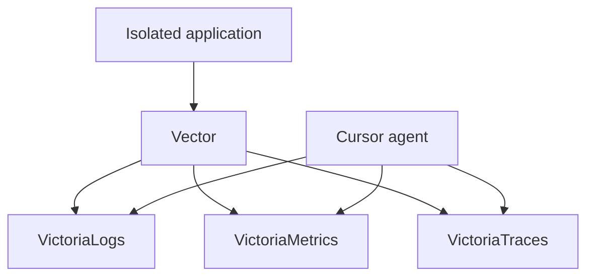

# Worktree and observability

Status: APPROVED  
Verification: NOT_VERIFIED

## Goal

Give every active agent a complete, isolated, directly observable version of
the system so it can reproduce behavior and verify outcomes without relying on
human screenshots, copied logs, or shared mutable state.

## Worktree environment

`harness env up` provisions, and `harness env down` safely removes, resources
tagged with the exact worktree identifier. `harness env status` reports their
health and connection details without exposing secrets.

Each environment receives:

- a unique worktree and branch;
- unique ports and configuration;
- an isolated database boundary;
- isolated cache, queue, and service namespaces where used;
- an application instance;
- isolated logs, metrics, traces, and evidence artifacts.

## Database isolation priority

1. dedicated ephemeral database service instance;
2. separate database on a shared local server;
3. separate schema only when the previous options are impractical.

Production and shared staging are never used for task environments. Startup
creates the boundary, runs migrations, loads deterministic seed data, and waits
for health checks. Cleanup removes only resources whose exact ownership tag
matches the worktree and preserves repository history and evidence.

## Runtime controllers

| System form | Required controller and evidence |
| --- | --- |
| Web frontend | Cursor Browser, DOM snapshots, screenshots, console, and network |
| API | HTTP client, contract assertions, logs, and traces |
| Worker | Queue fixtures, job state, side-effect evidence, and traces |
| Agentic system | Conversations, evaluations, model and tool traces, step limits |
| Mobile | Emulator or device controller, screenshots, logs, and network |

Browser control is required only when a frontend exists. Every behavior change
captures a before and after state appropriate to its system form.

## Local observability topology



- Logs are queried with LogQL-compatible interfaces.
- Metrics are queried with PromQL.
- Traces are queried with TraceQL-compatible interfaces.

The implementation must validate the exact supported query APIs of selected
versions. The conceptual contract is queryable local logs, metrics, and traces
for each isolated worktree.

## Correlation contract

Telemetry uses consistent fields where applicable:

```text
worktreeId
environment
release
traceId
requestId
domain
operation
```

Domain identifiers may be added when safe. Secrets, credentials, message
content, and unnecessary personal data are redacted before export.

## One instrumentation contract

Application code emits one semantic instrumentation model through a central
provider. Environment configuration selects exporters:

- local development routes detailed telemetry through Vector and Victoria;
- production routes curated errors, traces, and performance signals to Sentry
  and any approved operational backend.

Expected domain outcomes are not reported as Sentry errors. Duplicate
instrumentation paths are prohibited.

## Validation loop

The agent selects a target behavior, records baseline evidence, exercises the
runtime, correlates telemetry, implements a change, restarts only the owned
environment, repeats the workload, and records the resulting evidence. It
continues until acceptance and all relevant checks pass.

## Safety and cleanup

- Environment commands are idempotent.
- Cleanup never uses a broad unresolved path, variable, namespace, or wildcard.
- Worktree ownership is validated before deletion.
- Production credentials are not injected into local environments.
- Synthetic or explicitly approved non-production data is used.
- Failed cleanup reports exact remaining resources and safe recovery steps.

## Reference gate

The profile gate starts two worktrees concurrently and proves distinct ports,
database state, telemetry, application state, and artifacts. It interrupts and
resumes one environment, tears both down, and proves that neither modified the
other or any shared production-like resource.

## Provenance

- OPENAI-CONFIRMED: application bootable per worktree, Chrome DevTools control,
  DOM snapshots, screenshots and navigation, ephemeral isolated observability,
  Vector, Victoria logs/metrics/traces, and agent-queryable signals.
- RECONSTRUCTED: exact environment commands, isolation priority, identifiers,
  cleanup contract, controller matrix, and reference gate.
- CURSOR-ADAPTER: Cursor Worktrees and Browser.
- SELLGENIUS-EXTENSION: production Sentry export alongside the local OpenAI
  observability pattern.
