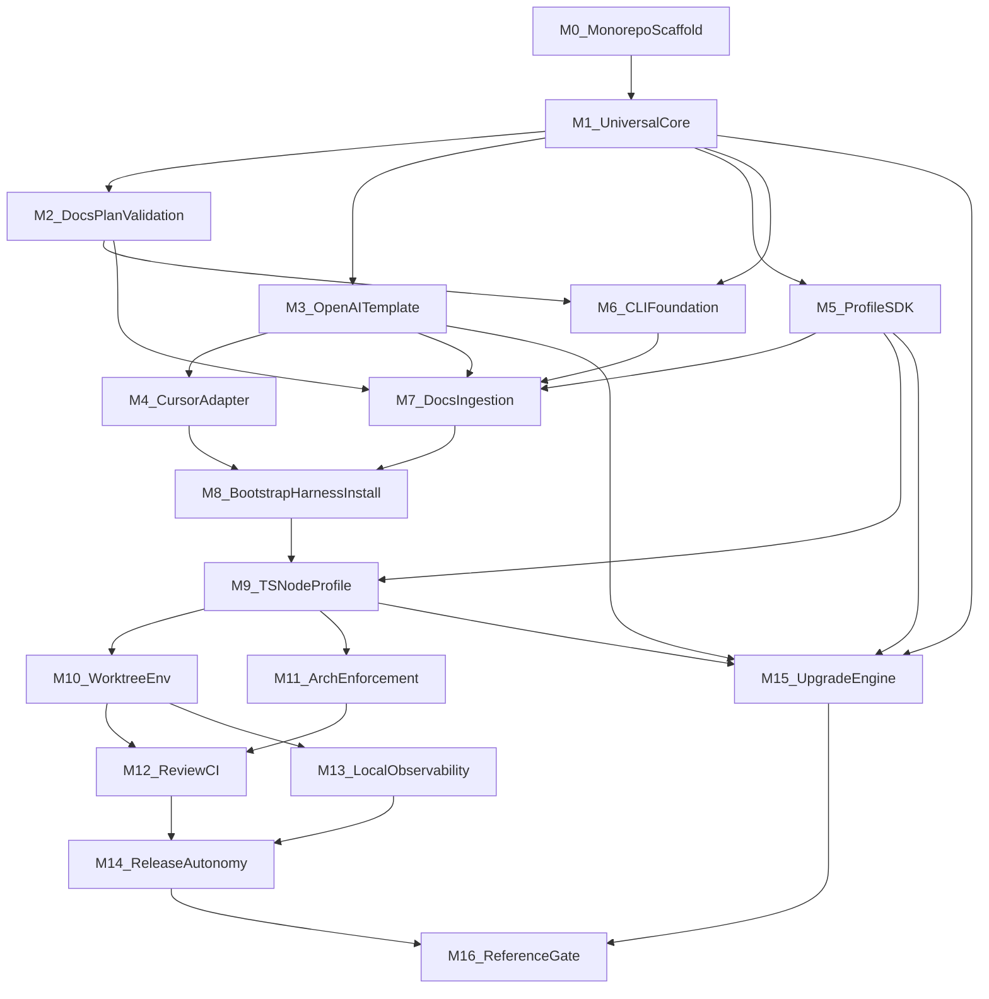

# Build Harness Blueprint V1

Status: ACTIVE  
Plan ID: build-harness-blueprint-v1  
Created: 2026-07-21  
Owner: agent (human approval required for material changes)  
Final gate: `HARNESS_BLUEPRINT_V1_GATE`

---

## Purpose / Big Picture

Deliver **Harness Blueprint V1**: a versioned factory that bootstraps agent-legible,
mechanically enforced project repositories from approved Docs. A system architect
can run:

```text
npx @sellgenius/harness init --docs ./project-docs
```

and receive a minimal runnable foundation with OpenAI knowledge layout, Cursor
adapter, resolved `typescript-node` profile (including the reference capability
set), worktree isolation, architecture enforcement, CI/review workflow,
observability, release/rollback/autonomy controls, and a controlled upgrade path.

**Success is observable when:**

1. The Blueprint monorepo builds, tests, and passes `harness check --full` on `main`.
2. A reference project bootstraps from approved Docs, passes all reference gates,
   and a second bootstrap run produces no unintended diff.
3. The final milestone emits **`HARNESS_BLUEPRINT_V1_GATE: PASS`** with linked evidence.
4. [`docs/QUALITY_SCORE.md`](../../QUALITY_SCORE.md) grades move from UNVERIFIED to
   evidenced grades where controls exist.

**V1 scope** follows [`docs/product-specs/harness-blueprint.md`](../../product-specs/harness-blueprint.md).
**V1 exclusions:** all languages/clouds, speculative capabilities, unrestricted
production access, and a frontend for this Blueprint repository itself
([`docs/FRONTEND.md`](../../FRONTEND.md) = NOT_APPLICABLE).

---

## Progress

Last updated: 2026-07-23 (M1 complete)

| Milestone | Proposed PRs | Status | Notes |
| --- | --- | --- | --- |
| M0 Monorepo scaffold | 1+ small PRs | `[x]` complete | pnpm workspace + 5 package stubs; Vitest smoke tests; [PR #1](https://github.com/SebastianZakrzewski/blueprint_harness/pull/1) |
| M1 Universal Core | 1+ small PRs | `[x]` complete | Core contracts in `packages/core`; 23 unit tests; [PR #2](https://github.com/SebastianZakrzewski/blueprint_harness/pull/2) |
| M2 Docs and ExecPlan validation | 1+ small PRs | `[ ]` remaining | Core only; no CLI dependency |
| M3 OpenAI Repository Template | 1+ small PRs | `[ ]` remaining | |
| M4 Cursor adapter | 1+ small PRs | `[ ]` remaining | |
| M5 Profile SDK | 1+ small PRs | `[ ]` remaining | |
| M6 CLI foundation | 1+ small PRs | `[ ]` remaining | Wraps M2 `validate-docs` |
| M7 Docs discovery, mapping, manifest | 1+ small PRs | `[ ]` remaining | |
| M8 Bootstrap init (HARNESS_INSTALLED) | 1+ small PRs | `[ ]` remaining | Self-apply at HARNESS_INSTALLED |
| M9 TypeScript/Node profile + scaffold | 3 proposed internal PRs | `[ ]` remaining | See M9 PR boundaries |
| M10 Worktree and isolated environment | 1+ small PRs | `[ ]` remaining | |
| M11 Architecture lints and structural tests | 1+ small PRs | `[ ]` remaining | |
| M12 Review and CI workflow | 1+ small PRs | `[ ]` remaining | |
| M13 Local observability stack | 1+ small PRs | `[ ]` remaining | OD-003 pins required to complete |
| M14 Release, rollback, recovery, autonomy | 3 proposed internal PRs | `[ ]` remaining | See M14 PR boundaries |
| M15 Upgrade Engine | 1+ small PRs | `[ ]` remaining | |
| M16 Reference validation and V1 gate | 3 proposed internal PRs | `[ ]` remaining | See M16 PR boundaries |

**Active milestone:** M2 Docs and ExecPlan validation.

**Blocked:** none for local V1 implementation. OD-001 blocks npm publication only.
OD-003 blocks **completion** of M13 until version pins are recorded.

---

## Surprises & Discoveries

| Date | Discovery | Evidence | Consequence |
| --- | --- | --- | --- |
| 2026-07-21 | Repository is documentation-only; no `packages/`, no `harness` CLI, no CI | `glob **/*` returns 25 markdown files only | M0 must establish all executable infrastructure; interim validation uses `pnpm` until M6 |
| 2026-07-21 | `docs/exec-plans/active/` did not exist | Only `docs/exec-plans/tech-debt-tracker.md` present | This plan creates the first active ExecPlan |
| 2026-07-21 | `docs/references/` listed in knowledge layout but empty | Directory absent | M3 template must create empty `docs/references/` in generated projects |
| 2026-07-21 | All canonical docs are APPROVED / NOT_VERIFIED | Consistent across index files | Implementation must produce verification evidence; do not mark docs VERIFIED without tests |
| 2026-07-22 | `pnpm` unavailable via corepack on Windows without admin; npm global install required `NODE_OPTIONS=--use-system-ca` | `corepack enable` EPERM; `npm install -g pnpm` cert error without flag | Document prerequisite in PR; use `npm install -g pnpm@9` with system CA on affected hosts |

---

## Decision Log

| ID | Date | Status | Decision | Affected milestones | Approval |
| --- | --- | --- | --- | --- | --- |
| OD-001 | 2026-07-21 | **DEFERRED** | npm scope `@sellgenius/harness`; registry and publication policy undecided. **Must not block implementation.** Required before npm publication. | Publish step (post-V1 gate) | **HUMAN_JUDGMENT_REQUIRED** before publish |
| OD-002 | 2026-07-21 | **RESOLVED** | **Docker Compose** is the reference deployment platform for V1 container delivery. | M9, M14, M16 | Human review 2026-07-21 |
| OD-003 | 2026-07-21 | **DEFERRED** | Vector/Victoria versions pinned during M13 using a verified compatibility matrix. **M13 cannot complete** until versions and query fixtures are recorded in Decision Log. | M13 | Human approves pins at M13 |
| OD-004 | 2026-07-21 | **RESOLVED** | **Local Supabase** is the default for validation, CI, worktree isolation, and the reference gate. Remote Supabase is optional and must not be required by V1 gates. | M9, M10, M16 | Human review 2026-07-21 |
| OD-005 | 2026-07-21 | **RESOLVED** | Inspectable in-repo fixture at `fixtures/reference-project/`. Additionally test clean project generation in a **temporary directory** (not committed). | M9, M16 | Human review 2026-07-21 |
| OD-006 | 2026-07-21 | **RESOLVED** | Blueprint self-applies during **M8** when `harness init` reaches **HARNESS_INSTALLED**. | M8 | Human review 2026-07-21 |
| OD-007 | 2026-07-21 | **RESOLVED** | Capability composition order: **base → NestJS → database/Drizzle → Supabase → Mastra → observability**. Omitted capabilities must not generate unrelated code. See [Capability composition](#capability-composition-od-007). | M9, M13 | Human review 2026-07-21 |
| OD-008 | 2026-07-21 | **DEFERRED (APPROVED)** | Production rollout thresholds remain `UNDEFINED` for V1 unless defined from reference-project evidence and human approval. Prevents production autonomy above permitted level; **does not block** local V1 reference gate. | M14, M16 | Per [`docs/RELIABILITY.md`](../../RELIABILITY.md) |
| OD-009 | 2026-07-21 | **RESOLVED** | Validation logic in `packages/core`. `packages/cli` contains only the CLI wrapper for `harness validate-docs`. M2 does not depend on the final Harness CLI. | M2, M6 | Human review 2026-07-21 |
| PLAN-001 | 2026-07-21 | **RESOLVED** | 17 milestones (M0–M16). **One milestone = one independently verifiable outcome.** A milestone may use one or more small, reviewable, reversible PRs. Do not force a total PR count before evidence exists. | All | Human review 2026-07-21 |
| PLAN-002 | 2026-07-21 | **ACTIVE** | Interim validation ladder per phase; see [Interim validation ladder](#interim-validation-ladder). | M0–M16 | Agent |
| PLAN-003 | 2026-07-22 | **RESOLVED** | ExecPlan approved for implementation. M0 monorepo scaffold complete; active milestone is M1. | M0–M16 | Independent review 2026-07-22 |
| PLAN-004 | 2026-07-23 | **RESOLVED** | M1 Universal Core merged on `main` (`7d059e0`). Gate: `pnpm --filter @blueprint-harness/core test` (23/23). | M1 | [PR #2](https://github.com/SebastianZakrzewski/blueprint_harness/pull/2) |
| PLAN-005 | 2026-07-23 | **DEFERRED** | `ValidationResult.ok` vs `findings` relationship undefined in canonical docs. M1 schema keeps fields independent; M2 `validate-docs` producers must set semantics before shipping. | M2 | Agent; resolve at M2 start |

---

## Outcomes & Retrospective

_Pending plan completion. Do not fill until M16 closes._

At closure, record:

- Whether `HARNESS_BLUEPRINT_V1_GATE: PASS` was achieved.
- What shipped vs deferred.
- Evidence links (CI runs, gate logs, PR URLs).
- Remaining debt (if any) with entries in [`tech-debt-tracker.md`](../tech-debt-tracker.md).
- Lessons for future ExecPlans.

---

## Context and Orientation

### What this repository is today

The **Harness Blueprint** central repository contains canonical documentation
plus a **pnpm + TypeScript monorepo** with **Universal Core contracts** in
`packages/core` (M1). CLI commands and CI workflows are not yet implemented.
Product and design specifications remain **APPROVED / NOT_VERIFIED**.

### What V1 must become

Five versioned components per [`ARCHITECTURE.md`](../../../ARCHITECTURE.md) and
[`docs/design-docs/blueprint-architecture.md`](../../design-docs/blueprint-architecture.md):

```text
packages/
├── cli/                  # Harness CLI
├── core/                 # Universal Core
├── template-openai/      # OpenAI Repository Template
├── profile-sdk/          # Profile SDK contract
└── profiles/
    └── typescript-node/  # First Stack Profile
```

The central Blueprint repository applies its own Harness to itself during **M8**
when `harness init` reaches **HARNESS_INSTALLED** (OD-006).

### Implementation status matrix

| Item | State |
| --- | --- |
| Canonical docs (AGENTS.md, ARCHITECTURE.md, docs/**) | **IMPLEMENTED** |
| Product specs and design docs | **IMPLEMENTED** (approved, not verified against code) |
| This ExecPlan | **IMPLEMENTED** (approved 2026-07-22; see PLAN-003) |
| Monorepo scaffold (`pnpm`, `packages/*`) | **IMPLEMENTED** (M0; local `pnpm -r build/test` green) |
| Universal Core | **IMPLEMENTED** (M1; `pnpm --filter @blueprint-harness/core test` 23/23) |
| Docs/ExecPlan validation library (`packages/core`) | **APPROVED, NOT IMPLEMENTED** |
| OpenAI Repository Template | **APPROVED, NOT IMPLEMENTED** |
| Cursor adapter | **APPROVED, NOT IMPLEMENTED** |
| Profile SDK | **APPROVED, NOT IMPLEMENTED** |
| `typescript-node` profile | **APPROVED, NOT IMPLEMENTED** |
| CLI (`harness` commands) | **APPROVED, NOT IMPLEMENTED** |
| Docs ingestion / manifest / mapping | **APPROVED, NOT IMPLEMENTED** |
| Bootstrap `init` lifecycle | **APPROVED, NOT IMPLEMENTED** |
| Worktree / env lifecycle | **APPROVED, NOT IMPLEMENTED** |
| Architecture lints / structural tests | **APPROVED, NOT IMPLEMENTED** |
| Review / CI workflow | **APPROVED, NOT IMPLEMENTED** |
| Observability (Vector/Victoria) | **APPROVED, NOT IMPLEMENTED** |
| Release / rollback / autonomy | **APPROVED, NOT IMPLEMENTED** |
| Upgrade Engine | **APPROVED, NOT IMPLEMENTED** |
| Reference project gates | **APPROVED, NOT IMPLEMENTED** |
| Reference fixture `fixtures/reference-project/` | **APPROVED, NOT IMPLEMENTED** |
| npm publication (`@sellgenius/harness`) | **DEFERRED** (OD-001; blocks publish only) |
| Reference deployment platform | **RESOLVED** — Docker Compose (OD-002) |
| Supabase gate mode | **RESOLVED** — local Supabase default (OD-004) |
| Capability composition order | **RESOLVED** (OD-007) |
| Vector/Victoria version pins | **DEFERRED** to M13 (OD-003) |
| Production rollout thresholds | **DEFERRED** (OD-008; blocks A3+ only) |

### Terminology

| Term | Meaning |
| --- | --- |
| Blueprint | This versioned factory repository and its published packages |
| Core | Technology-neutral policy, invariants, lifecycle, ownership |
| Profile | Stack-specific implementation of the Profile SDK |
| Capability | Optional module within a profile (e.g. database, agent runtime) |
| Bootstrap | `harness init` converting Docs + repo into a validated foundation |
| Gate | Automated check suite that must pass before a milestone or release closes |
| MERGE_CONTROLLED | Shared file class requiring three-way merge on upgrade |
| BLUEPRINT_MANAGED | Operational file updated only through upgrade PR |

### Documentation consulted

- [`AGENTS.md`](../../../AGENTS.md)
- [`ARCHITECTURE.md`](../../../ARCHITECTURE.md)
- [`docs/PLANS.md`](../../PLANS.md)
- [`docs/product-specs/index.md`](../../product-specs/index.md) and all four product specs
- [`docs/design-docs/index.md`](../../design-docs/index.md) and all eight design docs
- [`docs/PRODUCT_SENSE.md`](../../PRODUCT_SENSE.md)
- [`docs/DESIGN.md`](../../DESIGN.md)
- [`docs/FRONTEND.md`](../../FRONTEND.md)
- [`docs/RELIABILITY.md`](../../RELIABILITY.md)
- [`docs/SECURITY.md`](../../SECURITY.md)
- [`docs/QUALITY_SCORE.md`](../../QUALITY_SCORE.md)

### Invariants applied

- Repository-local versioned artifacts are the operational source of truth.
- External input is parsed and validated at system boundaries.
- Domain and layer dependency directions in `ARCHITECTURE.md` are enforced.
- No silent overwrites of project-owned or managed files.
- One task or ExecPlan uses one Git worktree and isolated environment.
- Agents may not disable checks, weaken assertions, or edit CI to bypass failure.
- `AUTONOMY_FREEZE` is always permitted; autonomy promotion requires human approval.
- Production changes flow through immutable artifact and release pipeline.

### Milestone dependency graph

M2 depends only on M1 (Core library). M6 depends on M1 and M2 (CLI wraps Core
validation). M2 does **not** depend on M6 or the final Harness CLI.



### Capability composition (OD-007)

Reference `typescript-node` capabilities install in this order. Each step depends
on the previous; omitted capabilities must not generate code, config, or
dependencies for unrelated stacks.

| Order | Capability | Depends on | Provides | If omitted |
| --- | --- | --- | --- | --- |
| 1 | `base` | — | Node/TS, pnpm, test runner, health route, minimal CI skeleton | N/A (required) |
| 2 | `nestjs` | `base` | NestJS app wiring, module layout, HTTP server | No NestJS files or deps |
| 3 | `database` (Drizzle + PostgreSQL) | `nestjs` | Schema, migrations, repo layer contracts | No DB drivers, schemas, or migration dirs |
| 4 | `supabase` | `database` | Local Supabase integration, auth/storage client wiring | No Supabase client or local stack config |
| 5 | `mastra` | `supabase` | Agent runtime, tool wiring, evaluation hooks | No Mastra packages or agent dirs |
| 6 | `observability` | `mastra` (or `base` if agent stack omitted) | Telemetry provider, Vector/Victoria hooks | No observability compose services or exporters |

`containers` (Docker Compose per OD-002) wraps deployable services for enabled
capabilities only. `sentry` export path is configured when `observability` is
present; it does not pull in unrelated application code.

---

## Plan of Work

Seventeen milestones (M0–M16). Each milestone delivers **one independently
verifiable outcome** and may span **one or more small, reviewable, reversible PRs**.
Do not force a total PR count before implementation evidence exists.

Every milestone merge (or final PR in a multi-PR milestone) must leave the
repository buildable and validated. Detailed specs follow in
[Milestone catalog](#milestone-catalog).

### Delivery model

| Rule | Meaning |
| --- | --- |
| Milestone outcome | One coherent, verifiable capability slice (e.g. M2 = docs validation library works) |
| PR sizing | Small, reviewable, reversible; split when rollback risk or review surface grows |
| Multi-PR milestones | Allowed when internal boundaries are clear (M9, M14, M16 propose defaults below) |
| Forbidden | Combining two milestone outcomes in one PR; skipping a milestone |

| Milestone | Summary | Depends on |
| --- | --- | --- |
| M0 | pnpm + TypeScript monorepo with package stubs | — |
| M1 | Universal Core types, invariants, schemas | M0 |
| M2 | Docs/ExecPlan validation library in Core (no CLI) | M1 |
| M3 | OpenAI knowledge layout template renderer | M1 |
| M4 | Cursor adapter generation | M3 |
| M5 | Profile SDK contract | M1 |
| M6 | CLI: `validate-docs` wrapper, `inspect`, `check` | M1, M2 |
| M7 | Docs discovery, manifest, mapping, validation | M2, M3, M5, M6 |
| M8 | `harness init` through HARNESS_INSTALLED + self-apply | M4, M7 |
| M9 | `typescript-node` profile + scaffold (3 proposed PRs) | M5, M8 |
| M10 | `harness env up\|down\|status` + isolation gate | M9 |
| M11 | Architecture lints + structural tests | M9 |
| M12 | GitHub CI + review workflow + merge report | M10, M11 |
| M13 | Vector/Victoria local observability | M10 |
| M14 | Release, rollback, recovery, autonomy (3 proposed PRs) | M12, M13 |
| M15 | Upgrade Engine | M1, M3, M5, M9 |
| M16 | Reference validation + V1 gate (3 proposed PRs) | M14, M15 |

---

## Concrete Steps

### Working directory

All commands assume repository root unless stated otherwise:

```text
c:/Users/devza/Desktop/blueprint_harness
```

Use an isolated worktree per milestone per [`AGENTS.md`](../../../AGENTS.md).
Before M10, worktree isolation for Blueprint development itself may use a
standard git worktree; full `harness env` commands apply from M10 onward.

### Interim validation ladder

Commands below are the **validated alternatives** per [`AGENTS.md`](../../../AGENTS.md).
Record the command used in each PR.

| Phase | Commands | Expected |
| --- | --- | --- |
| M0–M1 | `pnpm install && pnpm -r build && pnpm -r test` | Exit 0; all packages compile |
| M2–M5 | `pnpm --filter @blueprint-harness/core test` and `pnpm --filter @blueprint-harness/core run validate-docs` | Exit 0 on canonical docs; non-zero on negative fixtures |
| M6+ | `pnpm exec harness validate-docs` | Exit 0 on canonical docs (thin CLI wrapper over Core) |
| M6+ | `pnpm exec harness check --fast` | Exit 0; completes ≤30s on stub |
| Pre-PR (M6+) | `pnpm exec harness check --full` | Exit 0; all gates for milestone |
| M16 | `pnpm exec harness check --full` + gate script | `HARNESS_BLUEPRINT_V1_GATE: PASS` |

`harness validate-docs` is **NOT_AVAILABLE** until M6 merges. From M2 through M5,
use the Core package script `validate-docs` (temporary entry point) or the
matching test suite.

### M0–M1 manual checklist

Until M2 lands, verify manually:

- [x] `pnpm-workspace.yaml` lists all five packages
- [x] Package dependency graph matches `ARCHITECTURE.md` (cli → core, template, sdk; profiles → sdk, core) — no workspace edges wired yet (M1+)
- [x] `pnpm -r build` exits 0
- [x] `pnpm -r test` exits 0
- [x] No secrets in committed files

### Per-milestone workflow

1. Create worktree: `git worktree add ../blueprint_harness-mN -b milestone/mN-short-name`
2. Implement the active milestone scope only (one proposed internal PR at a time for multi-PR milestones).
3. Run milestone validation commands for that PR.
4. Update this plan's Progress and Decision Log.
5. Open a small PR with merge-readiness report (`READY_FOR_MERGE` or `BLOCKED`).
6. After the milestone's final PR merges, verify `main` passes milestone validation.
7. Do not combine two milestone outcomes in one PR.

### M16 final gate script (outline)

Implement as `scripts/gates/harness-blueprint-v1-gate.ts` (or equivalent) in M16:

```text
1. Validate fixtures/reference-project/ in-repo (inspectable reference)
2. Bootstrap from fixtures/reference-project/docs into a temp target directory
3. Run harness check --full on reference project (temp target)
4. Run two-worktree isolation gate
5. Run entropy/maintenance reference gate (docs/design-docs/entropy-and-maintenance.md)
6. Run upgrade round-trip fixture
7. Run release/rollback exercise fixture (Docker Compose per OD-002)
8. Re-run bootstrap into a fresh temp target; assert git diff --exit-code (idempotence)
9. Print HARNESS_BLUEPRINT_V1_GATE: PASS or FAIL with stable finding IDs
```

---

## Validation and Acceptance

### Plan-level acceptance (V1 complete)

| # | Criterion | Verification |
| --- | --- | --- |
| A1 | Reference project bootstraps from approved Docs | M16 gate log + fixture evidence |
| A2 | New agent navigates using only `AGENTS.md` and repo context | Independent agent smoke test in M16 |
| A3 | Invalid Docs, architecture, runtime, review, release, permission, entropy cases caught at stage gates | Negative fixtures per milestone |
| A4 | Valid reference change reaches `READY_FOR_MERGE` without false blocking | M12/M16 positive fixture |
| A5 | Re-running bootstrap and maintenance is idempotent | Second run `git diff --exit-code` |
| A6 | Autonomy cannot be self-granted or used to bypass controls | M14 HARNESS-001 + self-promotion fixtures |
| A7 | Entire reference gate suite passes | `HARNESS_BLUEPRINT_V1_GATE: PASS` |
| A8 | `harness check --full` green on Blueprint `main` | CI artifact |
| A9 | [`docs/QUALITY_SCORE.md`](../../QUALITY_SCORE.md) updated with evidence | Grade change history entries |

### Product spec scenario coverage

| Source | Scenarios | Milestone |
| --- | --- | --- |
| [`project-bootstrap.md`](../../product-specs/project-bootstrap.md) | 1–8 | M7, M8, M9, M16 |
| [`harness-upgrade.md`](../../product-specs/harness-upgrade.md) | 1–7 | M15, M16 |
| [`autonomous-task-lifecycle.md`](../../product-specs/autonomous-task-lifecycle.md) | 1–9 (applicable subset) | M12, M14, M16 |
| [`harness-blueprint.md`](../../product-specs/harness-blueprint.md) | Acceptance list | M16 |

---

## Idempotence and Recovery

### Per-milestone rollback

- **Action:** revert the PR(s) for that milestone on `main` (most recent first if multi-PR).
- **Verify:** prior milestone validation commands pass.
- **Safe:** yes, if no downstream milestone has merged.

### Bootstrap / init recovery

- Checkpoints recorded at each bootstrap state ([`docs-ingestion-and-bootstrap.md`](../../design-docs/docs-ingestion-and-bootstrap.md)).
- Re-run `harness init --docs <path>` resumes from last verified state.
- Failed state leaves repository at last completed checkpoint; no partial lock bump.

### Environment cleanup

```text
harness env down --worktree <worktreeId>
```

- Validates ownership tag before removing ports, DB, caches, telemetry namespaces.
- Never uses broad wildcards or unresolved paths.
- Failed cleanup reports remaining resources and safe manual steps.

### Upgrade recovery

- Failed upgrade leaves installed `harness.lock.json` at previous version.
- Partial metadata must not claim success.
- Resume from recorded upgrade checkpoint.

### Release / rollback

- Rollback promotes previous **verified artifact bytes**; does not rebuild old code.
- Rollback failure → `AUTONOMY_FREEZE` + `HUMAN_JUDGMENT_REQUIRED`.

### Escalation

Stop and report `HUMAN_JUDGMENT_REQUIRED` for: ambiguous product intent,
conflicting approved docs, material scope change, npm publication (OD-001),
security/legal tradeoffs, destructive migrations, missing rollback, or
attempting to complete M13 without OD-003 version pins recorded.

OD-001, OD-003 (until M13), and OD-008 do **not** block local V1 implementation
or the local reference gate.

---

## Artifacts and Notes

| Artifact | Location | When |
| --- | --- | --- |
| Milestone PRs | GitHub PR URLs | Each PR within M0–M16 |
| Gate logs | `artifacts/gates/` (create in M16) | M16 |
| Reference fixture (inspectable) | `fixtures/reference-project/` (OD-005) | M9/M16 |
| Temp bootstrap targets | OS temp dir or `./tmp/` (gitignored) | M8+ gates |
| CI runs | GitHub Actions | M12+ |
| This plan progress | This file | Every PR |

Do not commit secrets, production credentials, or unredacted telemetry payloads.

---

## Interfaces and Dependencies

### Public CLI commands (target)

| Command | Library (Core) | CLI wrapper | Milestone |
| --- | --- | --- | --- |
| `validate-docs` (Core script) | M2 | — | M2 |
| `harness validate-docs` | M2 | M6 | M6 |
| `harness inspect` | — | M6 | M6 |
| `harness check --fast\|--full` | partial M1 | M6 | M6 |
| `harness init --docs <path>` | M7, M8 | M8 | M8 |
| `harness env up\|down\|status` | M10 | M10 | M10 |
| `harness autonomy status` | M14 | M14 | M14 |
| `harness upgrade` | M15 | M15 | M15 |

### Package dependency direction (normative)

```text
packages/cli → core, template-openai, profile-sdk
packages/profiles/* → profile-sdk, core
packages/template-openai → core
packages/profile-sdk → core
Upgrade Engine (in core or dedicated package) → core, template-openai
```

Profiles may not redefine Core semantics.

### External dependencies (anticipated)

| Dependency | Milestone | Notes |
| --- | --- | --- |
| Node.js LTS | M0 | Pin in `.nvmrc` or `engines` |
| pnpm | M0 | Workspace manager |
| TypeScript | M0 | Strict mode |
| Vitest or Jest | M0 | Test runner |
| Git / git worktree | M8, M10 | Bootstrap and isolation |
| GitHub Actions | M12 | CI |
| Docker Compose | M9, M14, M16 | OD-002 resolved |
| PostgreSQL | M9 | `database` capability |
| Local Supabase CLI | M9, M10, M16 | OD-004 resolved; default for gates |
| Vector, Victoria* | M13 | OD-003 pins required to complete M13 |
| Sentry SDK | M9, M14 | Export path when observability enabled |

### Core exported contracts (M1)

- Invariant IDs: ARCH-001–HARNESS-001 per [`architecture-enforcement.md`](../../design-docs/architecture-enforcement.md)
- `ValidationResult` schema (human + machine readable, stable IDs)
- File ownership classes: `BLUEPRINT_MANAGED`, `PROJECT_OWNED`, `MERGE_CONTROLLED`, `GENERATED`
- Bootstrap state enum: DISCOVERED → COMPLETE per bootstrap design doc
- Policy evaluation interface for autonomy dimensions

---

## Risks

| ID | Risk | Likelihood | Impact | Mitigation |
| --- | --- | --- | --- | --- |
| R1 | OD-003 version pins delay M13 completion | Medium | Medium | Start M13 implementation; block completion until matrix recorded |
| R2 | M16 gate too large for one PR | Medium | Medium | Use three proposed internal PRs; build gate incrementally from M10 |
| R3 | Chicken-and-egg: harness CLI not available until M6 | High | Low | M2 uses Core `validate-docs` script; documented interim ladder |
| R4 | Observability stack flakiness in CI | Medium | Medium | Pin versions (OD-003); health waits; isolated ports |
| R5 | Scope creep into full application features | Medium | High | Scaffold contract + OD-007 omission rules |
| R6 | Self-application of harness breaks central repo | Low | High | MERGE_CONTROLLED for AGENTS.md; apply at M8 HARNESS_INSTALLED only |
| R7 | Reference stack complexity across M9 PRs | Medium | Medium | OD-007 order; three internal PR boundaries; capability flags |

---

## Rollback strategy

| Layer | Strategy |
| --- | --- |
| Milestone PR | Git revert; re-run prior milestone validation |
| Bootstrap | Resume from checkpoint; no overwrite of PROJECT_OWNED |
| Upgrade | Lock file unchanged on failure; branch discarded |
| Environment | `harness env down --worktree <id>` with tag validation |
| Release | Promote previous artifact; never rebuild |
| Autonomy | `AUTONOMY_FREEZE` automatic; human restores |

---

## Final completion criteria

1. `HARNESS_BLUEPRINT_V1_GATE: PASS` printed by gate script with evidence in `artifacts/gates/`.
2. `pnpm exec harness check --full` exits 0 on Blueprint `main`.
3. Reference bootstrap idempotent (second run: no unintended diff).
4. All applicable product-spec acceptance scenarios evidenced.
5. [`docs/QUALITY_SCORE.md`](../../QUALITY_SCORE.md) updated; no implementation area left UNVERIFIED without documented reason.
6. This plan's Outcomes & Retrospective completed.
7. Plan moved to `docs/exec-plans/completed/build-harness-blueprint-v1.md`.
8. Human approval for V1 release tag (A0 autonomy default).

---

## Milestone catalog

Each milestone defines: goal, scope/exclusions, expected files, implementation
sequence, commands, acceptance criteria, automated validation, failure/recovery,
documentation updates, and **proposed PR boundaries**.

A milestone may ship as one or more small PRs. Do not merge multiple milestone
outcomes into a single PR.

---

### M0 — Monorepo scaffold

**Proposed PR boundary:** one or more small PRs — e.g. `milestone/m0-workspace`,
`milestone/m0-package-stubs`. Outcome: runnable monorepo skeleton.

#### Goal

Establish a minimal runnable pnpm + TypeScript monorepo whose package boundaries
match [`ARCHITECTURE.md`](../../../ARCHITECTURE.md).

#### Scope and exclusions

- **In scope:** workspace config, shared TS config, package stubs, root scripts, `.gitignore`.
- **Out of scope:** harness commands, business logic, template rendering, CI workflows.

#### Expected files/packages

```text
pnpm-workspace.yaml
package.json
tsconfig.base.json
.gitignore
.npmrc
packages/cli/package.json, src/index.ts, tsconfig.json
packages/core/package.json, src/index.ts, tsconfig.json
packages/template-openai/package.json, src/index.ts, tsconfig.json
packages/profile-sdk/package.json, src/index.ts, tsconfig.json
packages/profiles/typescript-node/package.json, src/index.ts, tsconfig.json
```

#### Implementation sequence

1. Initialize pnpm workspace with `packages/*` and `packages/profiles/*`.
2. Add root `package.json` scripts: `build`, `test`, `lint` (lint may be stub).
3. Configure strict TypeScript `tsconfig.base.json`; extend in each package.
4. Export placeholder `version` from each package.
5. Add one passing smoke test per package.
6. Verify workspace dependency edges are not wired yet (M1+ adds them).

#### Commands

```text
pnpm install
pnpm -r build
pnpm -r test
```

**Expected:** all exit 0; each package emits its name/version on import test.

#### Acceptance criteria

| ID | Criterion |
| --- | --- |
| M0-AC1 | Five packages exist at paths matching architecture doc |
| M0-AC2 | `pnpm -r build` compiles all packages with strict TS |
| M0-AC3 | `pnpm -r test` passes with ≥1 test per package |
| M0-AC4 | Existing canonical docs unchanged except this ExecPlan |
| M0-AC5 | No `node_modules` or build artifacts committed |

#### Automated validation

- CI not yet required; local commands above are the gate.
- Optional: add minimal GitHub Actions `ci.yml` smoke (may defer to M12).

#### Failure and recovery

- **Failure:** build or test fails → fix TS config or stubs; do not add features.
- **Recovery:** safe to re-run `pnpm install`; delete `dist/` and rebuild.

#### Documentation updates

- Update this plan Progress: M0 `[x]`.
- No canonical doc changes.

---

### M1 — Universal Core

**Proposed PR boundary:** one or more small PRs — e.g. schemas first, then
invariants and policy interfaces. Outcome: Core library with tests.

#### Goal

Implement technology-neutral Core: invariant catalogue, lifecycle states,
validation result schema, file ownership, policy interfaces, audit events,
bootstrap/upgrade checkpoint model.

#### Scope and exclusions

- **In scope:** `packages/core` implementation + unit tests + JSON schema fixtures.
- **Out of scope:** CLI commands, template, profiles, I/O beyond test fixtures.

#### Expected files/packages

```text
packages/core/src/
  invariants.ts          # ARCH-001..HARNESS-001
  lifecycle.ts           # bootstrap + upgrade states
  validation-result.ts   # stable IDs, severity, remediation
  ownership.ts           # file class enum + metadata
  policy.ts              # autonomy dimension evaluation interface
  audit.ts               # audit event types
  checkpoint.ts          # resume model
packages/core/tests/
  fixtures/*.json
```

#### Implementation sequence

1. Define invariant ID constants matching architecture-enforcement doc.
2. Implement `ValidationResult` with machine-readable serialization.
3. Implement ownership classes and checkpoint schema.
4. Add policy evaluation interface (stub evaluator returns A0 defaults).
5. Unit tests: schema round-trip, invariant count, checkpoint resume logic.

#### Commands

```text
pnpm install
pnpm --filter @blueprint-harness/core build
pnpm --filter @blueprint-harness/core test
pnpm -r build
```

#### Acceptance criteria

| ID | Criterion |
| --- | --- |
| M1-AC1 | 18 invariant IDs exported matching design doc table |
| M1-AC2 | `ValidationResult` serializes/deserializes without data loss |
| M1-AC3 | Bootstrap state enum matches docs-ingestion state machine |
| M1-AC4 | `packages/core` has zero dependency on `cli`, `template`, `profiles` |
| M1-AC5 | 100% of public exports have contract documentation comments |

#### Automated validation

`pnpm --filter @blueprint-harness/core test`

#### Failure and recovery

- Schema breaking change → bump internal fixture version; do not proceed to M2 until tests green.

#### Documentation updates

- Progress M1 `[x]`.
- If invariant IDs differ from doc (they must not), escalate `HUMAN_JUDGMENT_REQUIRED`.

---

### M2 — Docs and ExecPlan validation

**Proposed PR boundary:** one or more small PRs — e.g. doc rules, then ExecPlan
linter, then fixtures. Outcome: validation library in Core **without CLI**.

#### Goal

Deliver the Docs and ExecPlan validation **library** inside `packages/core`,
with fixtures, automated tests, and a temporary package-level entry point.
M2 must **not** depend on the final Harness CLI.

#### Scope and exclusions

- **In scope:** `docs-validator.ts`, `execplan-linter.ts`, fixtures, unit/integration tests, temporary `validate-docs` script in Core `package.json`.
- **Out of scope:** `packages/cli` changes, `harness validate-docs` command (M6), docs mapping/ingestion (M7).

#### Expected files/packages

```text
packages/core/src/docs-validator.ts
packages/core/src/execplan-linter.ts
packages/core/src/validate-docs.ts      # programmatic API + CLI-like main for script
packages/core/tests/docs-validator.test.ts
packages/core/tests/execplan-linter.test.ts
packages/core/tests/fixtures/docs-invalid/
packages/core/tests/fixtures/execplan-invalid/
packages/core/package.json              # scripts.validate-docs entry point
```

#### Implementation sequence

1. Implement doc structure rules (required paths, status headers, index links).
2. Implement ExecPlan heading linter (12 required headings from PLANS.md).
3. Export `validateDocs(rootPath, options)` from Core.
4. Add `scripts.validate-docs` in `packages/core/package.json` calling Core API.
5. Add positive/negative fixtures; run against this repository.
6. Do **not** add `packages/cli/src/commands/validate-docs.ts` (deferred to M6).

#### Commands

```text
pnpm --filter @blueprint-harness/core test
pnpm --filter @blueprint-harness/core run validate-docs
pnpm --filter @blueprint-harness/core run validate-docs -- --format json
```

**Expected:** exit 0 on repo root; exit 1 on `packages/core/tests/fixtures/docs-invalid/`.

#### Acceptance criteria

| ID | Criterion |
| --- | --- |
| M2-AC1 | `pnpm --filter @blueprint-harness/core run validate-docs` exits 0 on canonical Blueprint docs |
| M2-AC2 | Missing ExecPlan heading fixture exits non-zero with stable finding ID |
| M2-AC3 | JSON output includes `findings[]` with `id`, `severity`, `path`, `message` |
| M2-AC4 | This ExecPlan passes the ExecPlan linter |
| M2-AC5 | `packages/cli` has no `validate-docs` implementation and no dependency introduced for M2 |
| M2-AC6 | All validation logic lives in `packages/core`; zero CLI code |

#### Automated validation

```text
pnpm --filter @blueprint-harness/core test
pnpm --filter @blueprint-harness/core run validate-docs
```

#### Failure and recovery

- False positive on valid doc → add positive fixture before changing rule.

#### Documentation updates

- Progress M2 `[x]`.
- OD-009 recorded as RESOLVED in Decision Log.

---

### M3 — OpenAI Repository Template

**Proposed PR boundary:** one or more small PRs. Outcome: template renders full knowledge layout.

#### Goal

`packages/template-openai` renders the published knowledge layout with ownership
metadata and placeholders.

#### Scope and exclusions

- **In scope:** template renderer, file manifest, ownership classification.
- **Out of scope:** Cursor adapter (M4), application scaffold (M9).

#### Expected files/packages

```text
packages/template-openai/src/
  render.ts
  manifest.ts            # paths + ownership class per file
  templates/             # AGENTS.md, ARCHITECTURE.md, docs/** skeletons
packages/template-openai/tests/
  render.test.ts
  snapshots/
```

#### Implementation sequence

1. Define manifest of all paths from harness-blueprint knowledge layout.
2. Create templates with `{{placeholders}}` for project name, profile, etc.
3. Implement `renderTemplate(targetDir, context)` idempotently.
4. Classify each output path by ownership enum from Core.
5. Snapshot test full render tree.

#### Commands

```text
pnpm --filter @blueprint-harness/template-openai test
node -e "require('./packages/template-openai').renderToTemp()"  # or test helper
```

#### Acceptance criteria

| ID | Criterion |
| --- | --- |
| M3-AC1 | Render creates every path listed in harness-blueprint knowledge layout |
| M3-AC2 | `docs/references/` created (may be empty) |
| M3-AC3 | Each file has ownership metadata in manifest |
| M3-AC4 | Second render with same context produces byte-identical output |
| M3-AC5 | No BACKEND.md or separate plan template file generated |

#### Automated validation

`pnpm --filter @blueprint-harness/template-openai test`

#### Failure and recovery

- Missing path → add to manifest before merging; do not patch consumers.

#### Documentation updates

- Progress M3 `[x]`.

---

### M4 — Cursor adapter

**Proposed PR boundary:** one or more small PRs. Outcome: Cursor surfaces in template render.

#### Goal

Extend template to materialize `.cursor/rules/`, `.cursor/skills/`, `.cursor/agents/`,
`.cursor/hooks.json` routing agents into canonical docs.

#### Scope and exclusions

- **In scope:** Cursor-facing operational files as BLUEPRINT_MANAGED.
- **Out of scope:** Cloud agent deployment, MCP server configs beyond stubs.

#### Expected files/packages

```text
packages/template-openai/templates/.cursor/
  rules/
  skills/
  agents/
  hooks.json
packages/template-openai/tests/cursor-adapter.test.ts
```

#### Implementation sequence

1. Add thin rules routing to AGENTS.md and doc indexes.
2. Add skills for task loop, review, bootstrap (progressive disclosure).
3. Add subagent definitions for independent reviewer, security, reliability.
4. Configure hooks.json for fast check invocation (post-M6 command).
5. Test: no secrets; rules reference repo-relative paths only.

#### Commands

```text
pnpm --filter @blueprint-harness/template-openai test
```

#### Acceptance criteria

| ID | Criterion |
| --- | --- |
| M4-AC1 | Render includes all four Cursor surfaces from ARCHITECTURE.md |
| M4-AC2 | Rules content points to repository docs, not duplicated canon |
| M4-AC3 | hooks.json invokes `harness check --fast` or documented stub pre-M6 |
| M4-AC4 | Grep render output for API keys/passwords → zero matches |

#### Automated validation

Template package tests + secret scan in CI (M12 may formalize).

#### Failure and recovery

- Hook points to missing command → use conditional or document minimum CLI version.

#### Documentation updates

- Progress M4 `[x]`.

---

### M5 — Profile SDK

**Proposed PR boundary:** one or more small PRs. Outcome: Profile SDK contract with tests.

#### Goal

Define the contract every Stack Profile must implement.

#### Scope and exclusions

- **In scope:** TypeScript interfaces, capability resolution, compatibility checks.
- **Out of scope:** concrete profile implementation (M9).

#### Expected files/packages

```text
packages/profile-sdk/src/
  contract.ts            # Profile interface
  capability.ts          # capability declarations, conflicts, ordering
  resolution.ts          # resolveCapabilities(docs) → proposal | error
packages/profile-sdk/tests/
```

#### Implementation sequence

1. Define `StackProfile` interface: detect, scaffold, check, env, arch, build, deploy, rollback.
2. Define capability schema with version ranges and incompatibility rules.
3. Implement resolution that fails before mutation on conflict.
4. Contract tests with mock profile.

#### Commands

```text
pnpm --filter @blueprint-harness/profile-sdk test
```

#### Acceptance criteria

| ID | Criterion |
| --- | --- |
| M5-AC1 | `StackProfile` interface documents all operations from blueprint-architecture doc |
| M5-AC2 | Incompatible capability pair returns error with stable ID before install |
| M5-AC3 | SDK depends only on `core` |
| M5-AC4 | Contract test proves mock profile satisfies interface |

#### Automated validation

`pnpm --filter @blueprint-harness/profile-sdk test`

#### Failure and recovery

- Interface change → update all profiles in same milestone series; SDK is foundation for M9.

#### Documentation updates

- Progress M5 `[x]`.

---

### M6 — CLI foundation

**Proposed PR boundary:** one or more small PRs — e.g. binary scaffold, then
`validate-docs` wrapper, then `inspect`/`check`. Outcome: thin CLI over Core.

#### Goal

Ship `harness` binary with **`validate-docs`** (thin wrapper over M2 Core library),
`inspect`, `check --fast|--full`, `--help`, `--version`.

#### Scope and exclusions

- **In scope:** command router; `validate-docs` delegates to `packages/core`; check orchestration; machine-readable output.
- **Out of scope:** `init`, `env`, `upgrade`, `autonomy` (later milestones); validation logic (stays in Core).

#### Expected files/packages

```text
packages/cli/src/
  main.ts
  commands/validate-docs.ts   # thin wrapper only
  commands/inspect.ts
  commands/check.ts
packages/cli/bin/harness.js
packages/cli/tests/
```

#### Implementation sequence

1. Set up `bin` entry with commander or similar.
2. Implement `validate-docs`: parse args, call Core `validateDocs()`, format output.
3. Implement `inspect`: Blueprint version, package graph, profile registry.
4. Implement `check --fast|--full` delegating to registered check providers.
5. Machine-readable `--format json` output using Core `ValidationResult`.
6. Wire root `package.json` script: `"harness": "pnpm --filter @blueprint-harness/cli exec harness"`.
7. Verify `harness validate-docs` and Core `run validate-docs` produce equivalent findings.

#### Commands

```text
pnpm exec harness --help
pnpm exec harness validate-docs
pnpm exec harness validate-docs --format json
pnpm exec harness inspect
pnpm exec harness check --fast
pnpm exec harness check --full
```

#### Acceptance criteria

| ID | Criterion |
| --- | --- |
| M6-AC1 | `harness --version` prints semver from package.json |
| M6-AC2 | `harness validate-docs` exits 0 on canonical docs; matches Core script findings |
| M6-AC3 | `harness inspect` JSON includes `blueprintVersion`, `packages[]` |
| M6-AC4 | `harness check --fast` exits 0 on clean repo; completes ≤30s |
| M6-AC5 | Injected failure fixture exits non-zero with invariant ID in output |
| M6-AC6 | `check --full` is strict superset of `--fast` |
| M6-AC7 | No validation rule logic duplicated in CLI (wrapper only) |

#### Automated validation

```text
pnpm exec harness validate-docs
pnpm exec harness check --fast
pnpm --filter @blueprint-harness/cli test
```

#### Failure and recovery

- CLI/Core output mismatch → fix wrapper formatting only; rules stay in Core.

#### Documentation updates

- Progress M6 `[x]`.
- From M6 onward, prefer `pnpm exec harness validate-docs` over Core script in CI.

---

### M7 — Docs discovery, mapping, manifest

**Proposed PR boundary:** one or more small PRs. Outcome: docs ingestion module with fixtures.

#### Goal

Implement manifest inventory, canonical detection, mapping proposals, conflict
detection, and validation per [`docs-ingestion-and-bootstrap.md`](../../design-docs/docs-ingestion-and-bootstrap.md).

#### Scope and exclusions

- **In scope:** core docs ingestion module; CLI integration if needed; fixtures.
- **Out of scope:** full `init` orchestration (M8), PR creation.

#### Expected files/packages

```text
packages/core/src/docs-ingestion/
  inventory.ts
  manifest.ts
  canonical.ts
  mapping.ts
  validate.ts
packages/core/tests/fixtures/docs-canonical/
packages/core/tests/fixtures/docs-noncanonical/
packages/core/tests/fixtures/docs-conflict/
```

#### Implementation sequence

1. Inventory all files under `--docs` path with checksums.
2. Detect canonical structure vs non-canonical.
3. Generate proposed manifest when absent.
4. Propose mappings; mark `HUMAN_JUDGMENT_REQUIRED` when authority changes.
5. Detect duplicates, conflicts, missing required subjects.
6. Validate mapped result against sources.

#### Commands

```text
pnpm --filter @blueprint-harness/core test -- docs-ingestion
pnpm exec harness validate-docs    # available after M6
pnpm exec harness check --fast     # available after M6
```

#### Acceptance criteria

| ID | Criterion |
| --- | --- |
| M7-AC1 | Canonical fixture imports without semantic mapping |
| M7-AC2 | Non-canonical fixture produces proposed mapping artifact |
| M7-AC3 | Missing manifest fixture generates proposed manifest |
| M7-AC4 | Conflict fixture stops with `HUMAN_JUDGMENT_REQUIRED` |
| M7-AC5 | Duplicate detection fixture reports stable finding ID |

#### Automated validation

Core ingestion test suite.

#### Failure and recovery

- Incorrect mapping → fix rules; retain source until validation passes.

#### Documentation updates

- Progress M7 `[x]`.

---

### M8 — Bootstrap init through HARNESS_INSTALLED

**Proposed PR boundary:** one or more small PRs. Outcome: `init` reaches HARNESS_INSTALLED;
Blueprint self-applies to this repository (OD-006).

#### Goal

`harness init --docs` executes through bootstrap states DISCOVERED → DOCS_VALIDATED →
HARNESS_INSTALLED with checkpointed resume. **Apply the Blueprint to this
repository** when HARNESS_INSTALLED is reached (writes `harness.config.ts`,
initial `harness.lock.json`, template + Cursor files per MERGE_CONTROLLED rules).

#### Scope and exclusions

- **In scope:** init command, state machine, template + cursor install, config/lock write, self-apply to Blueprint repo.
- **Out of scope:** application scaffold (M9), opening real GitHub PR (may stub gh).

#### Expected files/packages

```text
packages/cli/src/commands/init.ts
packages/core/src/bootstrap/
  state-machine.ts
  checkpoint-store.ts
packages/cli/tests/fixtures/bootstrap-*/
harness.config.ts              # MERGE_CONTROLLED; created on Blueprint self-apply
harness.lock.json              # created on Blueprint self-apply
```

#### Implementation sequence

1. Require anchor commit on `main` before worktree creation.
2. Create dedicated bootstrap branch/worktree.
3. Run docs pipeline (M7).
4. Render template (M3) + Cursor adapter (M4).
5. Write `harness.config.ts` and initial `harness.lock.json`.
6. Record checkpoint; support resume.
7. **Self-apply to Blueprint repo** at HARNESS_INSTALLED (OD-006): run init against this repository's docs root.

#### Commands

```text
pnpm exec harness init --docs ./fixtures/docs-canonical --target ./tmp/bootstrap-target
pnpm exec harness init --docs ./fixtures/docs-canonical --target ./tmp/bootstrap-target  # resume
```

#### Acceptance criteria

| ID | Criterion |
| --- | --- |
| M8-AC1 | Bootstrap scenarios 1–3 from project-bootstrap pass |
| M8-AC2 | Interrupted bootstrap resumes without duplicate files (scenario 6) |
| M8-AC3 | Second completed run produces no unintended diff (scenario 7) |
| M8-AC4 | State checkpoints recorded with checksums |
| M8-AC5 | Stops with clear report when anchor commit missing |
| M8-AC6 | Blueprint repo receives `harness.config.ts` and `harness.lock.json` at HARNESS_INSTALLED without overwriting PROJECT_OWNED docs |

#### Automated validation

Bootstrap fixture integration tests.

#### Failure and recovery

- Mid-bootstrap failure → re-run init; resumes from checkpoint.
- Clean temp target: `rm -rf ./tmp/bootstrap-target` only when not a git worktree.

#### Documentation updates

- Progress M8 `[x]`.
- OD-006 recorded as RESOLVED in Decision Log.

---

### M9 — TypeScript/Node profile and scaffold

**Proposed PR boundaries (3 internal PRs):**

| PR | Branch example | Outcome |
| --- | --- | --- |
| M9a | `milestone/m9a-profile-foundation` | `base` capability: Node/TS, pnpm, health route, minimal CI skeleton |
| M9b | `milestone/m9b-database-capabilities` | `nestjs` + `database` (Drizzle/PostgreSQL) capabilities |
| M9c | `milestone/m9c-supabase-mastra` | `supabase` + `mastra` capabilities; `fixtures/reference-project/` started |

All three PRs are part of one milestone outcome: profile scaffolds reference stack
per OD-007. Each PR must leave generated projects buildable for declared capabilities.

#### Goal

Implement `profiles/typescript-node` with capability-ordered scaffold per
[Capability composition (OD-007)](#capability-composition-od-007). Use inspectable
fixture at `fixtures/reference-project/` (OD-005) and validate clean generation
in a **temporary directory**.

#### Scope and exclusions

- **In scope:** SDK implementation, capability modules in OD-007 order, Docker Compose service defs for enabled capabilities (OD-002), local Supabase (OD-004).
- **Out of scope:** observability capability (M13); production deploy (M14); remote Supabase in gates.

#### Expected files/packages

```text
packages/profiles/typescript-node/src/
  index.ts
  capabilities/
    base.ts
    nestjs.ts
    database.ts          # Drizzle + PostgreSQL
    supabase.ts
    mastra.ts
  compose/               # Docker Compose fragments per enabled capability
packages/profiles/typescript-node/templates/scaffold/
fixtures/reference-project/
  docs/                  # inspectable approved docs for reference stack
  README.md              # explains fixture purpose
```

#### Implementation sequence

**M9a — profile foundation**

1. Implement `base` capability: Node/TS, pnpm, test runner, health route.
2. Wire `scaffold()` into bootstrap SCAFFOLD_GENERATED state.
3. Verify omitted higher capabilities generate no NestJS/DB/Supabase/Mastra files.

**M9b — database capabilities**

4. Add `nestjs` capability (depends on `base`).
5. Add `database` capability with Drizzle + PostgreSQL (depends on `nestjs`).
6. Add Compose services for PostgreSQL only when `database` enabled.

**M9c — Supabase/Mastra integration**

7. Add `supabase` capability using **local Supabase** (depends on `database`).
8. Add `mastra` capability (depends on `supabase`).
9. Create `fixtures/reference-project/docs` with full reference stack declaration.
10. Bootstrap fixture into temp dir; assert `pnpm install && pnpm test` passes.

#### Commands

```text
# In-repo fixture (inspectable)
ls fixtures/reference-project/docs

# Clean generation (temp target)
pnpm exec harness init --docs ./fixtures/reference-project/docs --target ./tmp/ref-project
cd ./tmp/ref-project && pnpm install && pnpm test

# Capability omission check
pnpm --filter @blueprint-harness/profiles-typescript-node test -- capability-omission
```

#### Acceptance criteria

| ID | Criterion |
| --- | --- |
| M9-AC1 | `base`-only docs generate project that builds and tests; no NestJS/DB files present |
| M9-AC2 | Full reference fixture generates project that builds and tests in temp dir |
| M9-AC3 | Health endpoint returns 200 with JSON `{ "status": "ok" }` |
| M9-AC4 | Only declared capabilities present in lock/config; omitted caps produce no unrelated code |
| M9-AC5 | Missing frontend → FRONTEND.md status NOT_APPLICABLE in output |
| M9-AC6 | Incompatible capabilities block before partial install (scenario 5) |
| M9-AC7 | Local Supabase used for supabase capability tests (OD-004) |
| M9-AC8 | `fixtures/reference-project/` committed and documented |

#### Automated validation

Profile tests + temp-dir bootstrap smoke + capability-omission fixtures.

#### Failure and recovery

- Partial scaffold in temp dir → delete temp dir; resume bootstrap from SCAFFOLD_GENERATED.
- Never commit temp bootstrap output.

#### Documentation updates

- Progress M9 `[x]` after M9c merges.
- Begin updating QUALITY_SCORE for typescript-node profile.

---

### M10 — Worktree and isolated environment

**Proposed PR boundary:** one or more small PRs. Outcome: env commands + two-worktree gate.
Local Supabase boundary per OD-004.

#### Goal

`harness env up|down|status` with worktree-tagged isolation per
[`worktree-and-observability.md`](../../design-docs/worktree-and-observability.md).

#### Scope and exclusions

- **In scope:** env commands, port allocation, DB boundary, ownership tags.
- **Out of scope:** full Vector/Victoria stack (M13).

#### Expected files/packages

```text
packages/cli/src/commands/env.ts
packages/core/src/environment/
  provision.ts
  cleanup.ts
  status.ts
packages/profiles/typescript-node/src/environment.ts
tests/gates/two-worktree-isolation.test.ts
```

#### Implementation sequence

1. Implement worktree ID generation and tagging.
2. Allocate unique ports and DB per worktree.
3. `env up`: migrate + seed + health wait.
4. `env down`: remove only tagged resources.
5. Two-worktree concurrent gate test.

#### Commands

```text
pnpm exec harness env up
pnpm exec harness env status
pnpm exec harness env down
pnpm test -- two-worktree-isolation
```

#### Acceptance criteria

| ID | Criterion |
| --- | --- |
| M10-AC1 | Two concurrent worktrees use distinct ports and DB boundaries |
| M10-AC2 | `env status` shows health without secrets |
| M10-AC3 | `env down` removes only tagged resources |
| M10-AC4 | Interrupt/resume fixture passes |
| M10-AC5 | Commands are idempotent |

#### Automated validation

Two-worktree gate test.

#### Failure and recovery

- Port conflict → retry with next free port; log assignment.
- Failed cleanup → report exact remaining resources.

#### Documentation updates

- Progress M10 `[x]`.

---

### M11 — Architecture lints and structural tests

**Proposed PR boundary:** one or more small PRs. Outcome: arch enforcement integrated into check commands.

#### Goal

Profile-translated layer rules, import lints, structural graph tests, boundary
validation fixtures.

#### Scope and exclusions

- **In scope:** ARCH/BOUNDARY/CONFIG/LOG invariant enforcement for TS layout.
- **Out of scope:** taste invariants requiring human review only.

#### Expected files/packages

```text
packages/profiles/typescript-node/src/lint/
packages/profiles/typescript-node/src/structural/
tests/structural/
tests/fixtures/arch-violations/
```

#### Implementation sequence

1. Translate ARCHITECTURE.md layers into import rules for generated layout.
2. Add structural tests: cycles, public exports, protected harness files.
3. Integrate into `harness check --fast` (subset) and `--full` (complete).
4. Positive and negative fixtures per rule per architecture-enforcement doc.
5. HARNESS-001: attempt to disable rule in fixture → must fail.

#### Commands

```text
pnpm exec harness check --fast
pnpm exec harness check --full
```

#### Acceptance criteria

| ID | Criterion |
| --- | --- |
| M11-AC1 | Each new rule has ≥1 positive and ≥1 negative fixture |
| M11-AC2 | Error messages include invariant ID and remediation |
| M11-AC3 | `check --fast` completes ≤30s on reference project |
| M11-AC4 | HARNESS-001 fixture blocks CI bypass attempt |
| M11-AC5 | Valid pattern in fixture is not rejected (no false positive) |

#### Automated validation

`harness check --full` + structural test suite.

#### Failure and recovery

- False positive → add positive fixture, fix rule, full gate.

#### Documentation updates

- Progress M11 `[x]`.

---

### M12 — Review and CI workflow

**Proposed PR boundary:** one or more small PRs. Outcome: CI runs `harness validate-docs` and `harness check --full`.

#### Goal

GitHub Actions for fast/full checks, PR gates, merge readiness report, Cursor
reviewer configs.

#### Scope and exclusions

- **In scope:** `.github/workflows/`, merge report schema, Bugbot/subagent configs in template.
- **Out of scope:** production deployment workflows (M14).

#### Expected files/packages

```text
.github/workflows/ci.yml
.github/workflows/pr-gate.yml
packages/core/src/merge-readiness.ts
packages/template-openai/templates/.github/
```

#### Implementation sequence

1. CI: install, build, `harness validate-docs`, `harness check --full` on PR.
2. Implement merge readiness report: `READY_FOR_MERGE` | `BLOCKED`.
3. CI failure classification per task-execution doc.
4. Enforce max two controlled reruns.
5. Template exports workflows for generated projects.

#### Commands

```text
pnpm exec harness check --full
# CI runs on push/PR automatically
```

#### Acceptance criteria

| ID | Criterion |
| --- | --- |
| M12-AC1 | PR workflow runs and reports status on GitHub |
| M12-AC2 | Intentional test failure classified as CODE_FAILURE or TEST_FAILURE |
| M12-AC3 | Merge readiness report schema validated by unit test |
| M12-AC4 | Third CI rerun without approval is blocked |
| M12-AC5 | Template-generated project includes equivalent CI |

#### Automated validation

CI green on PR; classification fixture tests.

#### Failure and recovery

- INFRA_FAILURE → one controlled rerun with logged evidence.

#### Documentation updates

- Progress M12 `[x]`.

---

### M13 — Local observability stack

**Proposed PR boundary:** one or more small PRs. Outcome: `observability` capability + Vector/Victoria stack.

#### Goal

Implement the `observability` capability (OD-007 step 6) with Vector →
VictoriaLogs/Metrics/Traces per worktree; correlation fields; single
instrumentation provider. Docker Compose per OD-002.

#### Scope and exclusions

- **In scope:** local telemetry stack, query helpers, correlation contract, compatibility matrix.
- **Out of scope:** production Sentry connection (configure export path only).
- **Completion blocker:** OD-003 — M13 **cannot be marked complete** until Vector/Victoria versions and query fixtures are recorded in Decision Log.

#### Expected files/packages

```text
packages/profiles/typescript-node/src/capabilities/observability.ts
packages/profiles/typescript-node/src/observability/
docker/compose.observability.yml    # Docker Compose per OD-002
docs/exec-plans/active/build-harness-blueprint-v1.md  # OD-003 pin entries when resolved
tests/gates/observability-query.test.ts
```

#### Implementation sequence

1. Build verified compatibility matrix for Vector/Victoria components (OD-003).
2. Record approved version pins in Decision Log before marking M13 complete.
3. Add `observability` capability depending on prior capabilities per OD-007.
4. Provision stack in `env up` with worktree tags via Docker Compose.
5. Implement single telemetry provider with env-selected exporters.
6. Validate LogQL/PromQL/TraceQL query APIs against pinned versions.
7. Reject duplicate instrumentation paths.

#### Commands

```text
pnpm exec harness env up
# query logs/metrics/traces for worktreeId
pnpm test -- observability-query
pnpm exec harness env down
```

#### Acceptance criteria

| ID | Criterion |
| --- | --- |
| M13-AC1 | Agent can query logs by `worktreeId` |
| M13-AC2 | Metrics and traces queryable for same worktree |
| M13-AC3 | Correlation fields present: worktreeId, traceId, requestId |
| M13-AC4 | Secrets redacted in exported telemetry fixtures |
| M13-AC5 | Duplicate instrumentation attempt fails check |
| M13-AC6 | OD-003 version pins and compatibility matrix recorded in Decision Log |
| M13-AC7 | Omitted `observability` capability generates no Vector/Victoria compose services |

#### Automated validation

Observability query gate test.

#### Failure and recovery

- Stack fails health wait → `env down`, log volumes, retry once.
- Missing OD-003 pins → stop; do not mark M13 complete.

#### Documentation updates

- Progress M13 `[x]` only after OD-003 pins recorded.

---

### M14 — Release, rollback, recovery, autonomy

**Proposed PR boundaries (3 internal PRs):**

| PR | Branch example | Outcome |
| --- | --- | --- |
| M14a | `milestone/m14a-release-rollback` | Immutable artifact model, staging deploy, rollback to verified artifact (Docker Compose per OD-002) |
| M14b | `milestone/m14b-recovery-controls` | Rollout pause, monitoring-unavailable freeze, recovery verification |
| M14c | `milestone/m14c-autonomy-controls` | `harness autonomy status`, `AUTONOMY_FREEZE`, permission-boundary tests, A0 default |

Production rollout thresholds remain UNDEFINED (OD-008); autonomy above A0 for
production is blocked, but local staging exercises and the V1 reference gate
are not blocked.

#### Goal

Immutable artifact model, staging deploy via Docker Compose, rollout states,
rollback, recovery controls, `harness autonomy status`, `AUTONOMY_FREEZE`,
permission-boundary tests per [`docs/SECURITY.md`](../../SECURITY.md).

#### Scope and exclusions

- **In scope:** release state machine, staging exercise on Compose, autonomy evaluator, security fixtures.
- **Out of scope:** real production traffic; defining production thresholds (OD-008 deferred).
- **Platform:** Docker Compose (OD-002 resolved).

#### Expected files/packages

```text
packages/core/src/release/
packages/core/src/autonomy/
packages/core/src/recovery/
packages/cli/src/commands/autonomy.ts
docker/compose.staging.yml
tests/gates/release-rollback.test.ts
tests/gates/recovery-freeze.test.ts
tests/gates/permission-boundary.test.ts
```

#### Implementation sequence

**M14a — release and rollback**

1. Implement artifact identity + checksum verification.
2. Staging deploy command delegating to profile; Docker Compose stack.
3. Rollback to previous verified artifact bytes.

**M14b — recovery controls**

4. Rollout states per release-and-autonomy doc.
5. `MONITORING_STATUS: UNAVAILABLE` → block production + freeze autonomy.
6. Recovery verification after rollback.

**M14c — autonomy controls**

7. `autonomy status` reports A0 defaults; UNDEFINED thresholds block A3+ only (OD-008).
8. Self-promotion and freeze fixtures.
9. Permission tests: reject SSH, secret read, direct DB write.

#### Commands

```text
pnpm exec harness autonomy status
pnpm test -- release-rollback recovery-freeze permission-boundary
```

#### Acceptance criteria

| ID | Criterion |
| --- | --- |
| M14-AC1 | Staging deploy + verify exercise passes on Docker Compose |
| M14-AC2 | Rollback restores previous artifact bytes |
| M14-AC3 | `MONITORING_STATUS: UNAVAILABLE` blocks production autonomy + freezes autonomy |
| M14-AC4 | Self-promotion attempt triggers freeze |
| M14-AC5 | Permission tests reject SSH, secret read, direct DB write |
| M14-AC6 | UNDEFINED production thresholds do not block local staging gate (OD-008) |
| M14-AC7 | Attempting A3+ production autonomy with UNDEFINED thresholds is rejected |

#### Automated validation

Release, recovery, and permission gate tests.

#### Failure and recovery

- Rollback failure → `AUTONOMY_FREEZE`; escalate human.

#### Documentation updates

- Progress M14 `[x]` after M14c merges.
- Update QUALITY_SCORE autonomy section.

---

### M15 — Upgrade Engine

**Proposed PR boundary:** one or more small PRs. Outcome: controlled upgrade PR flow with fixtures.

#### Goal

Controlled upgrade PRs: lock comparison, ownership classification, three-way merge,
no silent mutation.

#### Scope and exclusions

- **In scope:** `harness upgrade`, migration report, conflict surfacing.
- **Out of scope:** automated merge without PR.

#### Expected files/packages

```text
packages/core/src/upgrade/
packages/cli/src/commands/upgrade.ts
tests/fixtures/upgrade-*/
```

#### Implementation sequence

1. Compare installed lock vs target Blueprint version.
2. Classify files by ownership; detect managed-file drift.
3. Three-way merge for MERGE_CONTROLLED files.
4. Generate upgrade branch/worktree and report.
5. Block on incompatible profile; never bump lock on failure.

#### Commands

```text
pnpm exec harness upgrade --dry-run
pnpm exec harness upgrade
pnpm exec harness upgrade  # idempotent second run
```

#### Acceptance criteria

| ID | Criterion |
| --- | --- |
| M15-AC1 | Mechanical managed-file update produces clean PR (scenario 1) |
| M15-AC2 | PROJECT_OWNED doc byte-identical after upgrade (scenario 2) |
| M15-AC3 | MERGE_CONTROLLED conflict surfaced, not overwritten (scenario 3) |
| M15-AC4 | Incompatible profile blocks before lock bump (scenario 4) |
| M15-AC5 | Completed upgrade rerun produces no diff (scenario 6) |
| M15-AC6 | Failed upgrade leaves prior version operational (scenario resume) |

#### Automated validation

Upgrade scenario fixture suite.

#### Failure and recovery

- Failed upgrade → discard branch; lock unchanged.

#### Documentation updates

- Progress M15 `[x]`.

---

### M16 — Reference validation and V1 gate

**Proposed PR boundaries (3 internal PRs):**

| PR | Branch example | Outcome |
| --- | --- | --- |
| M16a | `milestone/m16a-reference-project` | Finalize `fixtures/reference-project/`; bootstrap + check --full on temp target |
| M16b | `milestone/m16b-failure-scenarios` | Negative gates: invalid docs, arch violations, permission boundaries, entropy seeds |
| M16c | `milestone/m16c-final-gate` | Gate orchestration script; `HARNESS_BLUEPRINT_V1_GATE: PASS`; plan completion |

#### Goal

Full reference validation using in-repo fixture (OD-005) and temp-dir bootstrap,
entropy gate, failure scenarios, all applicable acceptance scenarios, emit
**`HARNESS_BLUEPRINT_V1_GATE: PASS`**.

#### Scope and exclusions

- **In scope:** gate orchestration, reference fixture, negative scenario fixtures, QUALITY_SCORE update, plan completion.
- **Out of scope:** new features beyond spec; npm publication (OD-001).

#### Expected files/packages

```text
fixtures/reference-project/           # inspectable (OD-005)
scripts/gates/harness-blueprint-v1-gate.ts
tests/gates/negative-scenarios/
artifacts/gates/                        # gitignored output
```

#### Implementation sequence

**M16a — reference project**

1. Finalize `fixtures/reference-project/docs` with full reference stack.
2. Bootstrap into temp dir; `harness check --full` passes on generated project.
3. Verify in-repo fixture docs pass `harness validate-docs`.

**M16b — failure scenarios**

4. Negative fixtures: invalid docs, arch violation, permission breach, entropy seeds.
5. Confirm each fails at the correct stage with stable finding IDs.
6. Confirm valid counterexamples are not false-blocked.

**M16c — final gate**

7. Implement gate script per [M16 final gate script](#m16-final-gate-script-outline).
8. Run full gate; fix failures via targeted PRs.
9. Update QUALITY_SCORE with evidence.
10. Complete Outcomes & Retrospective; move plan to `completed/`.

#### Commands

```text
pnpm exec harness validate-docs
pnpm exec harness check --full
pnpm exec tsx scripts/gates/harness-blueprint-v1-gate.ts
```

**Expected final output line:**

```text
HARNESS_BLUEPRINT_V1_GATE: PASS
```

#### Acceptance criteria

| ID | Criterion |
| --- | --- |
| M16-AC1 | Gate script prints `HARNESS_BLUEPRINT_V1_GATE: PASS` |
| M16-AC2 | All harness-blueprint acceptance items evidenced |
| M16-AC3 | Bootstrap scenarios 1–8 pass (fixture + temp dir per OD-005) |
| M16-AC4 | Upgrade scenarios 1–7 pass |
| M16-AC5 | Entropy reference gate passes per entropy-and-maintenance doc |
| M16-AC6 | Negative scenario fixtures fail at correct stage with stable IDs |
| M16-AC7 | Independent agent can resume from this plan Progress section only |
| M16-AC8 | Plan moved to `docs/exec-plans/completed/` |
| M16-AC9 | OD-001 (npm publish) not required for gate PASS |

#### Automated validation

```text
pnpm exec harness check --full
pnpm exec tsx scripts/gates/harness-blueprint-v1-gate.ts
echo $?  # must be 0
```

#### Failure and recovery

- Gate FAIL → do not close plan; record findings with stable IDs; fix and re-run.
- Partial pass is not V1 completion.

#### Documentation updates

- Complete Outcomes & Retrospective.
- Update QUALITY_SCORE all implementation areas.
- Move this file to `docs/exec-plans/completed/build-harness-blueprint-v1.md`.

---

## HARNESS_BLUEPRINT_V1_GATE definition

The gate is **PASS** only when all conditions are true simultaneously:

| # | Condition | Evidence source |
| --- | --- | --- |
| G1 | `harness check --full` exits 0 on Blueprint `main` | CI log |
| G2 | In-repo `fixtures/reference-project/` validates; bootstrap from its docs into temp dir completes to COMPLETE | Gate script steps 1–2 |
| G3 | Reference `harness check --full` exits 0 on temp target | Gate script step 3 |
| G4 | Two-worktree isolation gate passes | Gate script step 4 |
| G5 | Entropy/maintenance gate passes | Gate script step 5 |
| G6 | Upgrade round-trip fixture passes | Gate script step 6 |
| G7 | Release/rollback exercise passes (Docker Compose) | Gate script step 7 |
| G8 | Second bootstrap into fresh temp dir produces no unintended diff | Gate script step 8 |
| G9 | No open `HUMAN_JUDGMENT_REQUIRED` blockers for V1 local gate scope | Decision Log: OD-001/003/008 do not block |
| G10 | Human approval recorded for V1 release tag | PR / release record |

**Output format:**

```text
HARNESS_BLUEPRINT_V1_GATE: PASS
```

or

```text
HARNESS_BLUEPRINT_V1_GATE: FAIL
findings:
  - id: GATE-xxx
    message: ...
```

---

## Resuming this plan (agent handoff)

1. Read this file Progress table for last completed milestone.
2. Read Decision Log for open/deferred items (OD-001, OD-003, OD-008).
3. Read Surprises & Discoveries for repository facts.
4. Check out `main`, pull, verify prior milestone commands pass.
5. Create worktree for next milestone; implement only that milestone's catalog section (one proposed internal PR at a time).
6. Update Progress, Decision Log, and Surprises before opening each PR.
7. Do not combine two milestone outcomes in one PR.
8. ExecPlan approval is recorded in PLAN-003. Do not start a milestone until the prior milestone's validation passes on `main`.

**Implementation status:** M1 complete (Universal Core contracts in `packages/core`). **Active milestone:** M2 Docs and ExecPlan validation.

**Documentation consulted (plan authoring):** listed in Context and Orientation.  
**Invariants applied (plan authoring):** listed in Context and Orientation.
