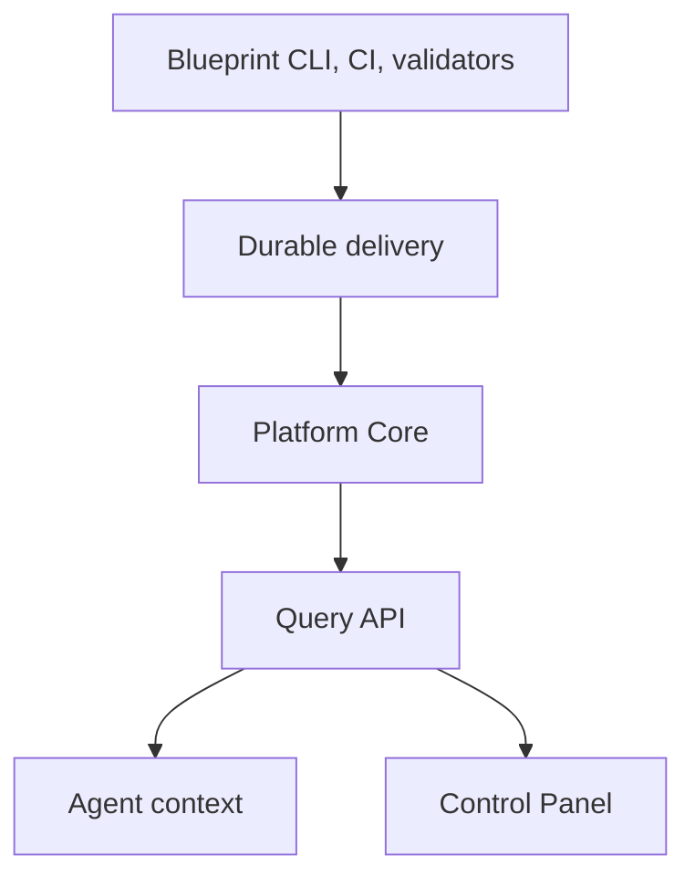
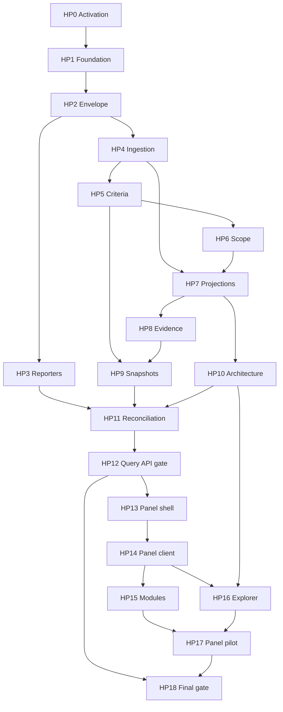

# Build Harness Platform V1.1

Status: ACTIVE
Blocked by: none (HP0 activation baseline complete; HP1 next)
Implementation started: true
Plan ID: `build-harness-platform-v1.1`
Created: 2026-07-25
Last updated: 2026-07-28 (HP0 complete)
Owner: agent; human approval required for activation and material changes
Target release: `1.1.0`
Includes: Platform Core, Query API, agent context, Control Panel V1
Final gate: `HARNESS_PLATFORM_V1_1_GATE`

---

## Purpose / Big Picture

Deliver one complete operational product above Harness Blueprint V1:

```text
Harness and CI results
→ authenticated Platform ingestion
→ append-only history
→ rebuildable exact-SHA read models
→ evidence, verification, reconciliation, and Query API
→ bounded agent context
→ first-party read-only Control Panel
```

This is one ExecPlan, not two. Platform Core and Control Panel remain separate
architectural components, but share:

- one exact Blueprint activation baseline;
- one Product Spec and acceptance map;
- one decision/discovery log;
- one pilot;
- one combined final gate and retrospective.

The plan preserves technical order through internal gates:

```text
Platform Core
→ PLATFORM_QUERY_API_READY: PASS
→ Control Panel
→ CONTROL_PANEL_PILOT_READY: PASS
→ HARNESS_PLATFORM_V1_1_GATE: PASS
```

Success is observable when:

1. all applicable `PLATFORM-AC-001` through `PLATFORM-AC-040` and
   `PANEL-AC-001` through `PANEL-AC-015` have linked evidence;
2. a reference project publishes one exact-SHA run, derives criteria, produces
   evidence, verifies a snapshot, and exposes identical state to the agent
   context and all relevant panel modules;
3. outage fixtures prove Blueprint router, worktrees, CLI checks, and CI continue
   without Platform;
4. the panel uses no write-capable operation and no direct Platform storage;
5. a repeated full run produces no unintended duplicate facts or generated diff;
6. the final gate emits:

```text
HARNESS_PLATFORM_V1_1_GATE: PASS
```

This plan is documentation only until activation. No Platform or panel
implementation may start while `Status: BLOCKED`.

---

## Progress

| Milestone | Outcome | Status | Depends on |
| --- | --- | --- | --- |
| Documentation integration | Product Specs, Design Docs, ADRs, indexes, unified plan | `[x]` complete | merged in docs/platform-v1.1-integration |
| HP0 | Activation baseline, approved architecture, resolved blockers | `[x]` complete | [baseline](../../generated/platform-activation-baseline.md) |
| HP1 | Package boundaries, contract toolchain, reference fixtures | `[x]` complete | HP0 |
| HP2 | Result Envelope and local validation | `[x]` complete | HP1 |
| HP3 | Blueprint/CI reporters and durable outbox | `[ ]` active | HP2 |
| HP4 | Authenticated ingest, idempotency, quarantine, event history | `[ ]` not started | HP2 |
| HP5 | Criteria registry, dependencies, impact, progress | `[ ]` not started | HP4 |
| HP6 | ExecPlan scope manifests and coordination | `[ ]` not started | HP5 |
| HP7 | Projectors, minimum read models, deterministic rebuild | `[ ]` not started | HP4–HP6 |
| HP8 | Evidence manifests, artifact index, sanitization | `[ ]` not started | HP4, HP7 |
| HP9 | Snapshot eligibility, verification, policy, revocation | `[ ]` not started | HP5, HP6, HP8 |
| HP10 | Architecture projection and drift | `[ ]` not started | HP1, HP7 |
| HP11 | Reconciliation, freshness, outage, recovery | `[ ]` not started | HP3, HP7–HP10 |
| HP12 | Query API, agent context, security, API readiness gate | `[ ]` not started | HP7–HP11 |
| HP13 | Control Panel shell, auth, routing, telemetry | `[ ]` blocked by internal API gate | HP12 |
| HP14 | Validated Platform client and failure states | `[ ]` not started | HP13 |
| HP15 | Nine inspection modules | `[ ]` not started | HP14 |
| HP16 | Architecture Explorer | `[ ]` not started | HP10, HP14 |
| HP17 | Panel hardening, pilot deployment, panel readiness gate | `[ ]` not started | HP15, HP16 |
| HP18 | Combined reference validation, release, final gate | `[ ]` not started | HP12, HP17 |

**Active milestone:** HP3 — Reporters and durable outbox.

**Current blocker:** none for HP1 scaffold. Panel milestones HP13–HP17 remain
blocked by `PLATFORM_QUERY_API_READY: PASS`.

---

## Surprises & Discoveries

| Date | Discovery | Evidence | Consequence |
| --- | --- | --- | --- |
| 2026-07-25 | Platform and panel were initially separate plans | Previous active plan documents | Consolidated under ADR-PLATFORM-004 |
| 2026-07-25 | Blueprint M2 documentation validation was not yet available at design time | Current Blueprint progress | Revalidate this plan after Blueprint final gate |
| 2026-07-25 | Panel requires stable API contracts but not a separate release baseline | Product and data-boundary review | Add `PLATFORM_QUERY_API_READY` inside this plan |
| 2026-07-28 | Blueprint V1 gate PASS at `49f8c56`; doc integration merged | `docs/generated/platform-activation-baseline.md` | HP0 activation recorded; plan ACTIVE |

Append implementation discoveries here with exact source, consequence, and any
required plan/Doc change.

---

## Decision Log

| ID | Date | Status | Decision | Approval |
| --- | --- | --- | --- | --- |
| PLATFORM-PLAN-001 | 2026-07-25 | APPROVED | Block implementation until exact Blueprint V1 final-gate SHA | Product architecture invariant |
| PLATFORM-PLAN-002 | 2026-07-25 | APPROVED | One active ExecPlan delivers Platform and Control Panel | Explicit project-owner instruction; ADR-PLATFORM-004 |
| PLATFORM-PLAN-003 | 2026-07-25 | APPROVED | Panel implementation requires internal `PLATFORM_QUERY_API_READY` gate | Required dependency boundary |
| PLATFORM-PLAN-004 | 2026-07-25 | PROPOSED | Use HP0–HP18 as independently verifiable milestone sequence | Activation review |
| PLATFORM-PLAN-005 | 2026-07-25 | PROPOSED | Final gate covers all applicable Platform and panel criteria | Activation review |
| PLATFORM-PLAN-006 | 2026-07-25 | PROPOSED | One pilot project validates Platform, agent context, and panel together | `PLATFORM-OD-011`, `PANEL-OD-004` |
| PLATFORM-OD-012 | 2026-07-28 | **RESOLVED** | Blueprint verified SHA `49f8c56`; gate evidence in `scripts/gates/` | HP0 |
| PLATFORM-OD-001 | 2026-07-28 | **RESOLVED** | Single-tenant per deployment; project-scoped isolation in data model | HP0 |
| PLATFORM-OD-002 | 2026-07-28 | **RESOLVED** | Local/dev PostgreSQL via Docker Compose; append-only events + read models | HP0/HP1 |
| PLATFORM-OD-004 | 2026-07-28 | **RESOLVED** | Scope manifest JSON at `.harness/execplan-scope.json`; Blueprint ExecPlan linter reused | HP6 |
| PLATFORM-OD-003 | 2026-07-28 | **DEFERRED** | Target HP8 | HP8 |
| PLATFORM-OD-005 | 2026-07-28 | **DEFERRED** | Target HP4 | HP4 |
| PLATFORM-OD-006 | 2026-07-28 | **DEFERRED** | Target HP11 | HP11 |
| PLATFORM-OD-007 | 2026-07-28 | **DEFERRED** | Target HP8/HP11 | HP8 |
| PLATFORM-OD-008 | 2026-07-28 | **DEFERRED** | Target HP9 | HP9 |
| PLATFORM-OD-009 | 2026-07-28 | **DEFERRED** | Target HP12 | HP12 |
| PLATFORM-OD-010 | 2026-07-28 | **DEFERRED** | Target HP18 | HP18 |
| PLATFORM-OD-011 | 2026-07-28 | **DEFERRED** | Target HP17 | HP17 |
| PANEL-OD-001 | 2026-07-28 | **DEFERRED** | Target HP17 | HP17 |
| PANEL-OD-002 | 2026-07-28 | **DEFERRED** | Target HP13 | HP13 |
| PANEL-OD-003 | 2026-07-28 | **DEFERRED** | Target HP12/HP14 | HP12 |
| PANEL-OD-004 | 2026-07-28 | **DEFERRED** | Target HP17 | HP17 |
| PANEL-OD-005 | 2026-07-28 | **DEFERRED** | Target HP18 | HP18 |
| HP0-ACTIVATION | 2026-07-28 | **RESOLVED** | Activation baseline recorded; plan ACTIVE; implementation not started | Project owner PR approval |

### Activation baseline

Complete and approve before HP0 closes:

```text
blueprintVersion: 1.0.0
blueprintVerifiedSha: 49f8c560e9e86bdb08ca5ad21f6481cacf3473b8
HARNESS_BLUEPRINT_V1_GATE evidence reference: scripts/gates/harness-blueprint-v1-gate.ts
policyVersion: platform-policy-v1
schema compatibility baseline: result-envelope@1 (HP2)
verified repository structure reference: docs/generated/platform-activation-baseline.md
approved Platform Product Spec: docs/product-specs/harness-platform-v1.1.md (PROPOSED)
approved Control Panel component Product Spec: docs/product-specs/harness-control-panel-v1.md (PROPOSED)
approved Platform Design Docs: docs/design-docs/index.md (PROPOSED rows)
approved panel Design Docs: control-panel-*, architecture-explorer-ui (PROPOSED)
approved required ADRs: ADR-PLATFORM-004 APPROVED; others PROPOSED per milestone
resolved activation-blocking PLATFORM-OD IDs: OD-012, OD-001, OD-002, OD-004
resolved activation-blocking PANEL-OD IDs: none at HP0 (all deferred with targets)
pilot project: fixtures/reference-project (proposed; HP17 confirmation)
activation reviewer: project owner
activation decision date: 2026-07-28
```

Empty or ambiguous required fields keep the plan BLOCKED.

### Query API readiness baseline

Record at HP12:

```text
platformVersion:
platformApiSchemaVersion:
platformApiContractChecksum:
platformApiCompatibilityEvidence:
representativeFixtureVersion:
fixtureChecksums:
authorization matrix evidence:
freshness/outage evidence:
PLATFORM_QUERY_API_READY evidence:
approved panel dependency versions:
```

Panel code may not begin before this baseline is complete.

### Open decisions

Resolve `PLATFORM-OD-001` through `PLATFORM-OD-012` and `PANEL-OD-001`
through `PANEL-OD-005` in the Product Spec. Each resolution records decision,
alternatives, reason, evidence, affected milestones, owner, and date. Do not
resolve technology, hosting, identity, retention, or authority silently.

---

## Outcomes & Retrospective

_Pending. Complete only after HP18._

Record:

- what shipped and what did not;
- exact release and deployment identities;
- whether both internal gates and final gate passed;
- evidence and independent review;
- incidents, rollback, and remaining debt;
- deviations from Product Specs and their approvals;
- lessons for Blueprint, Platform, panel, and future write-capable releases.

---

## Context and Orientation

### Starting state

At documentation integration (2026-07-28):

- Harness Blueprint V1 is complete; `HARNESS_BLUEPRINT_V1_GATE: PASS` recorded in
  `docs/exec-plans/completed/build-harness-blueprint-v1.md` (merge commit
  `49f8c56`);
- Platform and panel code do not exist;
- Platform Product Spec and design baseline exist as proposals;
- Control Panel Product Spec and UI design exist as proposals;
- HP0 activation baseline and human approval are pending;
- storage, API topology, identity, retention, pilot, and performance decisions
  remain open (resolved just-in-time per milestone).

Reinspect the actual repository at HP0. Conversational state is not a baseline.

### Release sequence

```text
Harness Blueprint 1.0.0 M0–M16
→ HARNESS_BLUEPRINT_V1_GATE: PASS
→ this ExecPlan HP0–HP18
→ HARNESS_PLATFORM_V1_1_GATE: PASS
```

This plan does not change Blueprint M0–M16.

### System boundary



Blueprint has no runtime dependency on Platform. Control Panel depends on the
Query API and never on Platform storage.

### Expected logical modules

```text
Platform contracts
Platform ingestion
Event history
Criteria and impact
ExecPlan coordination
Projectors/read models
Evidence/artifacts
Snapshot policy
Architecture projection
Reconciliation/freshness
Query API
Agent context
Platform security/audit/operations
Control Panel
```

HP0 maps these logical modules to actual verified repository package paths.

### Documentation consulted

- `AGENTS.md`;
- `ARCHITECTURE.md`;
- `docs/PLANS.md`;
- Blueprint Product Specs and Design Docs relevant to CLI, evidence, worktrees,
  review, release, autonomy, upgrade, and architecture;
- `docs/product-specs/harness-platform-v1.1.md`;
- `docs/product-specs/harness-control-panel-v1.md`;
- every Platform and panel Design Doc in `docs/design-docs/index.md`;
- every `ADR-PLATFORM-*` and `ADR-PANEL-*`;
- active Blueprint ExecPlan and final gate definition;
- `docs/SECURITY.md`, `docs/RELIABILITY.md`, `docs/FRONTEND.md`, and
  `docs/QUALITY_SCORE.md`.

At activation, replace this summary with exact repository-relative links and
record every file actually read.

### Invariants applied

- `PLATFORM-INV-001` through `PLATFORM-INV-012`;
- `PANEL-INV-001` through `PANEL-INV-007`;
- Blueprint repository-local truth and boundary parsing;
- no silent overwrite;
- one isolated worktree/environment per active milestone scope;
- agents cannot weaken checks or self-grant autonomy;
- immutable artifact release;
- `HUMAN_JUDGMENT_REQUIRED` for material unknowns.

### Milestone dependency graph



---

## Plan of Work

### Delivery model

- One milestone produces one independently verifiable outcome.
- A milestone may use multiple small PRs when internal boundaries are explicit.
- Every PR updates this plan, relevant Docs, and bounded evidence.
- Platform Core milestones precede panel milestones.
- The repository remains runnable after every merged milestone.
- No milestone claims later functionality through mocks alone.

### Workstreams

| Workstream | Milestones |
| --- | --- |
| Activation and contracts | HP0–HP2 |
| Result publication and history | HP3–HP4 |
| Domain state and coordination | HP5–HP7 |
| Evidence, verification, architecture | HP8–HP10 |
| Reconciliation, API, agent context | HP11–HP12 |
| Control Panel | HP13–HP17 |
| Combined release | HP18 |

### Gate behavior

`PLATFORM_QUERY_API_READY` is emitted only at HP12 after source-backed
contracts, exact-SHA behavior, authorization, freshness, and outage tests pass.

`CONTROL_PANEL_PILOT_READY` is emitted only at HP17 after all ten modules,
Architecture Explorer, browser/security/accessibility/performance checks, and
pilot verification pass.

The final gate requires both and may add stricter combined scenarios.

---

## Concrete Steps

### Working directory

Run from the repository root at the exact activated baseline. Each milestone
uses one isolated branch/worktree and the repository's environment isolation.

Proposed branch pattern:

```text
milestone/hp0-activation
milestone/hp1-foundation
...
milestone/hp18-final-gate
```

### Baseline commands

Resolve exact commands at HP0 from the verified Blueprint:

```text
pnpm install --frozen-lockfile
pnpm exec harness inspect
pnpm exec harness validate-docs
pnpm exec harness check --fast
pnpm exec harness check --full
```

Record versions, exit codes, bounded logs, and exact SHA.

### Per-milestone loop

1. update Progress and select one milestone scope;
2. inspect routed Docs, code, tests, and current evidence;
3. start one isolated worktree/environment;
4. implement one coherent boundary;
5. run focused tests and `harness check --fast`;
6. drive real runtime behavior where applicable;
7. self-review against mapped acceptance;
8. request independent and specialist review;
9. resolve every actionable finding;
10. run `harness check --full` and CI before milestone closure;
11. update Docs, decisions, evidence, and recovery notes;
12. merge only under current autonomy policy;
13. verify after merge and deployment where applicable.

### Provisional package commands

Package names are finalized at HP0:

```text
pnpm --filter @blueprint-harness/platform-contracts test
pnpm --filter @blueprint-harness/platform-domain test
pnpm --filter @blueprint-harness/platform-client test
pnpm --filter @blueprint-harness/platform-api test
pnpm --filter @blueprint-harness/platform-workers test
pnpm --filter @blueprint-harness/control-panel test
pnpm --filter @blueprint-harness/control-panel build
```

Packages scaffold at HP1; panel Playwright at HP13+.

### Gate commands

Create versioned gate orchestration during the mapped milestone:

```text
pnpm exec harness platform gate --query-api
→ PLATFORM_QUERY_API_READY: PASS|FAIL

pnpm exec harness platform gate --panel-pilot
→ CONTROL_PANEL_PILOT_READY: PASS|FAIL

pnpm exec harness platform gate --full
→ HARNESS_PLATFORM_V1_1_GATE: PASS|FAIL
```

Exact CLI integration is verified against Blueprint extension conventions.

---

## Validation and Acceptance

### Acceptance ownership

| Criteria | Primary milestones |
| --- | --- |
| PLATFORM-AC-001–004 | HP3, HP12, HP18 |
| PLATFORM-AC-005–010 | HP2, HP4 |
| PLATFORM-AC-011–014 | HP5 |
| PLATFORM-AC-015–016 | HP6 |
| PLATFORM-AC-017–022 | HP8, HP9 |
| PLATFORM-AC-023–028 | HP7, HP10, HP11 |
| PLATFORM-AC-029–035 | HP8, HP12 |
| PLATFORM-AC-036–040 | HP18 |
| PANEL-AC-001–005 | HP13, HP14 |
| PANEL-AC-006–007 | HP15 |
| PANEL-AC-008–012 | HP16 |
| PANEL-AC-013–015 | HP17, HP18 |

No criterion is closed solely because a file or endpoint exists.

### Detailed criterion-to-milestone map

The last listed milestone owns closure evidence. Earlier milestones contribute
required implementation or fixtures.

| Criterion | Milestone ownership |
| --- | --- |
| PLATFORM-AC-001 | HP3, HP18 |
| PLATFORM-AC-002 | HP3 |
| PLATFORM-AC-003 | HP3, HP12 |
| PLATFORM-AC-004 | HP12, HP18 |
| PLATFORM-AC-005 | HP2, HP4 |
| PLATFORM-AC-006 | HP4 |
| PLATFORM-AC-007 | HP4 |
| PLATFORM-AC-008 | HP2, HP4 |
| PLATFORM-AC-009 | HP4, HP5, HP9 |
| PLATFORM-AC-010 | HP4, HP7 |
| PLATFORM-AC-011 | HP5 |
| PLATFORM-AC-012 | HP5 |
| PLATFORM-AC-013 | HP5 |
| PLATFORM-AC-014 | HP5 |
| PLATFORM-AC-015 | HP6 |
| PLATFORM-AC-016 | HP6 |
| PLATFORM-AC-017 | HP9 |
| PLATFORM-AC-018 | HP8, HP9 |
| PLATFORM-AC-019 | HP8, HP9 |
| PLATFORM-AC-020 | HP9 |
| PLATFORM-AC-021 | HP9 |
| PLATFORM-AC-022 | HP9 |
| PLATFORM-AC-023 | HP7 |
| PLATFORM-AC-024 | HP10 |
| PLATFORM-AC-025 | HP10 |
| PLATFORM-AC-026 | HP11 |
| PLATFORM-AC-027 | HP11, HP12 |
| PLATFORM-AC-028 | HP7, HP11 |
| PLATFORM-AC-029 | HP12 |
| PLATFORM-AC-030 | HP12 |
| PLATFORM-AC-031 | HP4, HP8, HP12 |
| PLATFORM-AC-032 | HP4, HP9, HP12 |
| PLATFORM-AC-033 | HP2, HP8 |
| PLATFORM-AC-034 | HP12 |
| PLATFORM-AC-035 | HP4, HP8, HP9, HP11, HP12 |
| PLATFORM-AC-036 | HP18 |
| PLATFORM-AC-037 | HP18 |
| PLATFORM-AC-038 | HP3, HP11, HP18 |
| PLATFORM-AC-039 | HP10, HP15, HP16, HP18 |
| PLATFORM-AC-040 | HP18 |
| PANEL-AC-001 | HP13, HP14, HP15 |
| PANEL-AC-002 | HP14, HP15 |
| PANEL-AC-003 | HP13, HP14, HP17 |
| PANEL-AC-004 | HP14 |
| PANEL-AC-005 | HP14, HP15 |
| PANEL-AC-006 | HP15, HP16 |
| PANEL-AC-007 | HP14, HP15 |
| PANEL-AC-008 | HP16 |
| PANEL-AC-009 | HP16 |
| PANEL-AC-010 | HP15, HP16 |
| PANEL-AC-011 | HP16 |
| PANEL-AC-012 | HP14, HP17 |
| PANEL-AC-013 | HP17 |
| PANEL-AC-014 | HP13, HP17 |
| PANEL-AC-015 | HP3, HP11, HP17, HP18 |

### Required validation layers

- contract/schema and compatibility;
- domain/unit and decision tables;
- persistence and transaction integration;
- concurrency, duplicate, ordering, and replay;
- architecture/dependency and negative fixtures;
- authorization, isolation, sanitization, retention, and audit;
- outage, stale, recovery, rebuild, migration, and rollback;
- API consumer-driven fixtures;
- browser, accessibility, responsive, security headers, and performance;
- independent semantic review;
- CI, immutable artifacts, deployment, and post-deployment;
- complete end-to-end reference project.

### Final reference scenarios

Use all scenarios in the Platform Product Spec. At minimum prove:

- exact-SHA isolation and no mixed snapshot;
- duplicate/conflicting/out-of-order ingestion;
- criteria dependencies, impact, and plan conflicts;
- deterministic projector rebuild;
- evidence integrity and sanitizer rejection;
- verification, policy change, and revocation;
- architecture drift and bounded projection;
- source gap, staleness, outage, and recovery;
- project/role isolation;
- API exact-SHA and schema compatibility;
- all ten panel modules and failure states;
- Architecture Explorer graph/list equivalence;
- agent/panel state equivalence;
- repeated full run without unintended duplicates/diff.

### Documentation acceptance

- links and indexes are valid;
- statuses and verification claims match evidence;
- diagrams match implemented boundaries;
- this plan is current and self-contained;
- Blueprint M0–M16 remain unchanged;
- superseded panel plan is not active;
- `QUALITY_SCORE.md` changes only where evidence exists.

---

## Idempotence and Recovery

### General

- repeated envelope publication is safe under idempotency identity;
- same schema/code generation at pinned input produces no unintended diff;
- read models and layout caches are disposable;
- verification with identical canonical inputs returns the same snapshot;
- immutable artifacts are never overwritten;
- recovery appends facts rather than editing history.

### Ingestion

On interrupted request, retry the same envelope identity. If acceptance state is
unknown, query delivery status by idempotency identity; never invent a new
identity to force success.

### Projectors

Stop affected projector, mark models stale, preserve accepted events, repair,
rebuild into isolated storage, compare canonical output, switch only after
evidence, and resume from a durable watermark.

### Database/schema changes

Every migration defines:

- precondition and compatibility window;
- backup/checkpoint;
- forward and reverse behavior where safe;
- dual-read/write or deployment order when required;
- verification query;
- exact escalation condition.

Do not run destructive migration when rollback or production state is unknown.

### Evidence

Failed upload never creates a complete manifest. Retry immutable upload with
the same content identity or create a new explicit superseding artifact.

### Panel

Generated client reruns only from pinned approved contract. Layout caches can
be dropped. Deployment rolls forward with the same immutable artifact or back
to the prior verified artifact. No recovery mutates Platform project state.

### Outage

Preserve source results and outbox records. After recovery, drain, reconcile,
rebuild if required, restore `CURRENT`, and verify without rerunning successful
validators.

### Escalation

Stop with `HUMAN_JUDGMENT_REQUIRED` for unknown identity, production state,
policy, retention/legal obligation, irreversible migration, authorization,
incompatible API change, missing evidence, or material Product Spec conflict.

---

## Artifacts and Notes

Use repository-approved bounded evidence locations established by Blueprint V1.
Expected evidence:

| Evidence | Milestones |
| --- | --- |
| Activation baseline and Doc approvals | HP0 |
| Schemas, compatibility, canonical fixtures | HP1–HP2 |
| Outbox/delivery and outage records | HP3, HP11 |
| Ingestion, idempotency, quarantine logs | HP4 |
| Criteria/impact decision tables | HP5 |
| Scope conflict fixtures and contracts | HP6 |
| Rebuild hashes and projector watermarks | HP7 |
| Manifest, sanitizer, checksum, access tests | HP8 |
| Verification/revocation policy decisions | HP9 |
| Projection/drift fixtures | HP10 |
| Reconciliation/source health | HP11 |
| OpenAPI/client, authorization, API gate | HP12 |
| Panel screenshots, browser/accessibility evidence | HP13–HP17 |
| Release, deployment, post-deployment, final gate | HP18 |

Do not store secrets, raw production evidence, hidden reasoning, or unbounded
logs in the plan.

---

## Interfaces and Dependencies

### Blueprint dependencies

- canonical validation result and finding contracts;
- CLI/check/CI reporter extension points;
- evidence and artifact lifecycle;
- repository router and agent adapter;
- worktree/environment isolation;
- review, release, rollback, autonomy, and Upgrade Engine;
- docs/ExecPlan validation and ownership metadata.

Platform must not make these depend on its availability.

### Platform public interfaces

| Interface | Required contract |
| --- | --- |
| Result Envelope | Versioned, canonical, exact-SHA, authenticated, checksum-bound |
| Ingest acknowledgement | Accepted, duplicate, pending, rejected, or quarantined |
| Criteria registry | Versioned Git source with DAG and validation |
| ExecPlan scope | Machine-readable, versioned, tied to canonical plan |
| Evidence manifest | Immutable identity, checksums, provenance, retention |
| Architecture projection | Bounded, deterministic, exact-SHA, drift-aware |
| Query API | Read-only, versioned, paginated, freshness/provenance/authorization-aware |
| Agent context | Bounded subset after repository routing |
| Panel client | Parsed Query API only; no storage or mutation |

### Technology dependencies

Do not pin unresolved providers before approval. At HP0/HP12 record exact
versions, licenses, compatibility, security posture, operational ownership, and
upgrade policy for:

- event/read-model database;
- artifact store;
- API framework and transport;
- identity/OIDC/session;
- Next.js, React, TanStack, Zod, React Flow, ELK.js, Recharts;
- Vitest, Testing Library, Playwright, Sentry;
- deployment and observability infrastructure.

---

## Risks

| Risk | Control |
| --- | --- |
| Unified plan becomes too large | Independently verifiable HP milestones and internal gates |
| Panel begins against unstable API | HP13 blocked by `PLATFORM_QUERY_API_READY` |
| Platform claims completion without real consumer | Combined final gate includes panel criteria |
| Dashboard becomes truth | Read-only API, provenance, rebuildable read models |
| Old evidence applies to new SHA | Full SHA and mixed-snapshot rejection |
| Platform outage blocks Blueprint | Repository-first dependency test |
| Duplicate/out-of-order delivery corrupts state | Canonical identity, hash, deterministic projectors |
| Sensitive evidence leaks | Pre-storage sanitization, minimization, RBAC, audit |
| Scope conflict false positives | Semantic surfaces and sequential-work rule |
| Architecture graph overwhelms UI | Server bounds, progressive expansion, accessible fallback |
| Open technology choices cause rework | HP0 activation gate and explicit ODs |
| Final release hides partial state | Explicit freshness, completeness, and gate evidence |

---

## Milestone Catalog

### HP0 — Activation and canonical baseline

#### Goal

Convert the blocked proposal into an executable plan based on the actual
verified Blueprint V1 release.

#### Scope

- record every activation baseline field;
- inspect actual repository paths, contracts, commands, and final-gate evidence;
- reconcile all Product Specs, Design Docs, ADRs, indexes, and this plan;
- resolve activation-blocking ODs;
- approve package boundaries, delivery topology, pilot, and evidence locations;
- create/validate the machine-readable plan scope using the actual Blueprint
  contract;
- establish baseline checks and a no-Platform regression fixture.

No Platform or panel feature code.

#### Acceptance

| ID | Observable criterion |
| --- | --- |
| HP0-AC1 | Exact `blueprintVerifiedSha` and gate evidence resolve and match |
| HP0-AC2 | Required Docs/ADRs are approved or explicit blocker remains |
| HP0-AC3 | Every blocking OD has a recorded resolution |
| HP0-AC4 | Actual package paths and commands replace placeholders |
| HP0-AC5 | Baseline `harness check --full` and CI pass |
| HP0-AC6 | Blueprint M0–M16 behavior is unchanged |
| HP0-AC7 | Plan status changes to ACTIVE only after human activation approval |

#### Validation and recovery

Doc validation, link/index checks, baseline full gate, independent architecture
review. If any identity or contract is ambiguous, keep BLOCKED.

### HP1 — Platform foundation and contract toolchain

#### Goal

Create buildable package/application boundaries, schema tooling, test layers,
fixtures, and CI without implementing remote ingestion behavior.

#### Scope

- scaffold approved Platform logical modules;
- define dependency direction and structural tests;
- add canonical schema build/validation tooling;
- establish representative fixture directories and versioning;
- add local/test environment wiring and health surfaces;
- preserve clean builds when Platform feature is disabled.

#### Acceptance

| ID | Observable criterion |
| --- | --- |
| HP1-AC1 | Approved package boundaries build with strict types |
| HP1-AC2 | Negative dependency fixtures reject Blueprint→Platform and panel→storage imports |
| HP1-AC3 | Schema generation/validation rerun produces no unintended diff |
| HP1-AC4 | Project without Platform configuration builds and checks normally |
| HP1-AC5 | Public contracts have human-readable documentation |

#### Recovery

Scaffold reruns at pinned inputs are idempotent. Remove only exact HP1-created
unused boundaries if the milestone is abandoned; preserve Docs and baseline.

### HP2 — Result Envelope and local validation

#### Goal

Produce and parse canonical envelopes locally with version compatibility,
identity, checksum, size, and sensitive-content controls.

#### Scope

- schema and canonical serialization;
- local boundary parser and stable findings;
- idempotency identity derivation;
- payload hash;
- supported-version registry/upcasting policy;
- positive and negative fixtures.

#### Acceptance

Maps `PLATFORM-AC-005`, `PLATFORM-AC-008`, and schema portions of
`PLATFORM-AC-006–010`, `PLATFORM-AC-033`.

| ID | Observable criterion |
| --- | --- |
| HP2-AC1 | Canonical envelope round-trips without semantic loss |
| HP2-AC2 | Invalid/unsupported schemas fail with stable codes |
| HP2-AC3 | Full SHA, producer, run, validator, config, and checksum are required |
| HP2-AC4 | Hash and identity are deterministic |
| HP2-AC5 | Sensitive-content fixtures cannot produce valid publishable evidence |

#### Recovery

Never rewrite an accepted historical schema. Add version/upcaster and
compatibility fixture.

### HP3 — Reporters and durable delivery

#### Goal

Publish completed Blueprint/CI results without making Platform availability a
dependency and without rerunning successful validators.

#### Scope

- approved CLI, CI, validator reporter adapters;
- durable outbox or CI artifact;
- bounded retry/backoff and delivery status;
- feature-gated project enrollment;
- outage and recovery fixtures;
- optional agent adapter publication metadata.

#### Acceptance

Maps `PLATFORM-AC-001–003`, `PLATFORM-AC-038`.

| ID | Observable criterion |
| --- | --- |
| HP3-AC1 | Platform outage leaves local check/CI result unchanged |
| HP3-AC2 | Project without Platform makes no mandatory network request |
| HP3-AC3 | Failed delivery is durable as `SYNC_PENDING` |
| HP3-AC4 | Recovery retries same identity without validator rerun |
| HP3-AC5 | Router records current/stale/unavailable context use |

#### Recovery

Disable reporter feature gate to restore pure Blueprint path. Preserve durable
pending records for later authorized drain.

### HP4 — Ingestion, idempotency, quarantine, and accepted history

#### Goal

Authenticate, validate, deduplicate, quarantine, and durably append source
facts.

#### Scope

- producer workload identity and project enrollment;
- request limits and boundary validation;
- atomic idempotency/append;
- quarantine reason catalogue;
- accepted envelope/event correlation;
- project isolation and audit;
- out-of-order and concurrent fixtures.

#### Acceptance

Maps `PLATFORM-AC-005–010`, `PLATFORM-AC-031–032`, and ingestion parts of
`PLATFORM-AC-035`.

| ID | Observable criterion |
| --- | --- |
| HP4-AC1 | Same identity/hash yields one accepted fact |
| HP4-AC2 | Same identity/different hash yields `INTEGRITY_CONFLICT` |
| HP4-AC3 | Wrong SHA/project/producer cannot affect accepted state |
| HP4-AC4 | Acknowledgement follows durable atomic append |
| HP4-AC5 | Out-of-order fixtures retain enough identity to converge later |
| HP4-AC6 | Quarantine and authorization actions are audited |

#### Recovery

Do not edit prior accepted events. Quarantine new conflicts and append
corrections through approved event types.

### HP5 — Criteria, impact, and milestone state

#### Goal

Validate the repository criteria registry and derive exact-SHA criterion,
impact, progress, dependency, and milestone state.

#### Scope

- registry parser and DAG validation;
- applicability and required-validator resolution;
- deterministic state decision table;
- path/module/contract impact mapping;
- possible-regression behavior;
- weighted progress as presentation only.

#### Acceptance

Maps `PLATFORM-AC-011–014`.

| ID | Observable criterion |
| --- | --- |
| HP5-AC1 | Invalid graph and unknown references are rejected |
| HP5-AC2 | PASS requires all exact-SHA current evidence |
| HP5-AC3 | Changed affected contract invalidates current confidence |
| HP5-AC4 | Required non-PASS prevents milestone completion |
| HP5-AC5 | Recalculation converges independent of delivery order |

#### Recovery

Fix registry through Git and append/rebuild affected projection. Never manually
set PASS in storage.

### HP6 — ExecPlan scope and coordination

#### Goal

Validate machine-readable plan scope and detect only meaningful active
coordination conflicts.

#### Scope

- actual Blueprint-compatible scope manifest;
- semantic surface registry;
- active/stale-base conflict detection;
- coordination contracts and approval completeness;
- resolution by separation, serialization, or all-owner approval;
- history and read models.

#### Acceptance

Maps `PLATFORM-AC-015–016`.

| ID | Observable criterion |
| --- | --- |
| HP6-AC1 | Concurrent exclusive overlap blocks affected scopes |
| HP6-AC2 | Sequential historical overlap does not block |
| HP6-AC3 | Missing manifest impact fails closed |
| HP6-AC4 | Incomplete owner approval cannot clear conflict |
| HP6-AC5 | Resolution reason and provenance remain visible |

#### Recovery

Update scope/coordination in Git and append resolution. No administrative
status edit.

### HP7 — Projectors and minimum read models

#### Goal

Derive all required current read models from accepted history and prove
deterministic rebuild.

#### Scope

- projector framework, versions, checkpoints, and watermarks;
- project, SHA, criteria, plans, validations, conflicts, runs, governance,
  synchronization, and quarantine models;
- late-event recomputation;
- full isolated rebuild and canonical comparison;
- stale behavior on projector failure.

#### Acceptance

Maps `PLATFORM-AC-010`, `PLATFORM-AC-023`, `PLATFORM-AC-028`.

| ID | Observable criterion |
| --- | --- |
| HP7-AC1 | Minimum read models identify exact project/SHA and provenance |
| HP7-AC2 | Full rebuild equals canonical current state |
| HP7-AC3 | Late events converge to expected state |
| HP7-AC4 | Projector crash preserves events and marks projections stale |
| HP7-AC5 | Cross-project projection leakage is impossible |

#### Recovery

Repair projector, rebuild isolated target, compare, switch, resume watermark.

### HP8 — Evidence manifests and artifact index

#### Goal

Create immutable, checksum-valid, sanitized evidence manifests and authorized
bounded access.

#### Scope

- artifact provider adapter and immutable write;
- sanitizer/minimization pipeline;
- manifest canonicalization/hash;
- artifact index and access service;
- retention/legal-hold metadata;
- evidence access audit.

#### Acceptance

Maps evidence portions of `PLATFORM-AC-018–019`,
`PLATFORM-AC-031`, `PLATFORM-AC-033`, `PLATFORM-AC-035`.

| ID | Observable criterion |
| --- | --- |
| HP8-AC1 | Complete manifest binds exact SHA, policy, registry, validators, and artifacts |
| HP8-AC2 | Missing/corrupt evidence cannot appear complete |
| HP8-AC3 | Sanitizer failure blocks verification use |
| HP8-AC4 | Authorized bounded retrieval works; cross-project retrieval returns no metadata |
| HP8-AC5 | Access, retention, and legal-hold operations are audited |

#### Recovery

Retry immutable upload by content identity or create explicit superseding
artifact. Never overwrite evidence under existing identity.

### HP9 — Snapshot verification, policy, and revocation

#### Goal

Evaluate and append policy-bound VERIFIED and REVOKED records for one exact SHA.

#### Scope

- eligibility decision table and global gates;
- independent verifier authority;
- snapshot identity and idempotence;
- policy revalidation state;
- revocation authority/reason catalogue;
- audit and read models.

HP9 implements and validates the capability in shadow/reference mode. Production
snapshot authority remains disabled until HP18 closes the combined release
gate.

#### Acceptance

Maps `PLATFORM-AC-017–022`, verification parts of
`PLATFORM-AC-032`, `PLATFORM-AC-035`.

| ID | Observable criterion |
| --- | --- |
| HP9-AC1 | Criteria PASS with incomplete global gate remains UNVERIFIED |
| HP9-AC2 | Mixed/stale/conflicting/incomplete input cannot verify |
| HP9-AC3 | Identical decision returns same snapshot |
| HP9-AC4 | Policy change preserves history and requests revalidation |
| HP9-AC5 | Authorized revocation preserves original verification |
| HP9-AC6 | Implementing agent cannot self-verify/revoke |

#### Recovery

Append policy/revocation/correction facts. Never delete historical verification.

### HP10 — Architecture projection and drift

#### Goal

Generate bounded, deterministic, exact-SHA architecture views and drift
findings.

#### Scope

- declared and observed graph adapters;
- module, flow, contract, bounded class views;
- stable identity, sorting, checksum, bounds, continuation;
- drift detection and provenance;
- SHA-to-SHA comparison.

#### Acceptance

Maps `PLATFORM-AC-024–025`.

| ID | Observable criterion |
| --- | --- |
| HP10-AC1 | Projection identifies SHA, generator, config, scope, and bounds |
| HP10-AC2 | Same inputs produce canonical identical projection |
| HP10-AC3 | Reverse dependency produces linked `ARCHITECTURE_DRIFT` |
| HP10-AC4 | Unbounded class view is rejected |
| HP10-AC5 | Comparison retains base and target identity |

#### Recovery

Projection cache/read model is disposable. Rebuild from exact sources; never
write UI layout into architecture truth.

### HP11 — Reconciliation, freshness, and operational recovery

#### Goal

Detect missing source facts and stale state, recover without rewriting history,
and prove end-to-end outage behavior.

#### Scope

- Git, CI, registry, plan, artifact, architecture source adapters;
- reconciliation scheduling and policy thresholds;
- source-gap/stale/integrity events;
- delivery drain and projection recovery;
- observability, alerts, runbooks.

#### Acceptance

Maps `PLATFORM-AC-026–028`, `PLATFORM-AC-038`.

| ID | Observable criterion |
| --- | --- |
| HP11-AC1 | Missing source fact produces `SOURCE_GAP` |
| HP11-AC2 | Repair appends/rebuilds without history rewrite |
| HP11-AC3 | Threshold breach appears as `DATA_STALE` in affected state |
| HP11-AC4 | Outage/recovery restores CURRENT without validator rerun |
| HP11-AC5 | Alerts distinguish stale Platform data from project failure |

#### Recovery

Pause damaged source adapter, preserve last known state as stale, repair,
reconcile, rebuild, and restore only after evidence.

### HP12 — Query API, agent context, security, and API readiness gate

#### Goal

Expose stable, authorized, exact-SHA read resources and bounded agent context,
then close the internal API gate.

#### Scope

- versioned Query API and contract publication;
- pagination, deterministic ordering, bounded previews;
- exact-SHA/no-HEAD-substitution;
- freshness/provenance/authorization metadata;
- short-lived evidence access;
- bounded router-preserving agent context;
- identity/role matrix, audit, performance, compatibility;
- source-backed panel and agent fixtures;
- `PLATFORM_QUERY_API_READY` orchestration.

#### Acceptance

Maps `PLATFORM-AC-003–004`, `PLATFORM-AC-029–035` and readiness prerequisites
for `PLATFORM-AC-036`.

| ID | Observable criterion |
| --- | --- |
| HP12-AC1 | Every material response has exact identity, freshness, watermark, provenance, auth scope |
| HP12-AC2 | Requested SHA never becomes HEAD or another SHA |
| HP12-AC3 | Roles and projects are isolated |
| HP12-AC4 | Agent context is bounded, optional, and router-preserving |
| HP12-AC5 | API schemas pass compatibility and source-backed fixtures |
| HP12-AC6 | Outage produces explicit unavailable/stale behavior |
| HP12-AC7 | Gate emits `PLATFORM_QUERY_API_READY: PASS` with evidence |

#### Recovery

Keep prior compatible API active or roll back immutable artifact. Unknown
compatibility keeps the gate FAIL and panel milestones blocked.

### HP13 — Control Panel application shell

#### Goal

Create authenticated, observable, accessible application shell and exact-SHA
navigation after the API gate.

#### Scope

- approved Next.js/React/TypeScript scaffold;
- server session and project navigation;
- layout, design primitives, error boundaries, headers;
- URL identity model;
- testing and telemetry;
- CI/build/deployment skeleton;
- no feature read models beyond minimal readiness fixture.

#### Acceptance

Contributes to `PANEL-AC-001–003`, `PANEL-AC-013–014`.

| ID | Observable criterion |
| --- | --- |
| HP13-AC1 | Application builds with pinned approved dependencies |
| HP13-AC2 | Project/branch/exact-SHA selection survives navigation/refresh |
| HP13-AC3 | Session has read-only Platform claims only |
| HP13-AC4 | Security headers, error telemetry, and accessibility shell pass |
| HP13-AC5 | No storage credential or write client exists |

#### Recovery

Scaffold/codegen rerun at pinned versions produces no unintended diff.

### HP14 — Validated Platform client and failure states

#### Goal

Create the only panel data boundary, parse every response, isolate cache
identity, and normalize failures into stable UI states.

#### Scope

- generated/owned client from pinned API;
- Zod schemas and domain mappings;
- TanStack Query keys, pagination, retry policy;
- current/stale/partial/quarantined/unauthorized/not-found/unavailable/mismatch;
- contract and authorization fixtures;
- no raw transport in feature modules.

#### Acceptance

Maps `PANEL-AC-001–005`, `PANEL-AC-007`, `PANEL-AC-012`.

| ID | Observable criterion |
| --- | --- |
| HP14-AC1 | No unparsed response reaches feature code |
| HP14-AC2 | Cache keys cannot collide across project/SHA |
| HP14-AC3 | Failure states are distinct and preserve requested identity |
| HP14-AC4 | Lists are bounded and deterministically ordered |
| HP14-AC5 | Dependency tests reject direct storage and transport coupling |

#### Recovery

Regenerate only from pinned approved checksum. On mismatch, stop affected
rendering; do not coerce.

### HP15 — Inspection modules

#### Goal

Implement the nine non-graph inspection modules using source-backed read models.

#### Scope

- Project Overview;
- ExecPlans;
- Requirements and Milestones;
- Validation Center;
- HEAD and VERIFIED Snapshots;
- Evidence Packages;
- History and Comparison;
- Runs and Agent Activity;
- Governance and Settings.

Each includes happy, empty, stale, partial, denied, and unavailable behavior
where applicable.

#### Acceptance

Maps `PANEL-AC-006–007`, and contributes to `PLATFORM-AC-036`, `039`.

| ID | Observable criterion |
| --- | --- |
| HP15-AC1 | Nine modules preserve exact selected identity |
| HP15-AC2 | Material status links to provenance/evidence |
| HP15-AC3 | Bounds and pagination prevent unbounded fetch/render |
| HP15-AC4 | HEAD/VERIFIED never mixes unidentified SHAs |
| HP15-AC5 | Source-backed failure fixtures pass per module |

#### Recovery

Feature failure is isolated. Keep route identity and validated data; use
explicit partial/unavailable states.

### HP16 — Architecture Explorer

#### Goal

Deliver scoped interactive architecture inspection and equivalent accessible
representation.

#### Scope

- typed projection-to-view adapter;
- ELK.js deterministic layout and cache;
- React Flow graph;
- module, flow, contract, bounded class views;
- filters, expansion, node/edge details;
- drift and HEAD/VERIFIED comparison;
- accessible list/table;
- large-graph and layout-failure behavior.

#### Acceptance

Maps `PANEL-AC-008–012`, contributes to `PLATFORM-AC-039`.

| ID | Observable criterion |
| --- | --- |
| HP16-AC1 | Scoped projection renders with React Flow + ELK.js |
| HP16-AC2 | Graph and list use identical projection identity |
| HP16-AC3 | Comparison displays both SHAs and never mixes identity |
| HP16-AC4 | Drift links to declarations, code edges, findings, evidence |
| HP16-AC5 | Bounded large graph and accessibility tests pass |
| HP16-AC6 | Layout failure preserves list/table inspection |

#### Recovery

Drop layout cache and recompute. Never mutate Platform projection or
architecture source.

### HP17 — Panel hardening, pilot, and readiness gate

#### Goal

Prove the complete panel safely in production-like conditions for one approved
pilot project.

#### Scope

- full Playwright journeys;
- accessibility/manual keyboard review;
- authorization/security/secret review;
- performance budgets and representative scale;
- monitoring, release identity, source maps;
- immutable build, deployment, rollback;
- pilot smoke and post-deployment verification;
- independent review;
- `CONTROL_PANEL_PILOT_READY`.

#### Acceptance

Maps `PANEL-AC-013–015`.

| ID | Observable criterion |
| --- | --- |
| HP17-AC1 | Contract, unit, component, accessibility, browser tests pass |
| HP17-AC2 | Security headers, auth matrix, dependency/secret checks pass |
| HP17-AC3 | Approved performance budgets pass on pilot dataset |
| HP17-AC4 | Immutable deployment and rollback are verified |
| HP17-AC5 | Platform outage degrades panel only |
| HP17-AC6 | Independent review has no unresolved actionable issue |
| HP17-AC7 | Gate emits `CONTROL_PANEL_PILOT_READY: PASS` |

#### Recovery

Roll forward same artifact or back to prior verified artifact. Preserve
Platform state; unknown production state requires human judgment.

### HP18 — Combined reference validation and final gate

#### Goal

Prove the complete Platform-and-panel release, publish immutable artifacts,
verify deployment, close the plan, and emit the final gate.

#### Scope

- reference project full publication and verification;
- identical state in agent context and panel;
- duplicate/idempotent second run;
- deliberate regression from VERIFIED to HEAD;
- outage and recovery;
- all security/isolation/freshness/evidence/architecture scenarios;
- full Blueprint and Platform checks;
- immutable artifacts, pilot promotion, post-deployment verification;
- independent final review;
- Docs/quality/retrospective and plan move to completed.

#### Acceptance

Maps `PLATFORM-AC-036–040` and confirms every applicable panel criterion.

| ID | Observable criterion |
| --- | --- |
| HP18-AC1 | Reference run derives criteria, evidence, VERIFIED snapshot, API, agent, and panel state |
| HP18-AC2 | Agent and panel selected-SHA state is identical |
| HP18-AC3 | Second identical run produces no unintended duplicates or diff |
| HP18-AC4 | Outage/recovery and deliberate regression are visible correctly |
| HP18-AC5 | Both internal gates remain valid at final release identity |
| HP18-AC6 | All applicable Platform and panel criteria have linked evidence |
| HP18-AC7 | Full checks, CI, independent review, deployment, and post-deployment pass |
| HP18-AC8 | Final output is `HARNESS_PLATFORM_V1_1_GATE: PASS` |
| HP18-AC9 | Retrospective complete and plan moved to `completed/` |

#### Final output

Success:

```text
PLATFORM_QUERY_API_READY: PASS
CONTROL_PANEL_PILOT_READY: PASS
HARNESS_PLATFORM_V1_1_GATE: PASS
```

Any unmet required condition:

```text
HARNESS_PLATFORM_V1_1_GATE: FAIL
```

with stable finding IDs and evidence references.

#### Recovery

Do not declare partial success as the final release. Keep the plan active,
restore safe prior deployment if needed, preserve evidence/history, repair the
failed milestone, rerun affected and full gates, and close only on complete
evidence.
