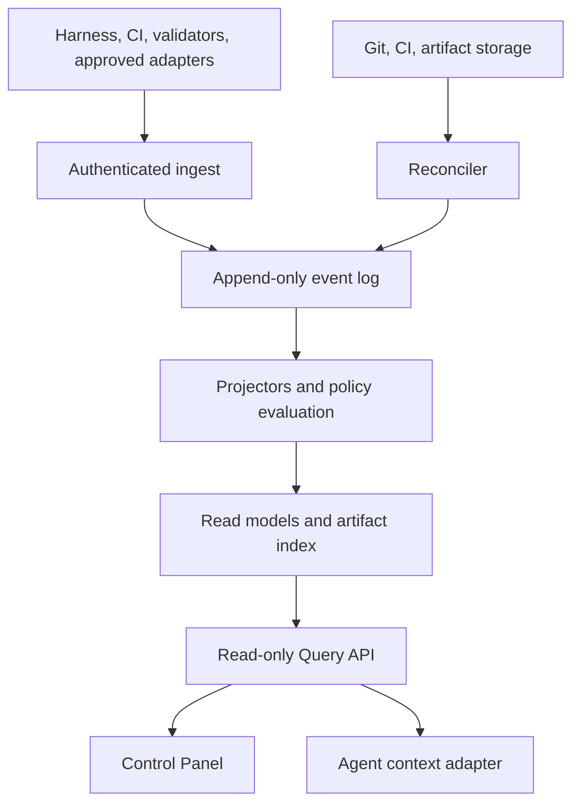

# Harness Platform V1.1

Status: PROPOSED
Implementation: NOT_IMPLEMENTED
Verification: NOT_VERIFIED
Target release: `1.1.0`
Delivery plan: `../exec-plans/completed/build-harness-platform-v1.1.md`
Includes: Platform Core, Read-only Query API, agent context, and Control Panel V1
Depends on: Harness Blueprint V1 verified at one exact Git SHA
Blocked by: `HARNESS_BLUEPRINT_V1_GATE: PASS`
Supersedes: separate Platform and Control Panel active delivery plans
Last reviewed: 2026-07-25

## Decision summary

Harness Platform V1.1 adds one shared, versioned operational model above
Harness Blueprint V1. It receives structured results from Harness, CI,
validators, and approved adapters; preserves append-only history; derives
rebuildable read models; exposes read-only context to authorized agents; and
ships the first-party Control Panel that makes the same state inspectable by a
human.

Platform Core and Control Panel remain separate runtime components:

```text
Producers
→ Platform Core
→ Read-only Query API
→ Control Panel
```

They are delivered through one ExecPlan because the release is not complete
until:

- the Platform proves source-backed, replayable, exact-SHA state;
- the Query API is stable and compatibility-tested;
- the panel proves those contracts in the real browser;
- both layers pass one combined reference gate.

The panel does not remove the Platform/API dependency. Panel implementation is
an internally gated later phase of the same release.

## Adoption precondition

Before the unified ExecPlan activates, it records:

```text
blueprintVersion
blueprintVerifiedSha
HARNESS_BLUEPRINT_V1_GATE evidence reference
policyVersion
schema compatibility baseline
approved Product Specs, Design Docs, and required ADRs
resolved activation-blocking PLATFORM-OD and PANEL-OD decisions
```

Until one exact Blueprint SHA passes its final gate:

```text
plan status: BLOCKED
implementation started: false
active implementation milestone: none
```

Documentation may be integrated into the Blueprint `1.0.0` repository while
Blueprint M0–M16 are in progress. Platform and panel code remain outside the
Blueprint `1.0.0` scope.

## Problem

Blueprint operational state is distributed across:

- Git commits, branches, and worktrees;
- Product Specs, Design Docs, ADRs, and ExecPlans;
- Harness CLI output and structural checks;
- CI runs, validator formats, and logs;
- evidence artifacts and release records;
- architecture declarations and observed dependency graphs;
- agent, reviewer, operator, and human activity.

A human or agent must reconstruct:

- which exact SHA is being inspected;
- which criteria and global gates pass for that SHA;
- why a milestone or plan is blocked;
- what changed between HEAD and the latest VERIFIED snapshot;
- which evidence supports a displayed status;
- whether aggregated data is current, stale, partial, or conflicting;
- which modules, contracts, and plans are affected by a change.

Manual reconstruction does not scale across SellGenius projects and can apply
old evidence to new code.

## Product outcome

For every enrolled project, provide one traceable, read-only operating model
that lets an authorized human or agent:

1. select a project, branch, and exact SHA;
2. distinguish current HEAD from immutable VERIFIED snapshots;
3. inspect criteria, milestones, ExecPlans, validations, conflicts, evidence,
   architecture, history, runs, activity, and governance;
4. trace every material status to source results and immutable identities;
5. detect stale, missing, quarantined, inconsistent, or unauthorized data;
6. obtain bounded task context without bypassing the repository router;
7. continue repository-local Harness work during a Platform outage.

The first human consumer is Control Panel V1. The first machine consumer is the
read-only agent context adapter.

## Users and actors

| Actor | Responsibility |
| --- | --- |
| System architect | Inspects state, risk, progress, evidence, and architecture; makes judgment decisions |
| Implementing agent | Reads bounded context through the existing router and publishes observable results |
| Reviewing agent | Independently checks the same SHA-scoped state and evidence |
| Harness CLI | Produces canonical local validation results and durable delivery records |
| CI reporter | Publishes authenticated results for a run, attempt, and exact SHA |
| Validator | Evaluates one defined contract and emits a versioned result |
| Projector | Derives rebuildable query models from accepted events |
| Reconciler | Compares Platform state with authorized Git, CI, registry, and artifact sources |
| Verifier | Evaluates snapshot eligibility under an exact policy |
| Control Panel | Displays read models; it does not decide or mutate project truth |

## Release composition

### Platform Core

- versioned Result Envelope and producer contracts;
- authenticated, idempotent ingestion;
- quarantine for invalid and conflicting inputs;
- append-only accepted event history;
- rebuildable projectors and read models;
- criteria registry, dependencies, impact, and progress;
- machine-readable ExecPlan scope and active conflict detection;
- evidence manifests and artifact index;
- HEAD, VERIFIED, REVOKED, and policy revalidation semantics;
- architecture projections and drift;
- reconciliation, freshness, and source-gap recovery;
- read-only Query API;
- bounded agent context provider;
- security, audit, retention, and observability.

### Control Panel V1

1. Project Overview;
2. ExecPlans;
3. Requirements and Milestones;
4. Validation Center;
5. HEAD and VERIFIED Snapshots;
6. Evidence Packages;
7. Architecture Explorer;
8. History and Comparison;
9. Runs and Agent Activity;
10. Governance and Settings.

The detailed panel component outcome is defined in
`harness-control-panel-v1.md`.

## Non-goals

V1.1 does not:

- replace Git as the source of code, approved Docs, policies, or configuration;
- replace the canonical ExecPlan narrative with database state;
- replace Harness checks, CI, or immutable artifact storage;
- mutate Docs, criteria, policy, snapshots, releases, deployments, or agents
  from the panel or agent reader;
- grant autonomy or clear `AUTONOMY_FREEZE`;
- trigger agents, CI, merges, releases, rollback, or deployments;
- expose hidden chain-of-thought, secrets, or unbounded production data;
- infer PASS from an agent statement or missing evidence;
- require Platform availability for repository routing, worktrees, checks, or CI;
- render unbounded whole-repository class graphs;
- add a frontend to Blueprint M0–M16;
- make all historical projects migrate before Blueprint commands continue.

Write operations require a future, separately approved product decision.

## Sources of truth

| Information | Authoritative source |
| --- | --- |
| Code, approved Docs, policy, configuration | Git repository at an exact SHA |
| Branch pointer | Git provider at a recorded observation time |
| ExecPlan purpose, decisions, recovery, progress | Versioned ExecPlan document |
| Criteria definitions and dependencies | Versioned criteria registry in Git |
| Validation outcome | Producing validator or CI result for an exact SHA |
| Evidence bytes | Immutable artifact storage |
| Accepted operational history | Append-only Platform event log |
| Current aggregated state | Rebuildable read models |
| Platform freshness | Reconciliation watermark and source health |
| Panel presentation state | URL and bounded client state; never project truth |

## Platform invariants

### PLATFORM-INV-001 — SHA isolation

A result for SHA A must never satisfy a criterion, global gate, projection, or
snapshot for SHA B.

### PLATFORM-INV-002 — no mixed snapshot

A VERIFIED snapshot cannot combine validation, criteria, policy, architecture,
configuration, or evidence from different source revisions.

### PLATFORM-INV-003 — repository-first operation

Platform unavailability must not stop the repository router, worktree
lifecycle, Harness checks, or CI.

### PLATFORM-INV-004 — read-only consumers

Control Panel V1 and the agent context adapter can read Platform V1.1. They
cannot mutate project truth, validation, criteria, policy, or snapshot state.

### PLATFORM-INV-005 — append-only history

Accepted events are not edited or deleted by agents. Corrections are new events
with explicit provenance.

### PLATFORM-INV-006 — rebuildable projections

Every current read model can be rebuilt from accepted events plus referenced
versioned sources.

### PLATFORM-INV-007 — explicit uncertainty

Missing, conflicting, quarantined, unavailable, partial, or stale input
produces an explicit non-success state. Unknown is never converted to PASS.

### PLATFORM-INV-008 — traceable status

Every material state identifies project, exact SHA, time, producer or policy
actor, and source references.

### PLATFORM-INV-009 — deterministic duplicate handling

The same idempotency identity and payload hash produces one accepted fact. The
same identity with another hash produces an integrity conflict.

### PLATFORM-INV-010 — policy-bound verification

Snapshot verification records the exact policy version and evidence manifest
hash. A later policy change never rewrites historical truth.

### PLATFORM-INV-011 — no self-asserted completion

An implementing agent cannot mark its own criterion, milestone, plan, or
snapshot verified.

### PLATFORM-INV-012 — project isolation

Identity, authorization, storage, queries, fingerprints, and retention are
isolated by tenant and project.

## Panel invariants

### PANEL-INV-001 — read-only boundary

Panel credentials and UI actions cannot call project-mutating operations.

### PANEL-INV-002 — exact-SHA identity

Every commit-sensitive view displays and queries one exact SHA. HEAD is never
silently substituted.

### PANEL-INV-003 — Platform API boundary

All project state enters through the versioned Query API and runtime parsing.
The panel never reads Platform storage directly.

### PANEL-INV-004 — visible uncertainty

Stale, partial, quarantined, unauthorized, not-found, and unavailable data are
visibly distinct from current complete data.

### PANEL-INV-005 — generated diagrams

Architecture diagrams are projections for a selected SHA. Layout and UI state
are not architecture truth.

### PANEL-INV-006 — traceable status

Every displayed material state links to provenance or explicitly explains why
supporting data is unavailable.

### PANEL-INV-007 — bounded rendering

Tables, logs, evidence previews, and graphs use pagination, server bounds, or
scoped expansion.

## System context



Large evidence bytes stay in immutable artifact storage. The Platform stores
metadata, checksum, provenance, retention state, and an authorized reference.

## Required domain contracts

### Result Envelope

Every producer emits a versioned envelope containing at least:

```text
schemaVersion
eventId and eventType
projectId and repositoryId
branch and full SHA
runId, attempt, trigger, start and completion time
producer type, ID, and version
validator ID, mode, status, configuration checksum, policy version
criteria IDs
findings
artifact references with checksums
observed time
payload hash
```

Status is one of `PASS`, `FAIL`, `ERROR`, `CANCELLED`, or `SKIPPED`.
Canonical serialization and schema evolution are defined in
`../design-docs/result-envelope-and-schema-evolution.md`.

### Criteria registry

Each criterion defines:

```text
criterionId
owner
milestoneId
weight
applicability
dependencies
required validations
affected modules, contracts, and paths
risk class
```

Allowed derived states:

```text
UNKNOWN
PASS
FAIL
BLOCKED
POSSIBLE_REGRESSION
NOT_APPLICABLE
```

Weighted progress is presentation only. It cannot complete a milestone while
one required criterion is not PASS.

### ExecPlan scope

The human-readable ExecPlan remains canonical. Its machine-readable scope
identifies plan, base SHA, branch, milestones, criteria, paths, modules,
contracts, schemas, APIs, events, policies, exclusive resources, and
dependencies.

Blocking active conflicts are resolved only by:

1. separating scope;
2. serializing plans with an explicit dependency; or
3. approval of a coordination contract by every required owner.

Sequential historical overlap is not a conflict.

### Event and projection model

Representative accepted events:

```text
ResultEnvelopeAccepted
ValidationRecorded
CriterionStateChanged
ExecPlanStateChanged
ScopeConflictDetected
ScopeConflictResolved
EvidenceManifestRecorded
ArchitectureProjectionRecorded
SnapshotVerified
SnapshotRevoked
SourceGapDetected
DataMarkedStale
ReconciliationCompleted
```

Delivery may be at least once and out of order. Projectors converge
deterministically and expose watermarks and projector versions.

### Minimum read models

1. project overview;
2. branch and exact-SHA state;
3. criteria and milestone state;
4. ExecPlans, dependencies, and conflicts;
5. validations and findings;
6. HEAD and snapshot comparison;
7. evidence package index;
8. architecture projection and drift;
9. runs and observable agent activity;
10. governance and effective policy;
11. synchronization health and quarantine.

Every material model includes:

```text
projectId
selected branch where applicable
selected SHA
source version or checksum
generatedAt
event watermark
freshness status
provenance references
```

### HEAD and VERIFIED

HEAD is a mutable branch pointer observed at a recorded time. VERIFIED is an
immutable claim that one exact SHA satisfied one exact policy and evidence
manifest.

Canonical snapshot identity:

```text
projectId + sha + policyVersion + evidenceManifestHash
```

All local criteria may PASS while a snapshot remains UNVERIFIED because a
global gate, source freshness, evidence completeness, conflict, or independent
policy decision is incomplete.

Revocation appends a new authorized fact. It never deletes or rewrites the
original snapshot.

### Freshness

```text
CURRENT
SYNC_PENDING
DATA_STALE
SOURCE_GAP
INTEGRITY_CONFLICT
```

Every query exposes freshness and a watermark. `DATA_STALE` prevents an agent
from treating the response as current context.

### Query API

The read-only API covers:

```text
projects and branches
overview
criteria and milestones
ExecPlans and conflicts
validations and findings
snapshots and comparisons
evidence manifests and authorized artifact links
architecture projections
runs and activity
governance and effective policy
freshness and quarantine
bounded agent context
```

Exact HTTP transport is approved at activation. Resource semantics are
normative. Callers never query Platform storage directly.

## Internal release gates

### Gate A — `PLATFORM_QUERY_API_READY`

Required before panel implementation:

- accepted events are durable and replayable;
- minimum read models rebuild deterministically;
- exact-SHA, freshness, provenance, and authorization semantics pass;
- the versioned Query API and representative fixtures are stable;
- Platform outage does not stop Blueprint operations.

Expected output:

```text
PLATFORM_QUERY_API_READY: PASS
```

### Gate B — `CONTROL_PANEL_PILOT_READY`

Required before combined final validation:

- all ten modules consume source-backed fixtures;
- no write-capable client exists;
- Architecture Explorer and accessible fallback pass;
- browser, accessibility, security, and performance checks pass;
- one pilot deployment is verified.

Expected output:

```text
CONTROL_PANEL_PILOT_READY: PASS
```

### Final gate

```text
HARNESS_PLATFORM_V1_1_GATE: PASS
```

This requires both internal gates and all applicable Platform and panel
criteria. It cannot be emitted by a mock-only UI or unconsumed API.

## Rollout

```text
Phase 0 — approve Docs, ADRs, unified ExecPlan, and activation baseline
Phase 1 — validate envelopes locally without remote dependency
Phase 2 — ingest in shadow mode and compare with source results
Phase 3 — build history, read models, evidence, and reconciliation
Phase 4 — pass PLATFORM_QUERY_API_READY
Phase 5 — build and pilot the read-only Control Panel
Phase 6 — enable policy-controlled VERIFIED snapshot creation
Phase 7 — pass the combined final gate and expand after evidence
```

Existing projects without Platform configuration keep using Blueprint V1.
Reporters and context reads are project feature gates. Failed adoption can
disable Platform integration without removing repository-local controls.

## Platform acceptance criteria

### Compatibility and boundaries

| ID | Observable criterion |
| --- | --- |
| PLATFORM-AC-001 | With Platform endpoints unavailable, the repository router, `harness check --fast`, `harness check --full`, and CI complete according to their own source results. |
| PLATFORM-AC-002 | A project without Platform configuration operates with no mandatory network call to Platform. |
| PLATFORM-AC-003 | The agent adapter uses the existing repository router and records whether Platform context was used, stale, or unavailable. |
| PLATFORM-AC-004 | Control Panel and agent credentials cannot call project-mutating operations because V1.1 exposes none to them. |

### Result identity and ingestion

| ID | Observable criterion |
| --- | --- |
| PLATFORM-AC-005 | Every accepted validation result includes project, repository, full SHA, run, attempt, producer version, validator identity, config checksum, and schema version. |
| PLATFORM-AC-006 | Re-delivery of the same identity and payload produces one accepted fact and a duplicate acknowledgement. |
| PLATFORM-AC-007 | Re-delivery of the same identity with a different payload hash produces `INTEGRITY_CONFLICT` and leaves the accepted event unchanged. |
| PLATFORM-AC-008 | Invalid schema, unauthorized producer, invalid SHA, and invalid checksum fixtures are rejected or quarantined with stable reason codes. |
| PLATFORM-AC-009 | A result for SHA A cannot change any criterion or snapshot state for SHA B. |
| PLATFORM-AC-010 | Out-of-order start and completion events converge to the same read model as correctly ordered delivery. |

### Criteria and ExecPlans

| ID | Observable criterion |
| --- | --- |
| PLATFORM-AC-011 | Registry validation rejects duplicate IDs, missing dependencies, cycles, unknown validators, and invalid applicability rules. |
| PLATFORM-AC-012 | Criterion PASS is derived only when all required evidence for the selected SHA and registry version passes. |
| PLATFORM-AC-013 | A changed affected contract moves dependent current state to `POSSIBLE_REGRESSION` or `BLOCKED` until required revalidation completes. |
| PLATFORM-AC-014 | Weighted progress changes when evidence changes but never marks a milestone complete while a required criterion is not PASS. |
| PLATFORM-AC-015 | Concurrent plans with an exclusive overlapping surface become blocked; sequential historical overlap does not create a conflict. |
| PLATFORM-AC-016 | A blocking plan conflict remains until scopes are separated, serialized, or every required owner approves the coordination contract. |

### Snapshots and evidence

| ID | Observable criterion |
| --- | --- |
| PLATFORM-AC-017 | All local criteria PASS while one global gate is incomplete leaves the candidate `UNVERIFIED`. |
| PLATFORM-AC-018 | A verified snapshot contains one exact SHA, policy version, registry checksum, and evidence manifest hash. |
| PLATFORM-AC-019 | A mixed-SHA, missing-artifact, checksum-mismatch, stale-source, or unresolved-conflict fixture cannot create `VERIFIED`. |
| PLATFORM-AC-020 | Repeating verification with identical inputs is idempotent and returns the same snapshot identity. |
| PLATFORM-AC-021 | Revocation preserves the original snapshot and appends reason, evidence, authority, and time. |
| PLATFORM-AC-022 | A policy change preserves historical verification and reports `POLICY_REVALIDATION_REQUIRED` for current eligibility when required. |

### Projections, architecture, and freshness

| ID | Observable criterion |
| --- | --- |
| PLATFORM-AC-023 | Deleting and rebuilding read models from accepted events produces the same canonical project state. |
| PLATFORM-AC-024 | Architecture projection identifies its exact SHA, generator version, and config checksum. |
| PLATFORM-AC-025 | A deliberate undeclared reverse dependency produces `ARCHITECTURE_DRIFT` with declaration, code-edge, and validation references. |
| PLATFORM-AC-026 | A source fact missing from Platform produces `SOURCE_GAP`, and reconciliation repairs it without rewriting existing events. |
| PLATFORM-AC-027 | Exceeding freshness policy produces `DATA_STALE` in every affected API response and prevents the agent from treating it as current context. |
| PLATFORM-AC-028 | Projector failure leaves accepted events intact and marks affected projections stale until rebuild succeeds. |

### API, security, and privacy

| ID | Observable criterion |
| --- | --- |
| PLATFORM-AC-029 | Every material query response identifies project, selected SHA, generation time, watermark, freshness, and provenance. |
| PLATFORM-AC-030 | Requesting exact SHA A never silently returns HEAD or SHA B. |
| PLATFORM-AC-031 | Cross-project and cross-tenant authorization fixtures return no protected metadata. |
| PLATFORM-AC-032 | Reporter identity cannot read project state; agent-reader identity cannot ingest, verify, revoke, or change policy. |
| PLATFORM-AC-033 | Secret, credential, raw production row, and failed-sanitization fixtures cannot enter a verification evidence package. |
| PLATFORM-AC-034 | Agent activity contains observable operations and results but no hidden chain-of-thought field. |
| PLATFORM-AC-035 | Evidence access, snapshot decisions, quarantine, reconciliation, and agent context reads produce append-only audit records. |

### End-to-end gate

| ID | Observable criterion |
| --- | --- |
| PLATFORM-AC-036 | A reference project publishes a full run, derives criteria, builds evidence, creates one exact verified snapshot, and exposes identical state to the panel and agent context. |
| PLATFORM-AC-037 | A second identical publication run produces no unintended duplicate events, projections, evidence manifests, or snapshots. |
| PLATFORM-AC-038 | A simulated Platform outage followed by recovery drains pending delivery, reconciles the project, and restores `CURRENT` without rerunning successful validators. |
| PLATFORM-AC-039 | A deliberate regression between VERIFIED and HEAD is visible in criteria, validation, architecture impact, and comparison views. |
| PLATFORM-AC-040 | The final gate emits `HARNESS_PLATFORM_V1_1_GATE: PASS` with linked evidence for all applicable Platform and panel criteria. |

## Panel acceptance criteria

| ID | Observable criterion |
| --- | --- |
| PANEL-AC-001 | A user can select a project and exact SHA and every material module preserves that selection. |
| PANEL-AC-002 | The UI never silently replaces a requested SHA with HEAD. |
| PANEL-AC-003 | Panel credentials cannot invoke a project-mutating Platform operation. |
| PANEL-AC-004 | Every API response is runtime-validated before domain data reaches feature components. |
| PANEL-AC-005 | Current, stale, partial, quarantined, unauthorized, not-found, and unavailable states have distinct UI behavior. |
| PANEL-AC-006 | All ten required modules have source-backed happy-path and failure-state fixtures. |
| PANEL-AC-007 | Tables are paginated or bounded and preserve deterministic server ordering. |
| PANEL-AC-008 | Architecture Explorer renders a scoped projection using React Flow and deterministic ELK.js layout. |
| PANEL-AC-009 | The same architecture projection is available as an accessible list or table. |
| PANEL-AC-010 | HEAD versus VERIFIED comparison never combines nodes or evidence from different unidentified SHAs. |
| PANEL-AC-011 | Architecture drift links to relevant declarations, observed edges, findings, and evidence when authorized. |
| PANEL-AC-012 | Direct Platform storage access is absent from production and test architecture. |
| PANEL-AC-013 | Unit, component, contract, accessibility, and critical Playwright journeys pass. |
| PANEL-AC-014 | Production build, frontend monitoring, security headers, and authorization tests pass. |
| PANEL-AC-015 | Platform unavailability degrades the panel without affecting Blueprint CLI, CI, repository routing, or local validation. |

## Reference validation scenarios

The unified ExecPlan includes at least:

1. valid run for one exact SHA;
2. identical duplicate delivery;
3. conflicting duplicate identity;
4. out-of-order delivery;
5. result from the wrong SHA;
6. changed validator version or checksum;
7. invalid criteria graph;
8. impact-driven revalidation;
9. concurrent conflicting ExecPlans;
10. sequential non-conflicting plans;
11. local PASS with incomplete global gate;
12. complete verified snapshot;
13. corrupt or missing evidence;
14. policy revalidation;
15. authorized revocation;
16. architecture drift;
17. source gap repaired by reconciliation;
18. stale Git or CI source;
19. Platform outage with repository-local continuation;
20. cross-project denial;
21. sanitizer rejection;
22. projector rebuild;
23. panel and agent reading the same exact SHA;
24. requested SHA not found without HEAD fallback;
25. unsupported API schema;
26. partial and quarantined panel states;
27. bounded large architecture graph;
28. accessible graph fallback;
29. interrupted and repeated deployment;
30. combined reference gate rerun with no unintended diff.

## Definition of Done

Harness Platform V1.1 is complete only when:

- the activation baseline identifies the exact verified Blueprint SHA;
- required Product Specs, Design Docs, and ADRs are approved;
- all blocking `PLATFORM-OD-*` and `PANEL-OD-*` are resolved;
- all applicable `PLATFORM-AC-*` and `PANEL-AC-*` have current evidence;
- event and API schemas pass compatibility tests;
- accepted history remains append-only and read models rebuild;
- isolation, permissions, privacy, sanitization, and audit tests pass;
- outage, recovery, reconciliation, and stale scenarios pass;
- `PLATFORM_QUERY_API_READY: PASS` is evidenced;
- all ten panel modules use source-backed state;
- `CONTROL_PANEL_PILOT_READY: PASS` is evidenced;
- the panel and agent adapter observe identical selected-SHA state;
- independent review finds no unresolved actionable issue;
- `docs/QUALITY_SCORE.md` changes only where independently evidenced;
- the unified ExecPlan retrospective is complete and moved to completed;
- the final run emits `HARNESS_PLATFORM_V1_1_GATE: PASS`.

## Open Platform decisions

| ID | Decision | Activation effect |
| --- | --- | --- |
| PLATFORM-OD-001 | Single-tenant deployment or multi-tenant service | Blocks storage and isolation topology |
| PLATFORM-OD-002 | Event store and read-model database technology | Blocks persistent Platform Core implementation |
| PLATFORM-OD-003 | Artifact provider and immutability controls | Blocks evidence package implementation |
| PLATFORM-OD-004 | Exact ExecPlan manifest format and location | Blocks scope registry implementation |
| PLATFORM-OD-005 | Enrollment and canonical project/repository identity authority | Blocks production ingestion |
| PLATFORM-OD-006 | Reconciliation cadence and freshness thresholds | Blocks production freshness policy |
| PLATFORM-OD-007 | Evidence/audit retention, legal hold, and deletion | Blocks production retention enablement |
| PLATFORM-OD-008 | Snapshot revocation authority and reason catalogue | Blocks verification authority |
| PLATFORM-OD-009 | API transport and hosting topology | Blocks Query API and panel client pins |
| PLATFORM-OD-010 | Performance dataset and service objectives | Blocks performance gate, not local contract work |
| PLATFORM-OD-011 | First pilot project | Blocks pilot and final gate |
| PLATFORM-OD-012 | Exact Blueprint completion SHA and gate evidence | Blocks plan activation |

## Open Panel decisions

| ID | Decision | Activation effect |
| --- | --- | --- |
| PANEL-OD-001 | Hosting environment and deployment topology | Blocks panel deployment |
| PANEL-OD-002 | OIDC provider and session implementation | Blocks authenticated shell |
| PANEL-OD-003 | Stable Platform API version and REST/OpenAPI approval | Blocks generated/owned client |
| PANEL-OD-004 | Pilot project and representative scale dataset | Blocks pilot gate |
| PANEL-OD-005 | Initial load and large-graph performance budgets | Blocks final performance acceptance |

## Risks and controls

| Risk | Control |
| --- | --- |
| Dashboard becomes a source of truth | Read-only consumers, provenance, rebuildable projections |
| Old PASS is applied to new code | Full SHA binding and mixed-snapshot rejection |
| Platform outage blocks engineering | Optional integration, durable outbox, repository fallback |
| Eventual consistency appears certain | Watermarks, freshness, reconciliation, visible stale state |
| Duplicate or reordered events corrupt state | Idempotency identity, payload hash, deterministic projectors |
| Separate Platform/panel baselines drift | One activation baseline and one unified ExecPlan |
| UI starts before contracts are stable | Internal `PLATFORM_QUERY_API_READY` gate |
| Sensitive evidence is indexed | Sanitization, minimization, scoped access, audit |
| Agent treats Platform as authority | Router-first bounded context with provenance |
| Scope grows into orchestration | Explicit V1.1 non-goals and no write API |
